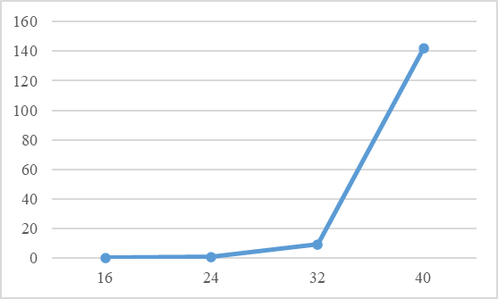
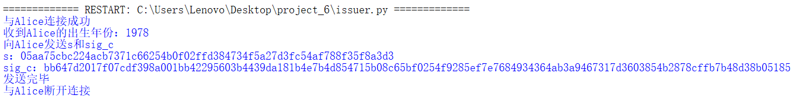
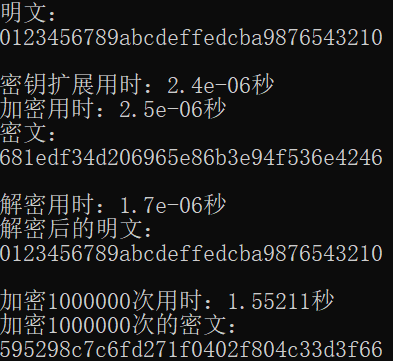
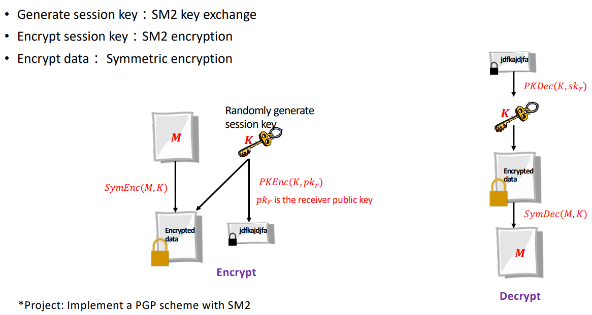
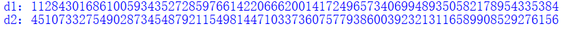
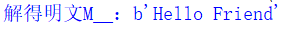

# homework_readme
创新创业实践课程作业project的说明文档，由于私人仓库转公开仓库，导致homework_group_49中的图片无法查看，因此在本仓库中补充对应的说明文档，将图片放置在对应image文件夹中。为了后续方便查看，故将代码也上传，因此该仓库为**最终版本**。

# homework_group_49

创新创业实践课程作业

- GitHub账号：hhhhtttgxy
  
- 姓名：耿欣阳
  
- 学号：202100460002

- 分工：无分工，本人独立完成

# 汇总报告

尊敬的老师们和助教们，您们好。这篇汇总报告大致说明了每个项目的实现情况（由于篇幅限制，只是简单说明）。同时，每个项目的文件夹（或者再下一级的文件夹）中都有**更为详细**的说明文档和对应的代码，可详细地了解对应的项目情况。

每个说明文档主要分为实现原理、实现过程（包括对代码的解释）、实现结果、参考文献四个部分。当然每个说明文档中均有部分图片，图片加载较为缓慢，因此还需稍作等待。

多次修改代码细节，并且最后整理时，在各个说明文档中补充了代码名称对应的具体实现表格。

## 运行环境

### Windows下


- python：IDLE 3.11 

- C++：Visual Studio 2022

### Linux下


## 运行指导
C++语言部分不涉及到配置环境等等。

python语言需要下载一些库，在cmd中输入以下指令即可，包含了全部代码需要的库。

```
pip install gmssl
pip install cryptography
pip install pypiwin32
```

经本人最后核验，代码均可以成功运行，并且在每个文件夹的说明文档的开头部分都有相应的代码说明，如遇任何问题，可联系本人解决。

- QQ：3105547171

- 邮箱：13718600519@163.com

## 作业内容（已全部完成📝）

以下时间单位未说明默认为秒（s）。

- **Project1: implement the naïve birthday attack of reduced SM3**

1. 调用gmssl库的sm3算法完成生日攻击

| 比特位数 | 16     | 24     | 32      | 40       |
| -------- | ------ | ------ | ------- | -------- |
| 用时     | 0.1451 | 1.0224 | 17.0731 | 167.5820 |


2. 使用自编写的sm3算法完成生日攻击

| 比特位数 | 16     | 24     | 32     | 40       |
| -------- | ------ | ------ | ------ | -------- |
| 用时     | 0.0624 | 0.7097 | 9.2725 | 141.9138 |



由于自编写的sm3算法效率更高因此使用自编写的sm3算法完成生日攻击效率也高。
  
- **Project2: implement the Rho method of reduced SM3**

使用了两种方法完成实现，一种是将每次的哈希结果存储起来：每次都对最后一个值进行哈希，并寻找列表中有无相同的哈希值，若有则找到碰撞，若没有则继续哈希列表中最后一个值，直到找到碰撞为止；另一种是不存储哈希结果：设置两个变量，一个变量一次只哈希一次，另一个变量一次哈希两次，最终会在哈希值的循环中产生碰撞。

1. 调用gmssl库的sm3算法完成Rho攻击

| 比特位数 | 16     | 24     | 32      |
| -------- | ------ | ------ | ------- |
| 方法一   | 0.2578 | 2.3415 | 51.3260 |
| 方法二   | 0.2826 | 3.2818 | 46.7776 |


2. 使用自编写的sm3算法完成Rho攻击

| 比特位数 | 16     | 24     | 32      |
| -------- | ------ | ------ | ------- |
| 方法一   | 0.1666 | 1.6869 | 43.7177 |
| 方法二   | 0.2517 | 2.4801 | 34.7840 |


由于自编写的sm3算法效率更高因此使用自编写的sm3算法完成Rho攻击效率也高。
  
- **Project3: implement length extension attack for SM3, SHA256, etc.**

1. 实现了自编写的sm3算法和sha256算法。

sm3：


sha256：


2. 针对两种算法进行了长度扩展攻击，并进行了验证。

sm3的长度扩展攻击：


sha256的长度扩展攻击：


  
- **Project4: do your best to optimize SM3 implementation (software)**

前面已经实现了自编写的python版本的sm3算法，然后实现了自编写的C++版本的sm3算法，再对其进行优化，主要采取三种优化方式：SIMD（一条指令处理多个数据）、UNROLL（循环展开）和INLINE（函数内联），最终在Linux平台下使用SIMD和O3完成优化（直接放入C++基础实现代码即可，当然要略微调整）。

五个版本每个版本测量5次，取平均值，以下时间单位均为秒（s），Linux下的优化单位除外，为微秒。

效率对比表：

|             | 1    | 2    | 3    | 4    | 5    | 平均时间 |
| ----------- | ---- | ---- | ---- | ---- | ---- | -------- |
| gmssl版本   | 0.007920 | 0.008905 | 0.008681 | 0.008312 | 0.008035 | 0.008371 |
| python版本  | 0.003987 | 0.004088 | 0.004861 | 0.005983 | 0.005999 | 0.004984 |
| C++基础版本 | 0.001516 | 0.001937 | 0.001897 | 0.001570 | 0.001565 | 0.001697 |
| C++优化版本 | 0.001247 | 0.001232 | 0.001268 | 0.001419 | 0.001239 | 0.001281 |
| Linux优化版本 | 16微秒 | 20微秒 | 19微秒 | 29微秒 | 27微秒 | 22.2微秒 |

效率对比图：将Linux优化版本的单位统一成秒。


gmssl版本到python版本以及python版本到C++版本效率提升较为明显，C++版本在进行优化后略有提升，最终优化了近7倍。再加上Linux下的优化（非常明显），最终优化了377倍:astonished:。
  
- **Project5: Impl Merkle Tree following RFC6962**

分为三个部分：1. 创建一个有10w条数据的Merkle Tree 2. 构建包含证明 3. 构建排除证明。

创建Merkle Tree时应注意对于叶子节点，在每次哈希时前面填充0x00，对于非叶子节点，在每次哈希时前面填充0x01，这是RFC6962中的要求。

后续实现时将包含证明和排除证明合并为Merkle证明。

最终能够成功构建10w条数据的Merkle树以及完成Merkle证明。

> 
> 
  
- **Project6: impl this protocol with actual network communication**


对Range Proof With Hash Function进行了实现，首先实现了一个未加入通讯的版本以熟悉该协议流程。


最终按照协议分为三方，完成了通讯实现，在现在是 2021 年且证明系统直到 2100 年这个背景下，Alice可以向Bob提供年龄证明。

> 测试1：
> 
>
> 
>
> 


> 测试2：
> 
>
> 
>
> 

- **Project7: Try to Implement this scheme**

参考下图完成了HashWires的实现，实现过程中选用的MDP列表为[312，303，233]，个人认为HashWires最核心的部分是重用链，当然其中哈希函数、KDF密钥派生、pl_accum操作、加盐操作、shuffle函数、检验和也就是最右边的单链以及Merkle Tree等等诸多细节均涉及，并且最终分为可信的发行方、证明方和验证方进行实现，最终实现了HashWires的一次性证明。


验证了三种情况的一次性证明：

> 
>
> 
>
> 
  
- **Project8: AES impl with ARM instruction**

此部分首先分析了PPT中给出的ARM指令对AES实现的代码（下图）。


然后在开源代码中找到了一些比较合适代码，可以在参考文献中看到给出了5个对应的开源代码的链接，其中将开源代码中ARM汇编对AES的实现以及一个ARM指令对AES的实现的文件夹放入对应项目，然后介绍了文件夹（AES_ARM）中的实现。

**以下是摘自对应仓库的介绍**

#

- aes_scalar.cpp

This is the scalar implementation, which can be compiled on any platform, not only ARM.

- aes_neon.cpp

This implementation uses the NEON SIMD instructions of ARMv8.

- aes_bitslice.cpp

This implementation uses the bitslicing algorithm, which allows a parallel processing of 8 encryptions/decryptions.
Only 128- and 256-bit keys are supported.

#

Compiled with **gcc 11.3.0** for Ubuntu using **-O3** optimization level.
Executed on **Raspberry Pi 4B**, 8GB RAM.
Each benchmark included 100,000,000 encryption rounds done on 8 data blocks.

- aes_scalar:   92 seconds
- aes_neon:     52 seconds
- aes_bitslice: 11 seconds

For comparison, the aes_scalar benchmark executed on an Intel Core i5 CPU took 24 seconds.

#
下面自己运行了一下aes_scalar.cpp。

- 在vs运行aes_scalar.cpp的结果：


- 在Linux下运行aes_scalar.cpp的结果：


最后又附上了一个非常具体的ARM中NEON相关的使用方法介绍的链接。

> 注：由于设备原因无法进行ARM编译😭，此部分只能以此种方式呈现。
  
- **Project9: AES / SM4 software implementation**

1. AES

对AES的加密和解密进行实现。


2. SM4

对SM4的加密和解密进行实现。



  
- **Project10: report on the application of this deduce technique in Ethereum with ECDSA**

当然从这个项目开始就进入了椭圆曲线相关密码的部分了，因此先要实现椭圆曲线相关的运算操作，包括模逆运算、椭圆曲线加法、椭圆曲线乘法，当然后续还实现了椭圆曲线快速乘法和求解二次剩余，这两部分是之后的项目中实现的，也可以作为本项目的补充。

首先对ECDSA签名进行了实现，包括公私钥生成算法、签名生成算法、签名验证算法和公钥恢复算法，一开始做了一个比较基础的实现，选用了比较简单的椭圆曲线参数。


然后有了后续项目中对椭圆曲线快速乘法和求解二次剩余的实现，最终重点补充了公钥恢复这一部分，增添了一些细节以达到普适性，当然也使用了secp256k1作为椭圆曲线参数。


在最后介绍了以太坊中使用ECDSA对交易签名的过程，并重点解释了公钥恢复这一操作的意义。


  
- **Project11: impl sm2 with RFC6979**

首先参照RFC6979文档生成k值，并摘录了文档中的相关内容，按照内容完成k值的生成，sm2的签名和验签部分调用gmssl库进行，重点是生成k的过程。


然后实现了自编写的sm2算法的签名和验签。


最终使用上述的生成k的方法以及自编写实现的sm2签名算法实现一个完整版的sm2 with RFC6979。


- **Project12: verify the above pitfalls with proof-of-concept code**

首先实现了ECDSA、Schnorr、SM2三个签名算法，当然ECDSA和SM2已经实现过了，略作调整，Schnorr在这里实现，使用的是第一种实现方法。

ECDSA
  


Schnorr


SM2
  


然后针对七个pitfalls给出了实现，其中(r,s) 和 (r,-s) 都是有效签名似乎只对ECDSA有效因此进行代码验证，并且在实验原理中给出了这部分的证明，Schnorr签名如果验证时只比对横坐标，那么以上两种均为有效签名；伪造签名在后续的第19个项目（伪造中本聪签名）处实现； DER 编码的模糊性可能导致区块链网络分裂 在实验原理部分给出了详细介绍。

其他的4个pitfalls均给出了3个签名算法的代码实现，并且在两个用户使用相同的随机数k导致对方能够知道自己的私钥d中还提到了两种方法，其中第二种方法使用ECDSA签名进行了举例说明。

> 注：此部分由于内容较多因此实现结果截图也较多，展示的话篇幅过大，故不在这里展示。

- **Project13: Implement the above ECMH scheme**

首先实现了求解二次剩余：参考博客中的方法求解二次剩余，当然如果模p余3那么可以直接使用费马小定理，值有两个最终返回较小的值；当然在此之前还需要实现判断二次剩余：使用欧拉准则。

实现了ECMH算法，大致思路为将哈希值映射成椭圆曲线上的点，然后使用椭圆曲线上的加法，这一步使用的是参考论文中的Try-and-Increment Method方式将哈希值转为椭圆曲线上的点。个人认为功能本质上就分为两个：添加和删除。

验证了添加和删除操作的合理性，并且证明了交换律。


- **Project14: Implement a PGP scheme with SM2**

最终实现了PGP协议以及sm2的密钥交换协议，均为通讯情况下的实现。

1. PGP协议




发送方：需要随机生成一个会话密钥K作为对称密钥K，然后用该密钥K加密消息M，还需要将该对称密钥K发送给接收方，以便接收方解密得到消息M，因此用接收方的公钥pk对会话密钥K进行公钥加密，最终将加密后的消息和会话密钥发送给接收方。


接收方：收到发送方传来的加密后的消息和会话密钥后，首先需要使用自己的私钥进行解密得到会话密钥K，进而解密得到消息M。


2. sm2的密钥交换协议


A：


B：


- **Project15: implement sm2 2P sign with real network communication**

实现了双方共同签名，双方缺一不可。


发送方：在签名成功后，告知接收方签名成功。


接收方：协助发送方完成签名。


  
- **Project16: implement sm2 2P decrypt with real network communication**

实现了双方共同解密，双方缺一不可。


首先完成自编写sm2的加密解密算法，以便于后续实现网络通信。


由于必须双方共同才能完成解密，因此将私钥分为两个部分存储即可，应由一个可信方掌握私钥并将其拆分并分别告知双方。



然后需要有人发送加密后的消息让双方解密，由于步骤与双方签名相比，更为繁琐，因此先写一个不需要通讯的版本（test.py）进行测试，模拟全部流程。



接下来，进行通讯版本的实现，实现分为三方：加密方和两个解密方（发送方和接收方），首先是加密方与发送方通讯，将密文信息告知发送方，此时加密方作为服务端，发送方作为客户端，然后发送方在得知密文后，与接收方进行通讯，完成共同解密，此部分参照实现原理中的流程即可，此时发送方作为服务端，接收方作为客户端。

加密方：


发送方：


接收方：


- **Project17: 比较Firefox和谷歌的记住密码插件的实现区别**

首先对Google Password Checkup进行了实现，然后比较了Firefox和谷歌的记住密码插件的实现区别，并使用找到的开源代码对Firefox和谷歌的密码进行解密。


1. Google Password Checkup

实现了Google Password Checkup，同时对服务器那端直接存储泄露的密码明文表示疑问并对此查询了一些资料。

Google：


client：


2. 比较了Firefox和谷歌的记住密码插件的实现区别

经过查询相关资料，找到的一些信息。

Firefox:


Firefox 可以通过使用主密码加密来保护敏感信息，例如保存的密码和证书。如果您创建了主密码，则每次启动 Firefox 时，它都会在第一次需要访问证书或存储的密码时要求您输入密码。您可以通过选中或取消选中此选项来设置、更改或删除主密码或通过单击更改主密码按钮。如果已设置主密码，则需要输入该密码才能更改或删除主密码。

谷歌：

谷歌会将密码存储在C:\Users\Lenovo\AppData\Local\Google\Chrome\User Data\Default的Login Data中，该数据库文件的类型是 SQLite，Login Data文件是加密的，加密方式是 AES-256 in GCM mode，用以确保用户登录凭据的安全性，但是密钥也存储在本地，对安全性有所降低，密钥存储在C:\Users\Lenovo\AppData\Local\Google\Chrome\User Data的Local State中，其内容的 encrypted_key 就是密钥。

解密需要用到 win32 提供的 API CryptUnprotectData 函数，这个函数保证解密是和加密在同一台电脑（用户）进行的，所以如果直接复制硬盘的浏览器数据到其他电脑上是解密不了的，但是只要你的 Windows 登录了，任何程序只要想都可以解密 chrome 的密码然后上传。

3. 使用找到的开源代码对Firefox和谷歌的密码进行解密

Firefox:


谷歌：


最后找到了一个安全密码管理程序Keeper对“在Chrome中存储密码安全吗”这一问题给出的解答，前面进行的解密也印证了这一说法：


- **Project18: send a tx on Bitcoin testnet, and parse the tx data down to every bit, better write script yourself**

使用bitcoin core的测试版，创建自己的地址，并且使用Testnet向自己发送比特币，然后使用获取到的txid对交易数据进行解析，并获取交易的hex。当然为了帮助理解在最前面附上了一些关于tx数据的解释。


  
- **Project19: forge a signature to pretend that you are Satoshi**

实现了ECDSA、Schnorr和sm2签名算法的伪造签名。

1. ECDSA

由于并未找到中本聪的公钥，因此通过他人伪造的签名值，恢复出公钥，进而完成对中本聪签名的伪造。最终分别用两个可能的公钥伪造中本聪签名。


并且经查询找到了一个伪造中本聪签名的sage实现，附在附录部分。

2. Schnorr


3. sm2


  
- **Project20: ECMH PoC** （与Project13一致）

- **Project21: Schnorr Batch**

首先实现了Schnorr签名的批量验证（未加随机数a）。

参照实验原理部分做了一个整合，发现单个验证的用时确实有所下降，验证效率为原来的2倍多，但不像实验原理的结果那样持续下降，且验证效率明显提升。

| 消息个数 | 验证总用时 | 单个验证用时 | 每秒验证个数 |
| -------- | ---------- | ------------ | ------------ |
| 1        | 0.06138    | 0.06138      | 16           |
| 4        | 0.15934    | 0.03984      | 25           |
| 16       | 0.47789    | 0.02987      | 33           |
| 64       | 1.84461    | 0.02882      | 35           |
| 256      | 8.23528    | 0.03217      | 31           |
| 1024     | 29.93588   | 0.02923      | 34           |
| 4096     | 120.89915  | 0.02952      | 34           |

但是直接这样验证会存在伪造攻击。


然后添加了随机数a以避免此种攻击。

可以看到，验证效率提升非常不明显，最快时效率仅为原来的1.5倍。

| 消息个数 | 验证总用时 | 单个验证用时 | 每秒验证个数 |
| -------- | ---------- | ------------ | ------------ |
| 1        | 0.08468    | 0.08468      | 12           |
| 4        | 0.29394    | 0.07349      | 14           |
| 16       | 0.95033    | 0.05940      | 17           |
| 64       | 3.64914    | 0.05702      | 18           |
| 256      | 14.42391   | 0.05634      | 18           |
| 1024     | 59.83890   | 0.05844      | 17           |
| 4096     | 239.60673  | 0.05850      | 17           |

最后使用Bos-Coster算法，尝试进一步加速。

可以看到前期提升很快，最高时能达到原来效率的10倍，后期效率相对下降（推测可能是因为随机生成的a增多造成），但与不使用Bos-Coster算法相比，效率依旧很高。

| 消息个数 | 验证总用时 | 单个验证用时 | 每秒验证个数 |
| -------- | ---------- | ------------ | ------------ |
| 1        | 0.06555    | 0.06555      | 15           |
| 4        | 0.05800    | 0.01450      | 69           |
| 16       | 0.15194    | 0.00950      | 105          |
| 64       | 0.45205    | 0.00706      | 142          |
| 256      | 1.69889    | 0.00664      | 151          |
| 1024     | 9.21118    | 0.00900      | 111          |
| 4096     | 84.99749   | 0.02075      | 48           |


未优化和优化后的每秒验证个数的对比图：


  
- **Project22: research report on MPT**

查询了MPT的相关资料，对MPT的原理进行了详细介绍，包括简要概述、patricia tree 前缀树的介绍、以太坊中对Key的编码和编码转换关系以及默克尔证明，然后针对MPT的源码进行解读包括编码转换、数据结构、Trie树的序列化和反序列化、Trie树的插入查找和删除、Trie树的cache管理、Trie树的默克尔证明等等，最终做出了总结。
