# implement the naïve birthday attack of reduced SM3
# 实现简化的SM3生日攻击算法

|        代码名称         |             具体实现             |
| :---------------------: | :------------------------------: |
|      project_1.py       | 调用gmssl库的sm3算法完成生日攻击 |
| project_1_supplement.py | 使用自编写的sm3算法完成生日攻击  |

## 1. 实现原理
### 1.1 sm3算法
http://www.sca.gov.cn/sca/xwdt/2010-12/17/1002389/files/302a3ada057c4a73830536d03e683110.pdf
### 1.2 生日攻击
- 生日问题：当老师问一个有30名学生的班级（n = 30）每个人的生日在哪一天（为简便，此处省略闰年）以确定是否有两个学生同一天生日（对应碰撞）。从直觉角度考虑，几率看起来很小，但是实际上是和直觉相反的。

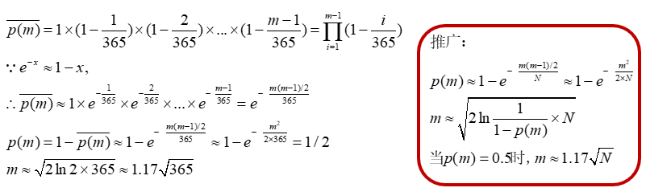

- 定理：设杂凑函数h的输出值长n比特，则经过约 $2^{n/2}$ 次杂凑运算，找到一对碰撞(x,x')的概率大于1/2。

（运用该定理实现攻击）

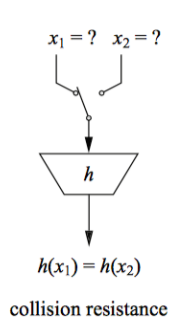

## 2. 实现过程
### 2.1 sm3算法的使用
使用gmssl库，使用示例如下。（ 参考https://www.cnblogs.com/rocedu/p/15518988.html ）
```python
from gmssl import sm3,func
data = b"111" # bytes类型
y = sm3.sm3_hash(func.bytes_to_list(data))
print(y)
```
### 2.2 步骤
此处的碰撞是以字符串作为碰撞的。

#### 2.2.1 sm3算法
将字符串编码再哈希。
```python
def h(str_): #sm3
    data=str_.encode()
    hash_=sm3.sm3_hash(func.bytes_to_list(data))
    return hash_
```
#### 2.2.2 生成固定长度的字符串
首先设置一个总的字符表，包括大小写字母以及数字，然后从字符表中随机选择，最终组合成固定长度的字符串。
```python
def generate_random_string(str_length): #生成固定长度字符串
    all_str=string.ascii_letters + string.digits
    result=''.join(random.choice(all_str) for _ in range(str_length))
    return result
```
由于考虑到碰撞消息的有意义性和算法的简便性，因此固定消息的长度，设置成16个字符。
#### 2.2.3 生日攻击
设置字符串长度（16）以及碰撞长度（字符长度），因此碰撞次数最多为2的（碰撞长度（比特长度）/2）次方，超过该次数则认为未找到碰撞。在碰撞字典中寻找，如果找到碰撞即前碰撞长度位一致且该字符串是一个新的字符串，那么输出结果，否则，将其存入字典并继续尝试。
```python
def birthday_attack(str_length,collision_length):
    collision_dict={}
    collision_bit_length=collision_length*4
    is_find=False
    for i in range(2**int(collision_bit_length/2)):
        str_=generate_random_string(str_length)
        hash_=h(str_)
        hash_f=hash_[:collision_length]
        if hash_f in collision_dict and collision_dict[hash_f]!=str_:
            is_find=True
            print("***找到碰撞***")
            print("碰撞前{}位：{}\n碰撞的字符串：{}\t{}".format(collision_bit_length,hash_f,str_,collision_dict[hash_f]))
            print("碰撞的哈希值：{}\t{}".format(hash_,h(collision_dict[hash_f])))
            break
        else:
            collision_dict[hash_f]=str_
    if is_find==False:
        print("***未找到***")
```
### 2.3 实现结果
在最后调用生日攻击函数时，使用time模块测量攻击时间，如果出现了未找到的情况，再次运行该代码直到打印出找碰撞为止。

> 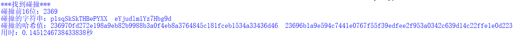
>
> 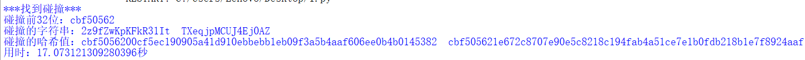
>
> 
>
> 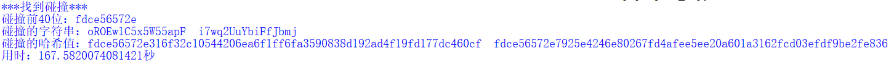

- 结果整合（单位：秒）

| 比特位数 | 16     | 24     | 32      | 40       |
| -------- | ------ | ------ | ------- | -------- |
| 用时     | 0.1451 | 1.0224 | 17.0731 | 167.5820 |

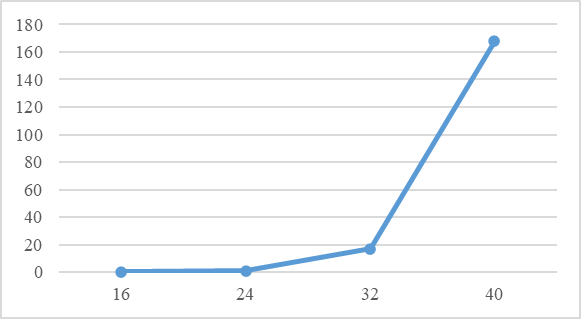

随着碰撞比特位数增加，时间呈指数级增加。


## 3. 补充
由于后续实现了自己编写的sm3算法的python版本，因此补充调用自己实现的sm3算法进行攻击（只需改为调用自编写的sm3算法即可，其它攻击部分无需改动）。

- 结果

> 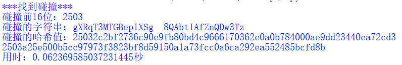
> 
> 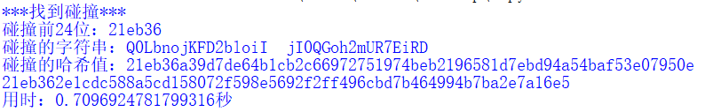
>
> 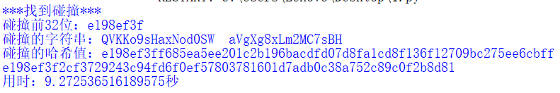
> 
> 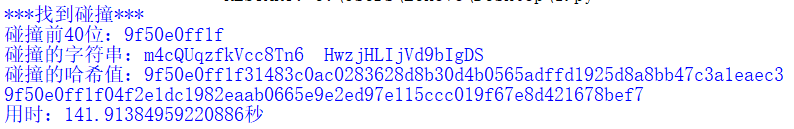

- 结果整合（单位：秒）

| 比特位数 | 16     | 24     | 32     | 40       |
| -------- | ------ | ------ | ------ | -------- |
| 用时     | 0.0624 | 0.7097 | 9.2725 | 141.9138 |

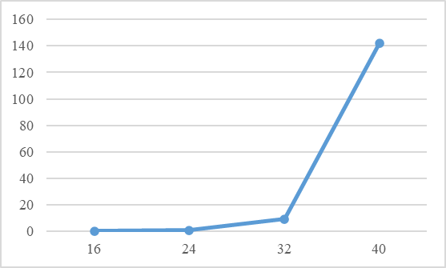

趋势仍为随着碰撞比特位数增加，时间呈指数级增加，但该实现效率比调用gmssl库更高，本质上是因为自编写的sm3算法效率更高。

> 注：后续考虑使用多线程加速。
