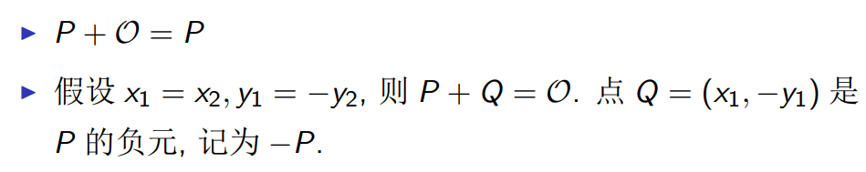
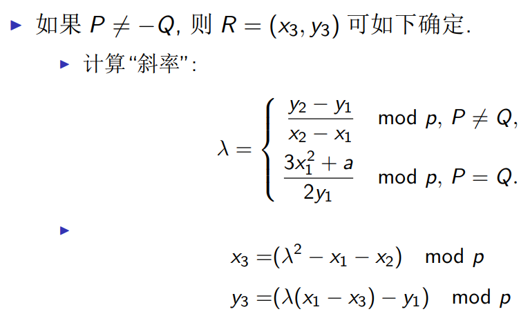
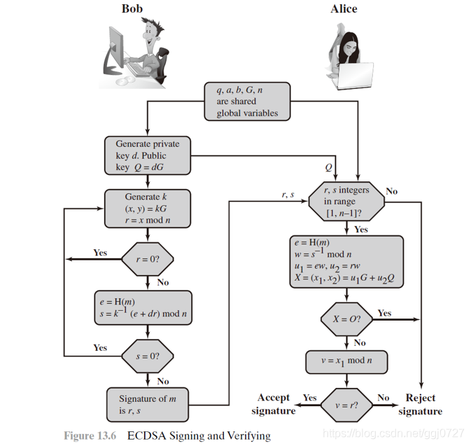
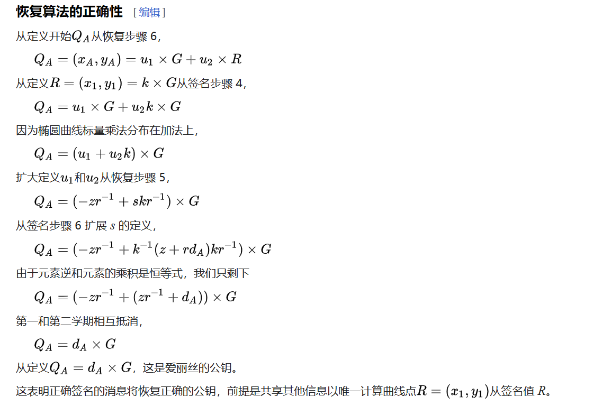
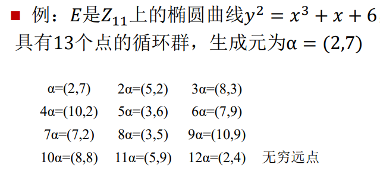
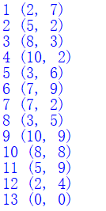
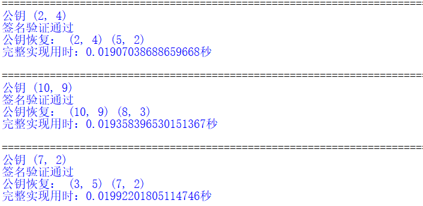
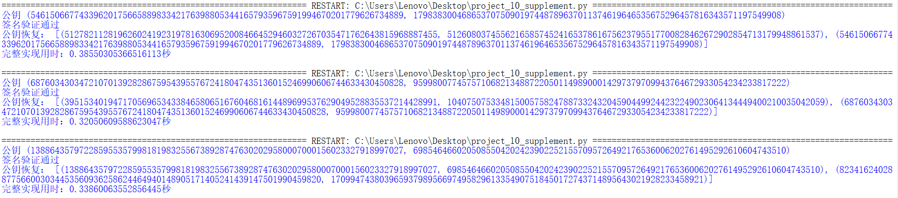
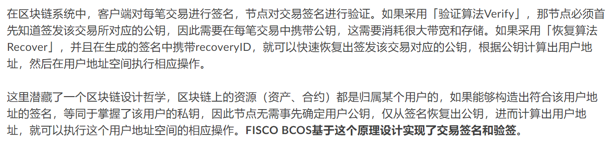

# report on the application of this deduce technique in Ethereum with ECDSA
# ECDSA

|         代码名称         |                      具体实现                       |
| :----------------------: | :-------------------------------------------------: |
|      project_10.py       |                 ECDSA签名的基础实现                 |
| project_10_supplement.py | ECDSA签名的完整实现（重点补充完整版的公钥恢复算法） |

## 0.椭圆曲线加法

素数域椭圆曲线加法规则如下：

> 
>
> 

> 注：假定后续在素数域中。

## 1. 实现原理
椭圆曲线数字签名算法（ECDSA）是使用椭圆曲线密码（ECC）对数字签名算法（DSA）的模拟，其安全性基于椭圆曲线离散对数问题。椭圆曲线离散对数问题远远难于传统的离散对数问题，因此椭圆曲线密码系统的单位比特强度要远高于传统的离散对数系统。其拥有计算参数小、密钥短、运算速度快等优势，在使用较短的密钥的情况下，ECC便可达到于DL系统相同安全级别。

### 1.1 公私钥生成算法
- 选择一条椭圆曲线 $E_p(a,b)$ 和基点 $G$
- 选择私钥 $d_A$ （ $d_A < n$ ， $n$ 为该 $G$ 的阶）， 利用基点 $G$ 计算公钥 $Q_A = d_A\cdot G$
### 1.2 签名生成算法
- 计算 $z=hash(m)$
- 选择一个随机整数 $k\in [1,n-1]$ 计算 $P = k\cdot G = (x_1,y_1)$
- 令 $r=x_1(mod\ n)$ 
- 计算 $s=k^{-1}(z+rd_A)(mod\ n)$
- 得到签名 $(r,s)$ ，如果 $r$ 或 $s$ 其中任意一方为 $0$ 则重新选择随机数 $k$ 再次计算
### 1.3 签名验证算法
- 公钥的验证（有一博客中提到，在此认为公钥不会存在问题，故忽略）
- 验证 $r$ 和 $s$ 均是处于 $[1,n-1]$ 范围内的整型数，否则验证失败
- 计算 $z=hash(m)$
- 计算 $u_1 = zs^{-1}(mod\ n),u_2 = rs^{-1}(mod\ n)$
- 计算点 $(x_1,y_1)=u_1G+u_2Q_A$
- 验证等式： $r = x_1(mod\ n)$
- 如果等式成立输出 $1$ ，否则输出 $0$
  


### 1.4 公钥恢复算法
- 验证 $r$ 和 $s$ 均是处于 $[1,n-1]$ 范围内的整型数，否则签名无效
- 计算曲线点 $R = (x_1,y_1)$ ， $x_1$ 是 $r,r + n,r + 2n$ 等其中之一， $y_1$ 是满足曲线方程的值
- 计算 $z=hash(m)$
- 计算 $u_1 = -zr^{-1}(mod\ n),u_2 = sr^{-1}(mod\ n)$
- 计算点 $Q_A=(x_A,y_A)=u_1G+u_2R$ ，此为可能的公钥（签名方可附加一些额外信息以帮助验证方确定唯一密钥）

节选自参考文献[3]：



> 注：参考文献[3]中有对算法正确性的证明。

## 2. 实现过程
选择的椭圆曲线以及基点如下：



为了方便椭圆曲线数字签名算法，首先需要实现求模逆、椭圆曲线加法、椭圆曲线乘法三个部分。

- 模逆运算：首先判断是否互质，如果不互质，那么没有模逆。
```python
def gcd(m,n): # 最大公因子
    if m%n==0:
        return n
    else:
        return gcd(n,m%n)

def inverse_mod(a,m): # 模逆
    if gcd(a,m)!=1: # 若a和m不互质，则无模逆
        return None 
    x1,x2,x3=1,0,a
    y1,y2,y3=0,1,m
    while y3!=0:
        q=x3//y3 
        y1,y2,y3,x1,x2,x3=(x1-q*y1),(x2-q*y2),(x3-q*y3),y1,y2,y3
    return x1%m
```

- 椭圆曲线加法：椭圆曲线加法的规则已经在最开始展示过了，因此不再赘述。
```python
def add(P,Q): # 椭圆曲线加法
    x1,y1=P
    x2,y2=Q
    if x1==y1==0:
        return (x2,y2)
    if x2==y2==0:
        return (x1,y1)
    if x1==x2:
        if y1==y2:
            n=(3*pow(x1,2)+a) # 分子
            m=(2*y1) # 分母
        else:
            return (0,0) # 无穷远点
    else:
        n=y2-y1
        m=x2-x1
        
    la=(n*inverse_mod(m,p))%p
    x3=(pow(la,2)-x1-x2)%p
    y3=(la*(x1-x3)-y1)%p
    return (x3,y3)
```

- 椭圆曲线乘法：相当于将乘法转化成多次加法。
```python
def mul(t,point): # 椭圆曲线乘法
    if t==0:
        return 0
    temp=point
    for i in range(t-1):
        temp=add(temp,point)
    return temp
```

由于椭圆曲线运算整个签名算法的基础，因此对此算法先做测试，经测试，结果无误。



- 公私钥生成算法
```python
def ECDSA_keygenerate(): #公私钥
    dA=random.randint(1,n-1)
    QA=mul(dA,G)
    return dA,QA
```

- 签名生成算法

```python
def ECDSA_sign(m,dA): # 签名
    z=sha_256(m)
    while True:
        k=random.randint(1,n-1)
        x1,_=mul(k,G)
        r=x1%n
        s=(inverse_mod(k,n)*(z+r*dA))%n
        if r!=0 and s!=0:
            return r,s
```

- 签名验证算法
```python
def ECDSA_verify(m,r,s,QA): # 验签
    if r<1 or r>n-1 or type(r)!=int or s<1 or s>n-1 or type(s)!=int:
        return False
    z=sha_256(m)
    inverse_s=inverse_mod(s,n)
    u1=(z*inverse_s)%n
    u2=(r*inverse_s)%n
    x1,_=add(mul(u1,G),mul(u2,QA))
    return r%n==x1%n
```

- 公钥恢复算法：由于选择的椭圆曲线等原因简化了该算法，只需令 $x_1=r$ 即可，并且在求解方程 $y_1^2=result(mod\ p)$ 时，由于后续选择的素数p模2余3，因此使用费马小定理来求解，最终得到了两个可能的公钥值，其中一个是正确的。
```python
def ECDSA_recover(m,r,s): # 恢复
    if r<1 or r>n-1 or type(r)!=int or s<1 or s>n-1 or type(s)!=int:
        return
    x1=r
    result=(pow(x1,3)+a*x1+b)%p
    y1_1=pow(result,(p+1)//4)%p
    y1_2=(-y1_1)%p
    R1=(x1,y1_1)
    R2=(x1,y1_2)
    z=sha_256(m)
    inverse_r=inverse_mod(r,n)
    u1=(-z*inverse_r)%n
    u2=(s*inverse_r)%n
    QA1=add(mul(u1,G),mul(u2,R1))
    QA2=add(mul(u1,G),mul(u2,R2))
    return QA1,QA2
```
## 3. 实现结果
随机测试了三次得到如下结果：



## 4. 补充完整实现
由于在后续项目中实现了椭圆曲线的快速乘法以及完整的求解二次剩余的算法，故在此补充一个更为完整的ECDSA，并使用比特币系统选用的secp256k1作为椭圆曲线参数，主要补充的是公钥恢复这一部分，增添了一些细节以达到普适性，实现时发现while循环中的部分有些类似于在ECMH中将哈希值转为椭圆曲线上的点的Try-and-Increment Method。

secp256k1椭圆曲线参数：

```python
n=0xFFFFFFFFFFFFFFFFFFFFFFFFFFFFFFFEBAAEDCE6AF48A03BBFD25E8CD0364141
p=0xFFFFFFFFFFFFFFFFFFFFFFFFFFFFFFFFFFFFFFFFFFFFFFFFFFFFFFFEFFFFFC2F
G=(0x79BE667EF9DCBBAC55A06295CE870B07029BFCDB2DCE28D959F2815B16F81798,0x483ada7726a3c4655da4fbfc0e1108a8fd17b448a68554199c47d08ffb10d4b8)
a=0
b=7
```

```python
def ECDSA_recover(m,r,s): # 恢复
    if r<1 or r>n-1 or type(r)!=int or s<1 or s>n-1 or type(s)!=int:
        return
    lst=[]
    x1=r
    while True:
        if x1>=p:
            break
        result=(pow(x1,3)+a*x1+b)%p
        if is_quadratic_residue(result,p): 
            y1_1 = quadratic_residue(result, p)
            y1_2 = (-y1_1)%p
            R1=(x1,y1_1)
            R2=(x1,y1_2)
            lst.append([R1,R2])
        x1=x1+n

    z=sha_256(m)
    inverse_r=inverse_mod(r,n)
    u1=(-z*inverse_r)%n
    u2=(s*inverse_r)%n
    QA=[]
    for R in lst:
        QA1=add(mul(u1,G),mul(u2,R[0]))
        QA2=add(mul(u1,G),mul(u2,R[1]))
        QA.append(QA1)
        QA.append(QA2)
        
    return QA
```

实现结果：



## 5. 补充以太坊中使用ECDSA对交易签名的过程

Secp256k1是指比特币中使用的ECDSA的椭圆曲线参数。以太坊也使用了 Secp256k1。

对以太坊一笔交易进行签名的大致步骤如下：

- 对交易数据进行 RLP 编码。
- 对得到的编码进行哈希。
- 将哈希值与标识以太坊的特定字符串拼接在一起，再次哈希。（这一步是为了保证该签名仅在以太坊上可用）
- 使用ECDSA算法对得到的哈希进行签名。
- 将得到的签名与交易数据拼接，再次进行RLP编码，得到最终的签名消息。

由于可以从签名中恢复公钥，再从公钥中得到签名者地址，所以签名消息中的交易内容不需要包含发送者的地址。

节选自参考文献[6]：




## 5. 参考文献
[1] https://blog.csdn.net/qq_41546054/article/details/120667547

[2] https://blog.csdn.net/wcc19840827/article/details/103857971

[3] https://en.wikipedia.org/wiki/Elliptic_Curve_Digital_Signature_Algorithm

[4] https://blog.csdn.net/weixin_43867940/article/details/130258535

[5] http://www.secg.org/sec2-v2.pdf

[6] https://fisco-bcos-documentation.readthedocs.io/zh_CN/latest/docs/articles/3_features/36_cryptographic/ecdsa_analysis.html
