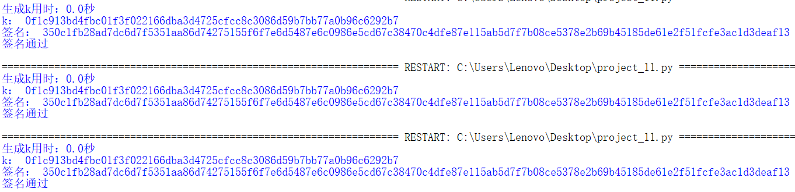
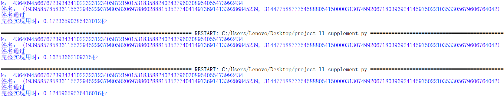

# impl sm2 with RFC6979
# 参照RFC6979文档生成k值

|         代码名称         |              具体实现              |
| :----------------------: | :--------------------------------: |
|       gmssl_sm2.py       |   gmssl库中sm2的实现（仅做展示）   |
|    sm2_sign_verify.py    |      sm2算法的签名和验签实现       |
|      project_11.py       | 调用gmssl库中的sm2签名算法完成实现 |
| project_11_supplement.py |  使用自编写的sm2签名算法完成实现   |

## 1. 实现原理
该部分在RFC6979文档的摘录如下：
```
3.2.  Generation of k
   Given the input message m, the following process is applied:
   a.  Process m through the hash function H, yielding:
          h1 = H(m)
       (h1 is a sequence of hlen bits).
   b.  Set:
          V = 0x01 0x01 0x01 ... 0x01
       such that the length of V, in bits, is equal to 8*ceil(hlen/8).
       For instance, on an octet-based system, if H is SHA-256, then V
       is set to a sequence of 32 octets of value 1.  Note that in this
       step and all subsequent steps, we use the same H function as the
       one used in step 'a' to process the input message; this choice
       will be discussed in more detail in Section 3.6.
   c.  Set:
          K = 0x00 0x00 0x00 ... 0x00
       such that the length of K, in bits, is equal to 8*ceil(hlen/8).
   d.  Set:
          K = HMAC_K(V || 0x00 || int2octets(x) || bits2octets(h1))
       where '||' denotes concatenation.  In other words, we compute
       HMAC with key K, over the concatenation of the following, in
       order: the current value of V, a sequence of eight bits of value
       0, the encoding of the (EC)DSA private key x, and the hashed
       message (possibly truncated and extended as specified by the
       bits2octets transform).  The HMAC result is the new value of K.
       Note that the private key x is in the [1, q-1] range, hence a
       proper input for int2octets, yielding rlen bits of output, i.e.,
       an integral number of octets (rlen is a multiple of 8).
   e.  Set:
          V = HMAC_K(V)
   f.  Set:
          K = HMAC_K(V || 0x01 || int2octets(x) || bits2octets(h1))
       Note that the "internal octet" is 0x01 this time.
   g.  Set:
          V = HMAC_K(V)
   h.  Apply the following algorithm until a proper value is found for
       k:
       1.  Set T to the empty sequence.  The length of T (in bits) is
           denoted tlen; thus, at that point, tlen = 0.
       2.  While tlen < qlen, do the following:
              V = HMAC_K(V)
              T = T || V
       3.  Compute:
              k = bits2int(T)
           If that value of k is within the [1,q-1] range, and is
           suitable for DSA or ECDSA (i.e., it results in an r value
           that is not 0; see Section 3.4), then the generation of k is
           finished.  The obtained value of k is used in DSA or ECDSA.
           Otherwise, compute:
              K = HMAC_K(V || 0x00)
              V = HMAC_K(V)
           and loop (try to generate a new T, and so on).
   Please note that when k is generated from T, the result of bits2int
   is compared to q, not reduced modulo q.  If the value is not between
   1 and q-1, the process loops.  Performing a simple modular reduction
   would induce biases that would be detrimental to signature security.
```

## 2. 实现过程

> 此部分的重点是生成k的过程。

主要实现生成k值的部分，sm2的签名和验签部分调用gmssl库进行实现（后续考虑补充自编写的代码）。->已补充的完整sm2 with RFC6979

- H函数：哈希算法采用sha256。
```python
def H(message): # sha256
    hash_message = hashlib.sha256(message)
    return hash_message.hexdigest()
```

- HMAC_K函数：使用hmac模块完成。
```python
def HMAC_K(k,m):
    k=bytes.fromhex(k)
    m=bytes.fromhex(m)
    return hmac.new(k,m,'sha256').hexdigest()
```
- RFC6979_gen_k函数：参考实验原理部分完成实现，其中int2octets和bits2octets由于整体全部使用16进制字符串，因此不必单独实现。
```python
def RFC6979_gen_k(m,x,q):
    h1=H(m) #a
    h_len=len(h1)*4
    V='01'*(ceil(h_len/8)) #b
    K='00'*(ceil(h_len/8)) #c
    K=HMAC_K(K,V+'00'+x+h1) #d
    V=HMAC_K(K,V) #e
    K=HMAC_K(K,V+'01'+x+h1) #f
    V=HMAC_K(K,V) #g
    while True: #h
        T=''
        while len(T)<64:
            V=HMAC_K(K,V)
            T=T+V
        k=int(T,16)
        if 0<k<int(q,16):
            return hex(k)[2:].zfill(64)
        K=HMAC_K(K,V+'00')
        V=HMAC_K(K,V)
```
## 3. 实现结果
三次k值均一致，因此说明代码实现成功。



## 4. 补充后的完整实现
使用上述的生成k的方法以及自编写实现的sm2签名算法实现一个完整版的sm2 with RFC6979，结果如下：



## 5. 参考文献

https://www.rfc-editor.org/rfc/rfc6979#section-3.2

https://sca.gov.cn/sca/xwdt/2010-12/17/content_1002386.shtml
