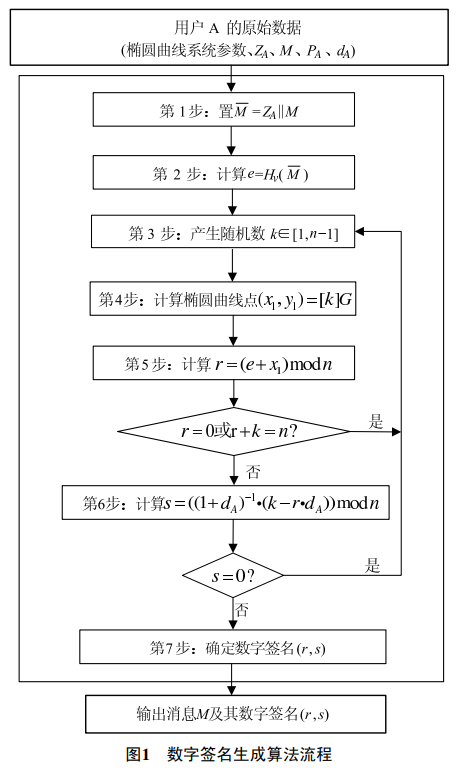
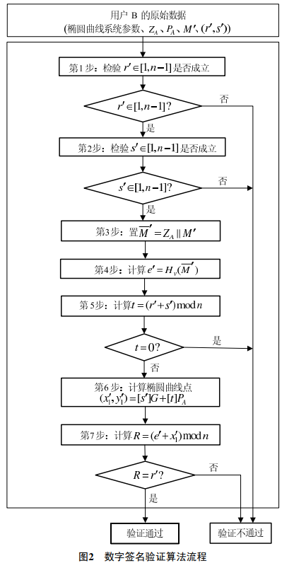
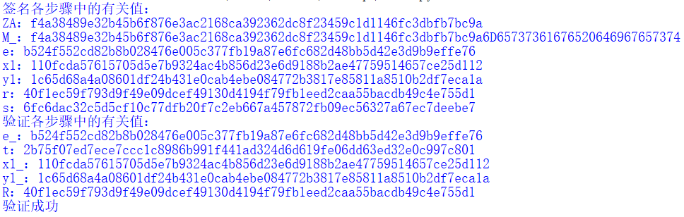

# 实现sm2算法的签名和验证

|      代码名称      |        具体实现         |
| :----------------: | :---------------------: |
| sm2_sign_verify.py | sm2算法的签名和验签实现 |

SM2算法和RSA算法都是公钥密码算法，SM2算法是一种更先进安全的算法，在我们国家商用密码体系中被用来替换RSA算法。 随着密码技术和计算机技术的发展，目前常用的1024位RSA算法面临严重的安全威胁，我们国家密码管理部门经过研究，决定采用SM2椭圆曲线算法替换RSA算法。

## 1. 实现过程
参照官方文档完成实现 https://sca.gov.cn/sca/xwdt/2010-12/17/content_1002386.shtml

> 


- 签名实现：
```python
def sm2_sign(M, ID, P, d):
    ENTL=hex(len(ID)*4)[2:].zfill(4)
    Z=H(ENTL+ID+hex(a)[2:].zfill(64)+hex(b)[2:].zfill(64)+hex(G[0])[2:].zfill(64)+hex(G[1])[2:].zfill(64)+hex(P[0])[2:].zfill(64)+hex(P[1])[2:].zfill(64))
    M_=Z+M
    e=H(M_)
    #k=random.randint(1,n-1)
    k=0x6CB28D99385C175C94F94E934817663FC176D925DD72B727260DBAAE1FB2F96F # 用于验证
    (x1,y1)=mul(k,G)
    r=(int(e,16)+x1)%n
    if r==0 or r+k==n:
        print("出错")
        return
    s=(inverse_mod(1+d,n)*(k-r*d))%n
    if s==0:
        print("出错")
        return
    return (r,s)
```

- 验证实现：
```python
def sm2_verify(M_,ID,sign,P):
    r_,s_=sign
    if r_<1 or r_>n-1 or s_<1 or s_>n-1:
        print("出错")
        return
    ENTL=hex(len(ID)*4)[2:].zfill(4)
    Z=H(ENTL+ID+hex(a)[2:].zfill(64)+hex(b)[2:].zfill(64)+hex(G[0])[2:].zfill(64)+hex(G[1])[2:].zfill(64)+hex(P[0])[2:].zfill(64)+hex(P[1])[2:].zfill(64))
    M__=Z+M_
    e_=H(M__)
    t=(r_+s_)%n
    if t==0:
        print("出错")
        return
    (x1_,y1_)=add(mul(s_,G),mul(t,P))
    R=(int(e_,16)+x1_)%n
    return R==r_
```

## 2. 实现验证
使用附录中示例1的消息、ID值、椭圆曲线、公私钥以及随机数k作为验证。
```python
p=0x8542D69E4C044F18E8B92435BF6FF7DE457283915C45517D722EDB8B08F1DFC3
a=0x787968B4FA32C3FD2417842E73BBFEFF2F3C848B6831D7E0EC65228B3937E498
b=0x63E4C6D3B23B0C849CF84241484BFE48F61D59A5B16BA06E6E12D1DA27C5249A
G=(0x421DEBD61B62EAB6746434EBC3CC315E32220B3BADD50BDC4C4E6C147FEDD43D,0x0680512BCBB42C07D47349D2153B70C4E5D7FDFCBFA36EA1A85841B9E46E09A2)
n=0x8542D69E4C044F18E8B92435BF6FF7DD297720630485628D5AE74EE7C32E79B7

M="6D65737361676520646967657374"
ID="414C494345313233405941484F4F2E434F4D"

P=(0x0AE4C7798AA0F119471BEE11825BE46202BB79E2A5844495E97C04FF4DF2548A,0x7C0240F88F1CD4E16352A73C17B7F16F07353E53A176D684A9FE0C6BB798E857)
d=0x128B2FA8BD433C6C068C8D803DFF79792A519A55171B1B650C23661D15897263
k=0x6CB28D99385C175C94F94E934817663FC176D925DD72B727260DBAAE1FB2F96F # 用于验证
```
中间值以及签名结果和验证结果：




经验证，与官方文档结果一致。

> 注：后续在使用该加密解密时，使用推荐曲线参数。

