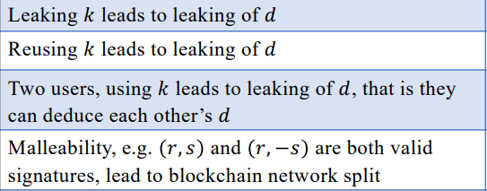

此处对应的是3个签名算法的前4个pitfall。

|       代码名称       |                           具体实现                           |
| :------------------: | :----------------------------------------------------------: |
|       func.py        |                        共用的密码算法                        |
|       ECDSA.py       |                      实现ECDSA签名算法                       |
|  ECDSA_pitfall_1.py  |             泄露随机数k导致私钥d的泄露（ECDSA）              |
|  ECDSA_pitfall_2.py  |           重复使用随机数k导致私钥d的泄露（ECDSA）            |
|  ECDSA_pitfall_3.py  | 两个用户使用相同的随机数k导致对方能够知道自己的私钥d（ECDSA） |
|  ECDSA_pitfall_4.py  |            (r,s) 和 (r,-s) 都是有效签名（ECDSA）             |
|      Schnorr.py      |                     实现Schnorr签名算法                      |
| Schnorr_pitfall_1.py |            泄露随机数k导致私钥d的泄露（Schnorr）             |
| Schnorr_pitfall_2.py |          重复使用随机数k导致私钥d的泄露（Schnorr）           |
| Schnorr_pitfall_3.py | 两个用户使用相同的随机数k导致对方能够知道自己的私钥d（Schnorr） |
|        sm2.py        |                       实现sm2签名算法                        |
|   sm2_pitfall_1.py   |              泄露随机数k导致私钥d的泄露（sm2）               |
|   sm2_pitfall_2.py   |            重复使用随机数k导致私钥d的泄露（sm2）             |
|   sm2_pitfall_3.py   | 两个用户使用相同的随机数k导致对方能够知道自己的私钥d（sm2）  |

