# verify the above pitfalls with proof-of-concept code

此部分对代码名称对应的具体实现表格放到了文件夹1-4以及文件夹7的说明文档中。

## 1. 实现原理
该项目涉及到3个签名算法，分为7个部分：

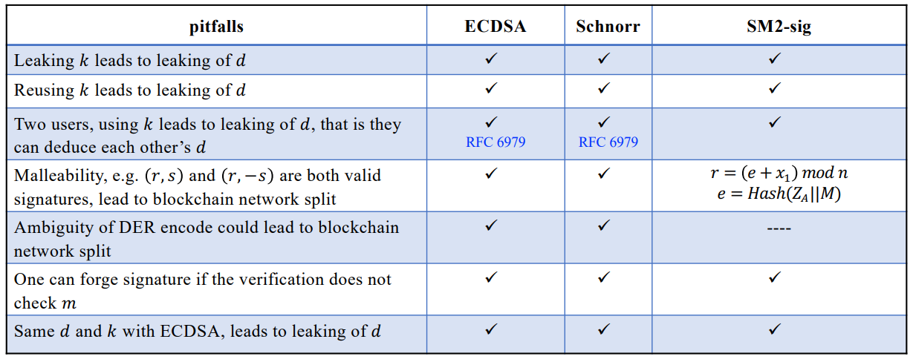

- **泄露随机数k导致私钥d的泄露**
  
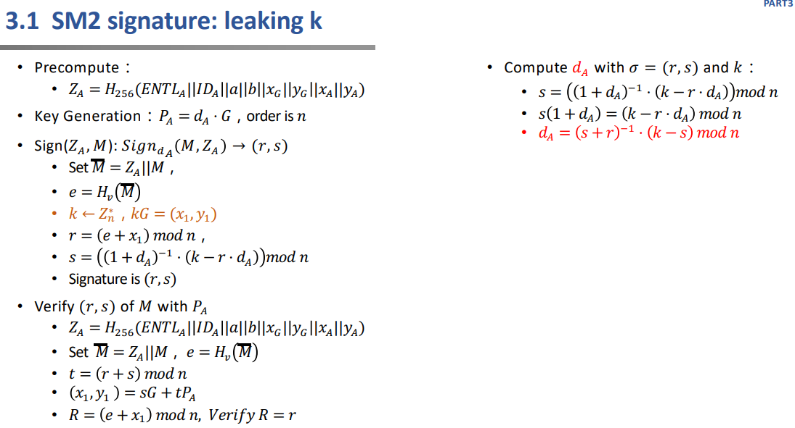

- **重复使用随机数k导致私钥d的泄露**

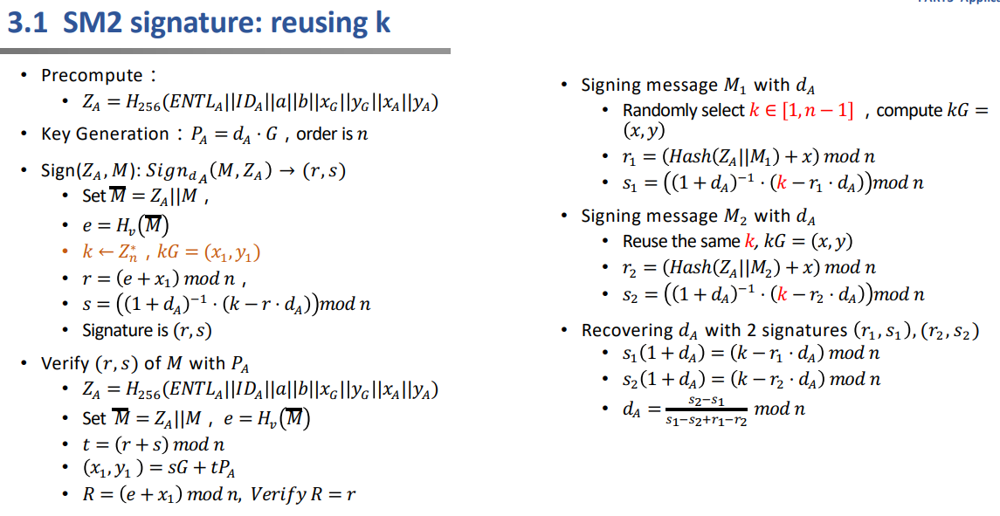

- **两个用户使用相同的随机数k导致对方能够知道自己的私钥d**

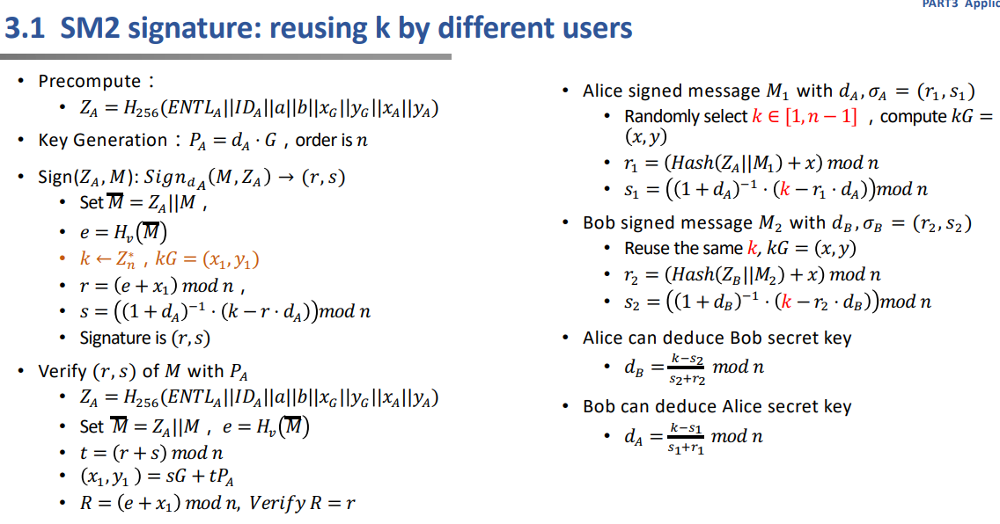

- **(r,s) 和 (r,-s) 都是有效签名**

本质上是因为椭圆曲线的横坐标对应两个纵坐标（排除纵坐标为0的点）。

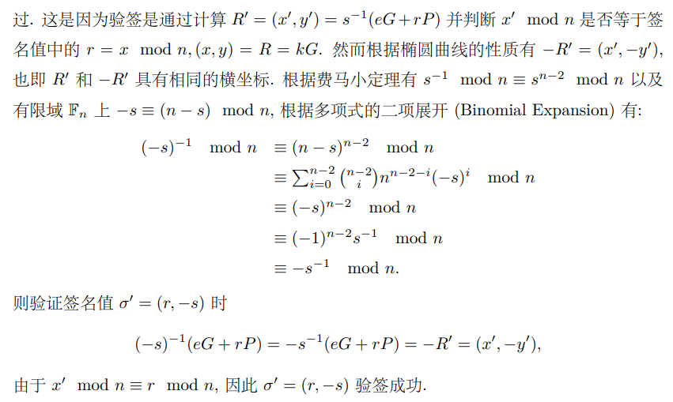

- **DER 编码的模糊性可能导致区块链网络分裂**

DER 编码是 ASN.1 (Abstract Syntax Notation One) 编码中的一种编码规则. ASN.1 中另外支持的编码规则包括 BER (Basic Encoding Rules) 和 CER( Canonical Encoding Rules). 其中 DER 和 CER编码规则完全指定了编码规则, 也即对于特定的数据仅有一个编码值是合法的. DER 针对数据长度的不同, 有两种方式来编码数据载荷的长度: Short Encoding 和 Long Encoding, 并规定当数据载荷的长度小于 128 个字节时,应当使用 Short Encoding. 基于 secp256k1 曲线的 ECDSA 签名值中的 r, s 都是 32 字节的整数, 所以采用的是 Short Encoding 的 DER 编码方式.

Bitcoin 中从 OpenSSL 中继承了签名值的 DER 编码方式, 这是因为早期的 Bitcoin 的密码能力通过 OpenSSL 实现, 而 OpenSSL 中 ECDSA 签名操作返回的是使用 DER 编码后的签名值. 由于签名值中的 r, s 都是证书, 接下来仅考虑对 INTEGER 的编码方式.对 INTEGER 的编码基本上是以字节为基本单位将整数表达成 256 进制表示, 编码规则同时要求对于正数 (r, s 是正数), 第一个字节的最高位必须为 0, 如果第一个字节的最高位为 1, 则需要在第一个字节之前添加一个全零字节. 另外 DER 编码规则同时规定, 对于所有可能的编码值中, 选用最短的编码值作为合法的签名值:

The Distinguished Encoding Rules specify we must choose the shortest encoding that fully represents the length of the element.The encoded lengths do not include the ASN.1 header or length bytes, simply the payload.

理论或者设想总是美好的, 但是在具体实现时经常出现偏离规则的情况, 正如 OpenSSL 的实现中 DER 解码时候也会接受没有严格遵循前述规则的 DER 编码:

One specifically critical area is the encoding of signatures. Until recently, OpenSSL’s releases would accept various deviations from the DER standard and accept signatures as valid. When this changed in OpenSSL 1.0.0p and 1.0.1k, it made some nodes reject the chain.

在区块链场景中会引发的问题, 如果各个节点运行的 OpenSSL 版本不同, 则对于一个没有遵循 DER 规则的签名值编码, 可能会出现某些节点认为包含了这样签名的区块为合法区块, 而另一些节点则将该节点视为非法的区块, 从而导致网络的分裂. 因此, Bitcoin 中在 BIP-66 中对 Bitcoin 网络应该接收的签名的 DER 编码做了更为严格的限制.


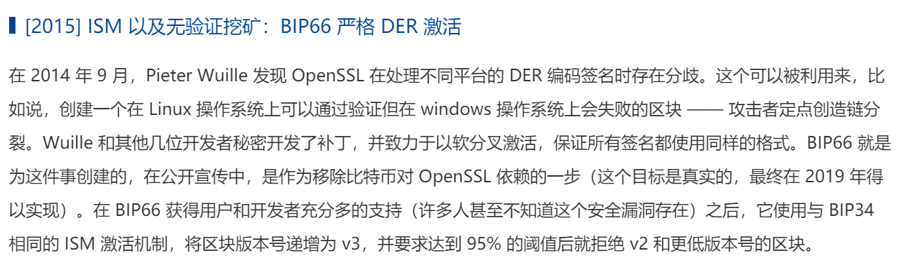


- **伪造签名**

此部分放到第19个项目（伪造中本聪签名）处实现。

- **Schnorr或SM2-sig与ECDSA使用相同的随机数k和私钥d会导致d的泄露**

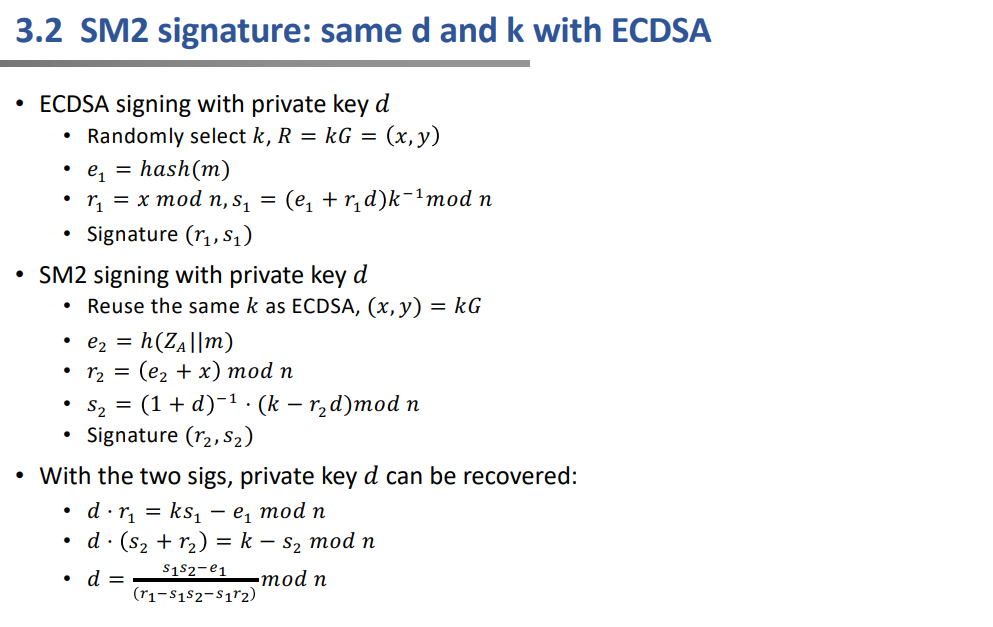


下图为3个签名算法的流程：
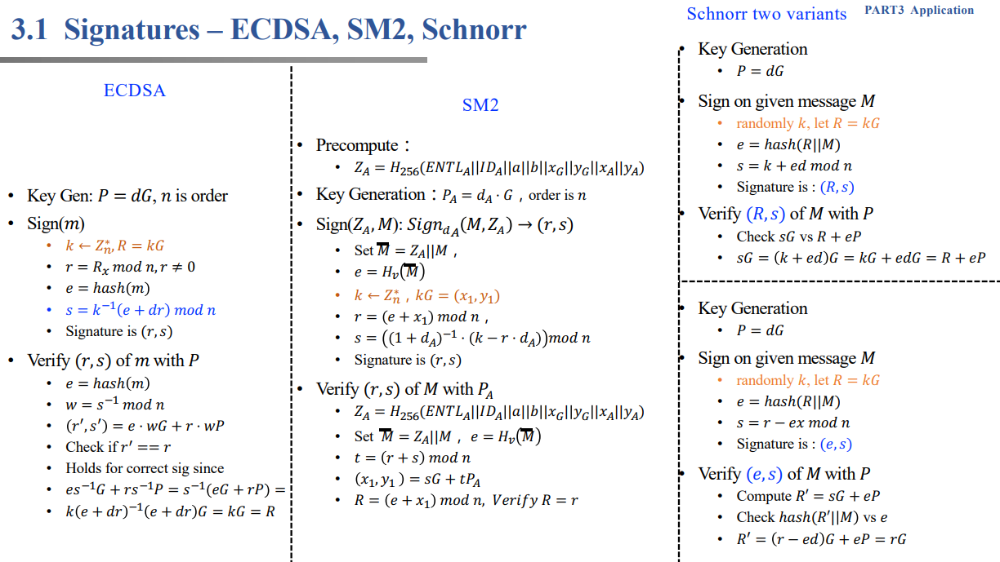

> 注：Schnorr签名使用第一种，为了统一，后续椭圆曲线均使用SM2椭圆曲线公钥密码算法推荐曲线参数，哈希函数均使用SM3。

## 2. 实现过程与结果
### 2.0 签名算法的实现结果
- ECDSA
  
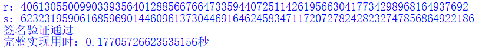

- Schnorr

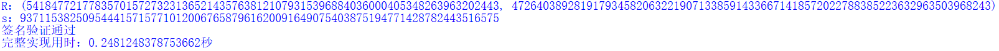

- SM2
  
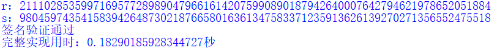


### 2.1 泄露随机数k导致私钥d的泄露

实现时只需考虑到签名过程中最终所使用的求s的等式即可，因为该式中只有k和d两个未知量，若k已知，那么可求解出d。

- ECDSA
  
$s=k^{-1}(e+dr)\ mod\ n$，因此 $d=r^{-1}(sk-e)\ mod\ n$

```python
def ECDSA_pitfall_1(m,r,s,k):
    z=H(m.hex())
    z=int(z,16)
    d=(inverse_mod(r,n)*(s*k-z))%n
    return d
```

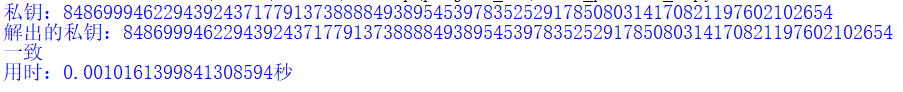

- Schnorr
  
$s=k+ed\ mod\ n$，因此 $d=e^{-1}(s-k)\ mod\ n$

```python
def Schnorr_pitfall_1(M,R,s,k):
    e=H(hex(R[0])[2:]+hex(R[1])[2:]+M.hex())
    d_=(inverse_mod(int(e,16),n)*(s-k))%n
    return d_
```

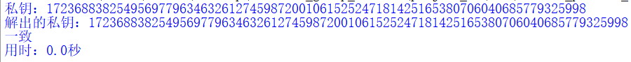


- SM2
  
$s={(1+d_A)}^{-1}(k-rd_A)\ mod\ n$，因此 $d_A={(s+r)}^{-1}(k-s)\ mod\ n$

```python
def sm2_pitfall_1(sign,k):
    r,s=sign
    d_=(inverse_mod(s+r,n)*(k-s))%n
    return d_
```

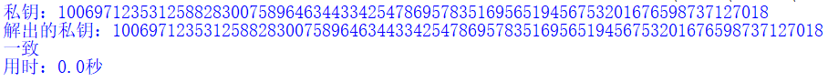


### 2.2 重复使用随机数k导致私钥d的泄露

- ECDSA

$s_1=k^{-1}(e_1+dr)\ mod\ n$       
$s_2=k^{-1}(e_2+dr)\ mod\ n$ 

其中r只与k有关，k相同因此r也相同，最终整理可得 $d=(s_2e_1-s_1e_2){(r(s_1-s_2))}^{-1}\ mod\ n$
```python
def ECDSA_pitfall_2(m1,m2,r,s1,s2):
    z1=H(m1.hex())
    z1=int(z1,16)
    z2=H(m2.hex())
    z2=int(z2,16)
    d=((s2*z1-s1*z2)*inverse_mod(r*(s1-s2),n))%n
    return d
```

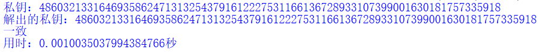

- Schnorr

$s_1=k+e_1d\ mod\ n$          
$s_2=k+e_2d\ mod\ n$

R只与k有关，最终整理可得 $d=(s_1-s_2){(e_1-e_2)}^{-1}\ mod\ n$

```python
def Schnorr_pitfall_2(M1,M2,R,s1,s2):
    e1=H(hex(R1[0])[2:]+hex(R[1])[2:]+M1.hex())
    e2=H(hex(R2[0])[2:]+hex(R[1])[2:]+M2.hex())
    d_=(inverse_mod(int(e1,16)-int(e2,16),n)*(s1-s2))%n
    return d_
```

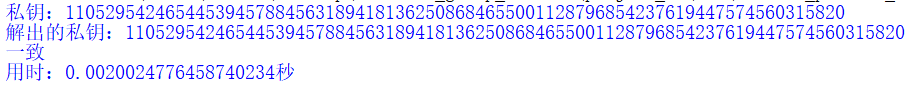


- SM2

$s_1={(1+d_A)}^{-1}(k-r_1d_A)\ mod\ n$          
$s_2={(1+d_A)}^{-1}(k-r_2d_A)\ mod\ n$

最终整理可得 $d_A=(s_2-s_1){(s_1-s_2+r_1-r_2)}^{-1}\ mod\ n$

```python
def sm2_pitfall_2(sign1,sign2):
    r1,s1=sign1
    r2,s2=sign2
    d_=(inverse_mod(s1-s2+r1-r2,n)*(s2-s1))%n
    return d_
```

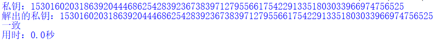

### 2.3 两个用户使用相同的随机数k导致对方能够知道自己的私钥d

本质上和2.1类似，因为使用了相同的随机数k，相当于双方均可以使用这个已知的k求解出对方的私钥（PPT中使用此种方式，后续同样使用该方式完成实现）。

也可以不使用k，使用自己的私钥求解对方的私钥，以ECDSA为例，该方法最终求解等式为：

$d_1=(s_1e_2+s_1d_2r-s_2e_1){(s_2r)}^{-1}\ mod\ n$             
$d_2=(s_2e_1+s_2d_1r-s_1e_2){(s_1r)}^{-1}\ mod\ n$

- ECDSA

$s_1=k^{-1}(e_1+d_1r)\ mod\ n$       
$s_2=k^{-1}(e_2+d_2r)\ mod\ n$ 

其中r只与k有关，k相同因此r也相同，最终整理可得

$d_1=r^{-1}(s_1k-e_1)\ mod\ n$           
$d_2=r^{-1}(s_2k-e_2)\ mod\ n$

```python
def ECDSA_pitfall_3(m,r,s,k):
    z=H(m.hex())
    z=int(z,16)
    d=(inverse_mod(r,n)*(s*k-z))%n
    return d
```

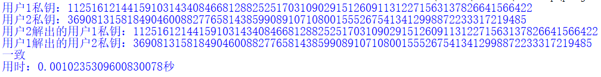

- Schnorr

$s_1=k+e_1d_1\ mod\ n$          
$s_2=k+e_2d_2\ mod\ n$

R只与k有关，最终整理可得 

$d_1=e_1^{-1}(s_1-k)\ mod\ n$                         
$d_2=e_2^{-1}(s_2-k)\ mod\ n$

```python
def Schnorr_pitfall_3(M,R,s,k):
    e=H(hex(R[0])[2:]+hex(R[1])[2:]+M.hex())
    d_=(inverse_mod(int(e,16),n)*(s-k))%n
    return d_
```

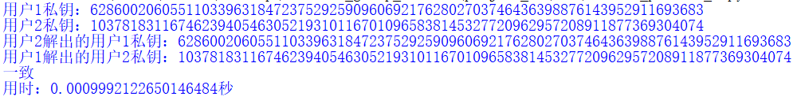


- SM2

$s_1={(1+d_A)}^{-1}(k-r_1d_A)\ mod\ n$          
$s_2={(1+d_B)}^{-1}(k-r_2d_B)\ mod\ n$

最终整理可得

$d_A={(s_1+r_1)}^{-1}(k-s_1)\ mod\ n$             
$d_B={(s_2+r_2)}^{-1}(k-s_2)\ mod\ n$

```python
def sm2_pitfall_3(sign,k):
    r,s=sign
    d_=(inverse_mod(s+r,n)*(k-s))%n
    return d_
```

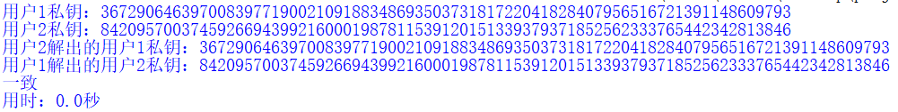

### 2.4 (r,s) 和 (r,-s) 都是有效签名

分别使用(r,s) 和 (r,-s)验签。经过分析，本质上是因为在椭圆曲线上同一个横坐标对应了两个纵坐标（排除纵坐标为0的点），也就是说如果只比对横坐标的话，那么有可能存在纵坐标并不一致的现象。

- ECDSA

```python
if ECDSA_verify(m,r,s,QA): # (r,s)
    print("(r,s)签名验证通过")
else:
    print("(r,s)签名验证失败")
    
if ECDSA_verify(m,r,n-s,QA): # (r,-s)
    print("(r,-s)签名验证通过")
else:
    print("(r,-s)签名验证失败")
```
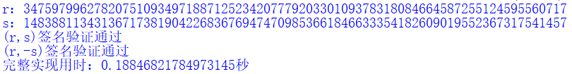

> 注：Schnorr签名如果验证时只比对横坐标，那么以上两种均为有效签名。

### 2.5 Schnorr或SM2-sig与ECDSA使用相同的随机数k和私钥d会导致d的泄露
- ECDSA and Schnorr
  
$s_1=k^{-1}(e_1+dr)\ mod\ n$      
$s_2=k+e_2d\ mod\ n$

最终整理可得 $d=(s_1s_2-e_1){(r+e_2s_1)}^{-1}\ mod\ n$

```python
def pitfall_7(M,r,s1,R,s2):
    e1=int(H(M.hex()),16)
    e2=int(H(hex(R[0])[2:]+hex(R[1])[2:]+M.hex()),16)
    d_=((s1*s2-e1)*inverse_mod(r+e2*s1,n))%n
    return d_
```

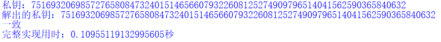


- ECDSA and SM2-sig

$s_1=k^{-1}(e_1+dr_1)\ mod\ n$         
$s_2={(1+d)}^{-1}(k-r_2d)\ mod\ n$

最终整理可得 $d=(s_1s_2-e_1){(r_1-s_1s_2-s_1r_2)}^{-1}\ mod\ n$

```python
def pitfall_7(M,r1,s1,r2,s2):
    e1=int(H(M.hex()),16)
    d_=((s1*s2-e1)*inverse_mod(r1-s1*s2-s1*r2,n))%n
    return d_
```

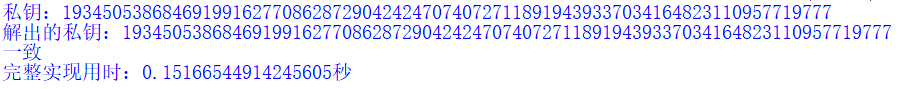

> 注：考虑到如果将每个签名算法的pitfalls都写在一起可能会有些混乱（需要对签名函数略微调整），因此将每个pitfall分文件实现。

### 参考文献
https://blog.csdn.net/qq_41546054/article/details/122283955

https://www.odaily.news/post/5173024

https://crypto-in-action.github.io/ecdsa-blockchain-dangers/190816-secp256k1-ecdsa-dangers.pdf

> 注：最后一个参考文献是在查询 DER编码导致区块链网络分裂 时查询到的，找到该文档后发现其对ECDSA的问题写的非常详细，只可惜我在查到该论文时，其余部分已经完成实现以及撰写完了文档，因此只补充了 两个用户使用相同的随机数k导致对方能够知道自己的私钥d 的第二种方法 以及 (r,s) 和 (r,-s) 都是有效签名这部分的证明，后续考虑继续阅读补充，相见恨晚:cry:。
