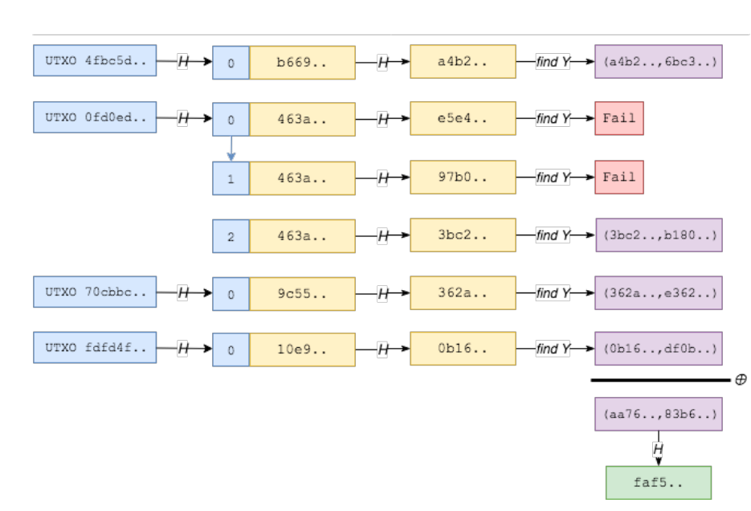
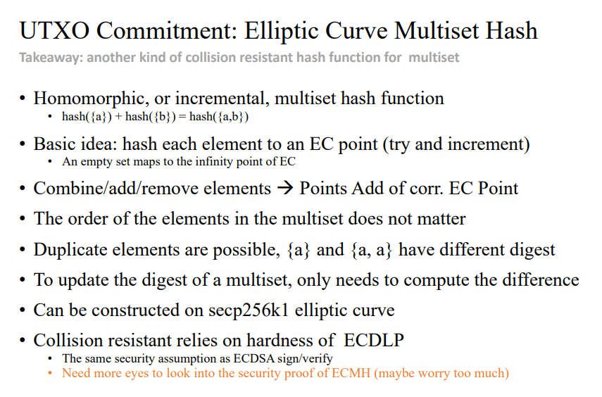
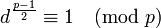
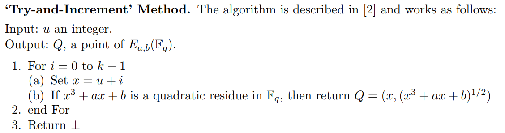
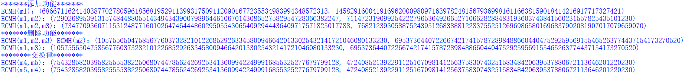

# Implement the above ECMH scheme

|   代码名称    |   具体实现   |
| :-----------: | :----------: |
| project_13.py | 实现ECMH算法 |

## 1. 实现原理





- 大致思路为将哈希值映射成椭圆曲线上的点，然后使用椭圆曲线上的加法。
  
- ECMH commitment
  
ECMH可以把多个数据的 hash 合并到一个 hash 中，但还可以支持删除。这样节点维护一个 UTXO 的根 hash 的成本就很低了，每次只需做增量修改。然后只需要把 UTXO 根 hash 记录到区块上，其他节点同步 UTXO 集合之后，就可以验证该集合是否被篡改了。但这个方案的缺点是只能做全量验证，没办法验证单独一个 UTXO 是否存在。


## 2. 具体实现

- 使用的椭圆曲线参数（secp256k1）：


```python
n=0xFFFFFFFFFFFFFFFFFFFFFFFFFFFFFFFEBAAEDCE6AF48A03BBFD25E8CD0364141
p=0xFFFFFFFFFFFFFFFFFFFFFFFFFFFFFFFFFFFFFFFFFFFFFFFFFFFFFFFEFFFFFC2F
G=(0x79BE667EF9DCBBAC55A06295CE870B07029BFCDB2DCE28D959F2815B16F81798,0x483ada7726a3c4655da4fbfc0e1108a8fd17b448a68554199c47d08ffb10d4b8)
a=0
b=7
```

- 后续需要判断二次剩余以及求解二次剩余。

使用欧拉准则判断二次剩余： 当且仅当该式成立为二次剩余。

```python
def is_quadratic_residue(a,p): # 欧拉准则
    return pow(a,(p-1)//2,p)==1 
```

求解二次剩余：参考博客[1]中的方法求解二次剩余，当然如果模p余3那么可以直接使用费马小定理，值有两个最终返回较小的值。

```python
def quadratic_residue(a,p):
    if p%4==3:
        result=pow(a,(p+1)//4,p)
        if result>p-result:
            return p-result
        return result
    
    while True: # 找到一个非二次剩余
        b=random.randint(1,p-1)
        if is_quadratic_residue(b,p)==False:
            break
    temp=p-1
    t=0
    while True:
        if temp%2!=0:
            break
        temp=temp//2
        t=t+1
    s=(p-1)//pow(2,t)

    x=[0]*t
    w=[0]*t
    x[t-1]=pow(a,(s+1)//2,p)
    w[t-1]=(inverse_mod(a,p)*pow(x[t-1],2,p))%p
    for i in range(t-1,0,-1):
        if pow(w[i],pow(2,i-1),p)==1:
            x[i-1]=x[i]
        else:
            la=pow(b,pow(2,t-i-1)*s,p)
            x[i-1]=(la*x[i])%p
            
        w[i-1]=(inverse_mod(a,p)*pow(x[i-1],2,p))%p

    if x[0]>p-x[0]:
        return p-x[0]
    
    return x[0]
```

- 首先将消息使用sha256进行哈希，然后参考论文中的Try-and-Increment Method方式将哈希值转为椭圆曲线上的点。


```python
def message_to_point(m): # Try-and-Increment Method
    h_m=sha_256(m)
    u=int(h_m,16)
    i = 0
    while True:
        x=(u+i)%p
        temp=(pow(x,3)+a*x+b)%p
        if is_quadratic_residue(temp,p): 
            y = quadratic_residue(temp, p)
            Q=(x, y)
            return Q
        i+=1
```

功能本质上就分为两个：添加和删除。

- 添加功能

```python
def ECMH_add(m,ECMH): # 添加
    ECMH_m=message_to_point(m)
    result=add(ECMH,ECMH_m)
    return result
```

- 删除功能

```python
def ECMH_delete(m,ECMH): # 删除
    ECMH_m=message_to_point(m)
    _ECMH_m=(ECMH_m[0],p-ECMH_m[1]) # -ECMH_m
    result=add(ECMH,_ECMH_m)
    return result
```

## 3. 实现结果



## 4. 参考文献
[1] https://blog.csdn.net/zhouyuheng2003/article/details/86685762

[2] https://blog.csdn.net/jason_cuijiahui/article/details/86711927

[3] https://eprint.iacr.org/2009/226.pdf
