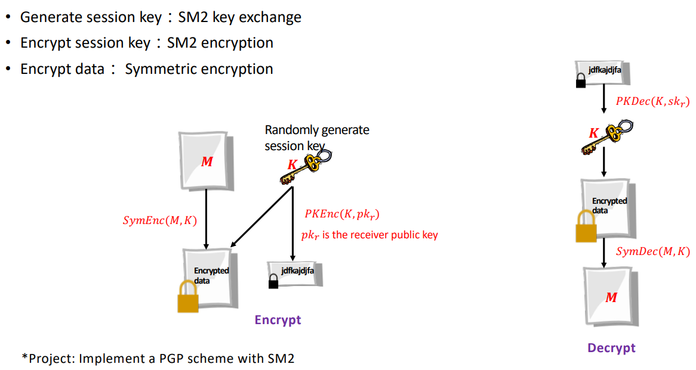
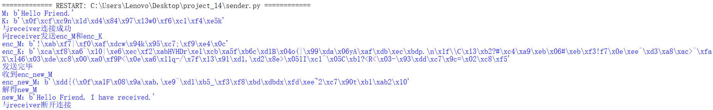
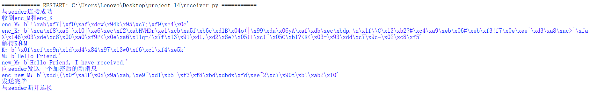

# Implement a PGP scheme with SM2
**最终实现了PGP协议以及sm2的密钥交换协议**

|     文件名称     |     具体实现      |
| :--------------: | :---------------: |
|       PGP        |   PGP协议的实现   |
| sm2_key_exchange | sm2密钥交换的实现 |

## 1. 实现原理

- 发送方：需要随机生成一个会话密钥K作为对称密钥K，然后用该密钥K加密消息M，还需要将该对称密钥K发送给接收方，以便接收方解密得到消息M，因此用接收方的公钥pk对会话密钥K进行公钥加密，最终将加密后的消息和会话密钥发送给接收方。
  
- 接收方：收到发送方传来的加密后的消息和会话密钥后，首先需要使用自己的私钥进行解密得到会话密钥K，进而解密得到消息M。
## 2. 实现过程
PGP分为两方：发送方和接收方，发送方作为服务端，接收方作为客户端。其中公钥密码算法使用sm2，对称密码算法使用sm4，均使用gmssl库完成。

> 注：认为发送方和接收方均为个人，并且为双向通讯，因此实际上并不需要明显区分服务端和客户端，在此认为发送方需要主动发起密钥协商（并不是向真正的服务端那样一直开启），并等待接收方加入协商过程，故将发送方作为服务端，接收方作为客户端，但反之也是合理的，其目的主要为通讯，因此不必纠结于服务端和客户端的身份。

### 2.1 算法库的使用
- sm2的加密解密（公钥密码）
```python
import base64
import binascii
from gmssl import sm2, func
#16进制的公钥和私钥
private_key = '00B9AB0B828FF68872F21A837FC303668428DEA11DCD1B24429D0C99E24EED83D5'
public_key = 'B9C9A6E04E9C91F7BA880429273747D7EF5DDEB0BB2FF6317EB00BEF331A83081A6994B8993F3F5D6EADDDB81872266C87C018FB4162F5AF347B483E24620207'
sm2_crypt = sm2.CryptSM2(
    public_key=public_key, private_key=private_key)

#数据和加密后数据为bytes类型
data = b"111"
enc_data = sm2_crypt.encrypt(data)
dec_data =sm2_crypt.decrypt(enc_data)
assert dec_data == data
```

- sm4的加密解密（对称密码）

```python
from gmssl.sm4 import CryptSM4, SM4_ENCRYPT, SM4_DECRYPT

key = b'3l5butlj26hvv313'
value = b'111' #  bytes类型

crypt_sm4 = CryptSM4()
crypt_sm4.set_key(key, SM4_ENCRYPT)
encrypt_value = crypt_sm4.crypt_ecb(value) #  bytes类型
crypt_sm4.set_key(key, SM4_DECRYPT)
decrypt_value = crypt_sm4.crypt_ecb(encrypt_value) #  bytes类型
assert value == decrypt_value
```

### 2.2 具体实现
- 使用socketserver模块-基于tcp协议通信。

- 为了方便后续的加密解密，将sm2和sm4的加密解密放入一个文件func4.py，方便后续发送方和接收方使用。
```python
def sm2_enc(p,pk):
    ······
def sm2_dec(c,sk):
    ······
def sm4_enc(p,k):
    ······
def sm4_dec(c,k):
    ······
```
- 主要过程在实验原理中已经提到过了，遂不再赘述。

发送方：
```python
print("与receiver连接成功")
print("向receiver发送enc_M和enc_K")
print("enc_M：{}".format(enc_M))
print("enc_K：{}".format(enc_K))
self.request.send(enc_M)
time.sleep(1)
self.request.send(enc_K)
print("发送完毕")
```
接收方：
```python
print("与sender连接成功")
enc_M = s.recv(1024)
enc_K = s.recv(1024)
print("收到enc_M和enc_K")
print("enc_M：{}".format(enc_M))
print("enc_K：{}".format(enc_K))
K=sm2_dec(enc_K,private_key)
M=sm4_dec(enc_M,K)
print("解得K和M")
print("K：{}".format(K))
print("M：{}".format(M))
```

- 由于发送方还需确认接收方是否成功收到会话密钥K，因此接收方需要发送一个使用会话密钥K加密得到的新消息，如果发送方成功解出有意义的内容，则认为协商会话密钥成功，后续可使用该会话密钥进行本次通讯。

发送方：
```python
enc_new_M= self.request.recv(1024)
print("收到enc_new_M")
print("enc_new_M：{}".format(enc_new_M))
new_M=sm4_dec(enc_new_M,K)
print("解得new_M")
print("new_M：{}".format(new_M))
```

接收方：
```python
new_M=b'Hello Friend, I have received.'
print("new_M：{}".format(new_M))
enc_new_M=sm4_enc(new_M,K)
print("向sender发送一个加密后的新消息")
print("enc_new_M：{}".format(enc_new_M))
s.send(enc_new_M)
print("发送完毕")
```
## 3. 实现结果
- 发送方
  



- 接收方
  

