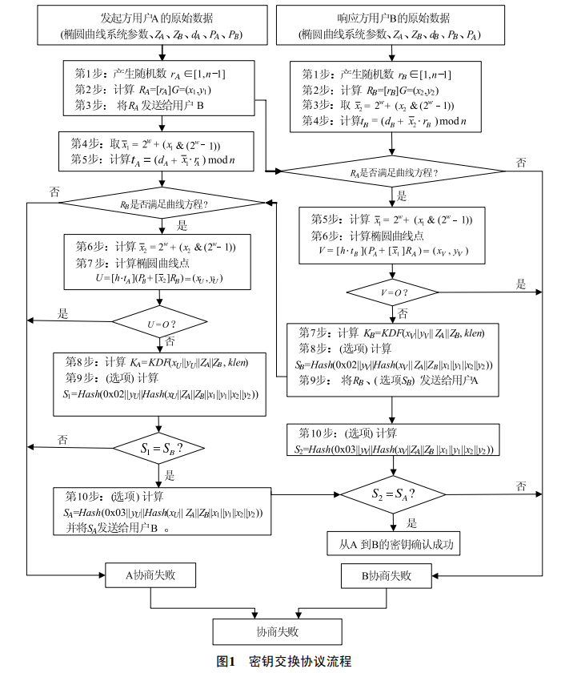
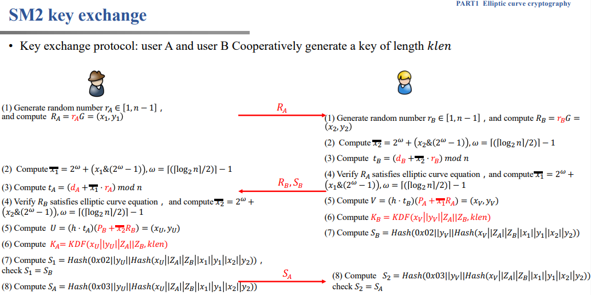
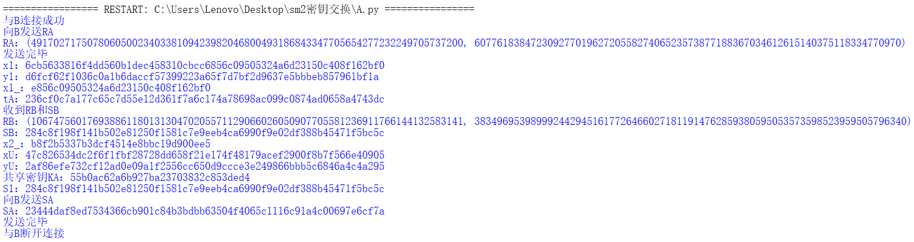
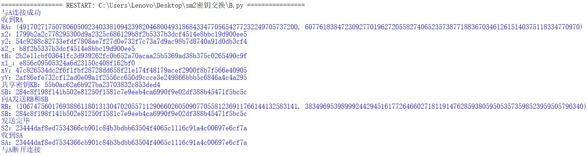

# 实现sm2算法的密钥交换
## 1. 实现过程
参照官方文档完成实现 https://sca.gov.cn/sca/xwdt/2010-12/17/content_1002386.shtml

> 
> 

## 2. 实现验证
使用附录中示例1的ID值、椭圆曲线、公私钥以及随机数k和协商获得密钥数据的长度klen比特作为验证。
```python
p=0x8542D69E4C044F18E8B92435BF6FF7DE457283915C45517D722EDB8B08F1DFC3
a=0x787968B4FA32C3FD2417842E73BBFEFF2F3C848B6831D7E0EC65228B3937E498
b=0x63E4C6D3B23B0C849CF84241484BFE48F61D59A5B16BA06E6E12D1DA27C5249A
G=(0x421DEBD61B62EAB6746434EBC3CC315E32220B3BADD50BDC4C4E6C147FEDD43D,0x0680512BCBB42C07D47349D2153B70C4E5D7FDFCBFA36EA1A85841B9E46E09A2)
n=0x8542D69E4C044F18E8B92435BF6FF7DD297720630485628D5AE74EE7C32E79B7

IDA="414C494345313233405941484F4F2E434F4D"
IDB="42494C4C343536405941484F4F2E434F4D"
klen=128

rA=0x83A2C9C8B96E5AF70BD480B472409A9A327257F1EBB73F5B073354B248668563 # 验证
rB=0x33FE21940342161C55619C4A0C060293D543C80AF19748CE176D83477DE71C80 # 验证

```

密钥交换的过程：

A：



B：



> 注：认为A和B均为个人，并且为双向通讯，因此实际上并不需要明显区分服务端和客户端，在此认为A需要主动发起密钥交换（并不是向真正的服务端那样一直开启），并等待B的加入，故将A作为服务端，B作为客户端，但反之也是合理的，其目的主要为通讯，因此不必纠结于服务端和客户端的身份。

经验证，与官方文档结果一致。

> 注：后续在使用该密钥交换协议时，使用推荐曲线参数。
