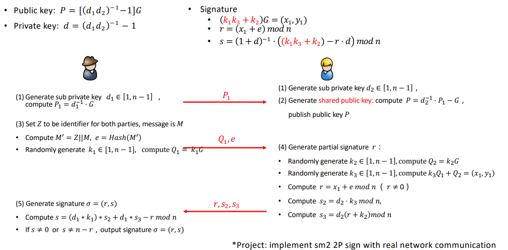
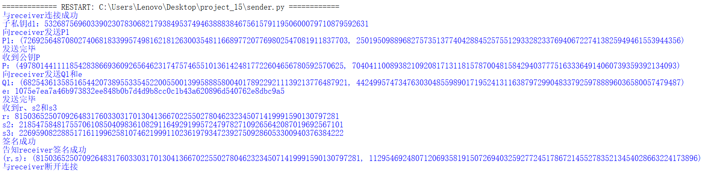
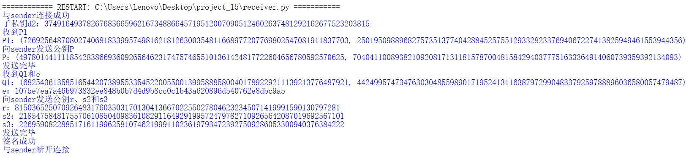

# implement sm2 2P sign with real network communication

|  代码名称   |    具体实现    |
| :---------: | :------------: |
|  func6.py   | 共用的密码算法 |
|  sender.py  |     发送方     |
| receiver.py |     接收方     |

> 注：运行时需要先运行sender.py再运行receiver.py。

## 1. 实现原理

## 2. 实现过程
- 选用推荐曲线参数：
```python
n=0xFFFFFFFEFFFFFFFFFFFFFFFFFFFFFFFF7203DF6B21C6052B53BBF40939D54123
p=0xFFFFFFFEFFFFFFFFFFFFFFFFFFFFFFFFFFFFFFFF00000000FFFFFFFFFFFFFFFF
G=(0x32c4ae2c1f1981195f9904466a39c9948fe30bbff2660be1715a4589334c74c7,0xbc3736a2f4f6779c59bdcee36b692153d0a9877cc62a474002df32e52139f0a0)
a=0xFFFFFFFEFFFFFFFFFFFFFFFFFFFFFFFFFFFFFFFF00000000FFFFFFFFFFFFFFFC
b=0x28E9FA9E9D9F5E344D5A9E4BCF6509A7F39789F515AB8F92DDBCBD414D940E93
```

- 参照实现原理中的流程实现即可
  
发送方：在签名成功后，告知接收方签名成功。
```python
print("与receiver连接成功")
d1=random.randint(1, n-1)
print("子私钥d1：{}".format(d1))
P1=mul(inverse_mod(d1, n),G)
print("向receiver发送P1")
print("P1：{}".format(P1))
self.request.send(str(P1).encode('utf-8'))
print("发送完毕")
P=self.request.recv(1024).decode('utf-8')
print("收到公钥P")
print("P：{}".format(P))
M='Hello Friend'
Z='Alice_Bob'
M_=Z+M
e=sha_256(M_)
k1=random.randint(1,n-1)
Q1=mul(k1, G)
print("向receiver发送Q1和e")
print("Q1：{}".format(Q1))
print("e：{}".format(e))
self.request.send(str(Q1).encode('utf-8'))
time.sleep(1)
self.request.send(e.encode('utf-8'))
print("发送完毕")

r=self.request.recv(1024).decode('utf-8')
s2=self.request.recv(1024).decode('utf-8')
s3=self.request.recv(1024).decode('utf-8')
print("收到r、s2和s3")
print("r：{}".format(r))
print("s2：{}".format(s2))
print("s3：{}".format(s3))

s=((d1*k1)*int(s2)+d1*int(s3)-int(r))%n
if s==0 and s==n-r:
    print("运算出错")
    sys.exit() # 退出程序
else:
    sign=(int(r),s)
    print("签名成功")
    print("告知receiver签名成功")
    self.request.send("签名成功".encode('utf-8'))
    print("(r,s)：{}".format(sign))
```

接收方：协助发送方完成签名。

```python
print("与sender连接成功")
d2=random.randint(1, n-1)
print("子私钥d2：{}".format(d2))
P1=s.recv(1024).decode('utf-8')
print("收到P1")
print("P1：{}".format(P1))
_G=(G[0],p-G[1]) #-G
P=add(mul(inverse_mod(d2,n),eval(P1)),_G)
print("向sender发送公钥P")
print("P：{}".format(P))
s.send(str(P).encode('utf-8'))
print("发送完毕")
Q1=s.recv(1024).decode('utf-8')
e=s.recv(1024).decode('utf-8')
print("收到Q1和e")
print("Q1：{}".format(Q1))
print("e：{}".format(e))
k2=random.randint(1, n-1)
Q2=mul(k2,G)
k3=random.randint(1, n-1)
(x1,x2)=add(mul(k3,eval(Q1)),Q2)

r=(x1+int(e,16))%n
if r==0:
    print("出错")
    sys.exit() # 退出程序
s2=(d2*k3)%n
s3=(d2*(r+k2))%n

print("向sender发送公钥r、s2和s3")
print("r：{}".format(r))
print("s2：{}".format(s2))
print("s3：{}".format(s3))
s.send(str(r).encode('utf-8'))
time.sleep(1)
s.send(str(s2).encode('utf-8'))
time.sleep(1)
s.send(str(s3).encode('utf-8'))
print("发送完毕")
result=s.recv(1024).decode('utf-8')
print(result)
```

> 注：认为发送方和接收方均为个人，并且为双方协作且为双向通讯，因此实际上并不需要明显区分服务端和客户端，在此认为发送方需要主动发起签名（并不是向真正的服务端那样一直开启），并等待接收方加入协作过程，故将发送方作为服务端，接收方作为客户端，但反之也是合理的，其目的主要为通讯，因此不必纠结于服务端和客户端的身份。

## 3. 实现结果
发送方：



接收方：


