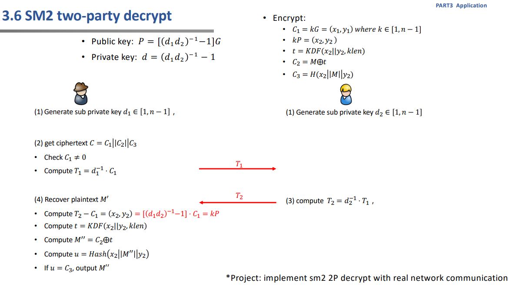
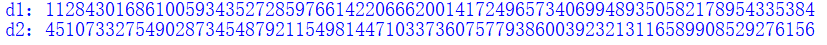
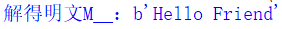
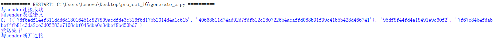
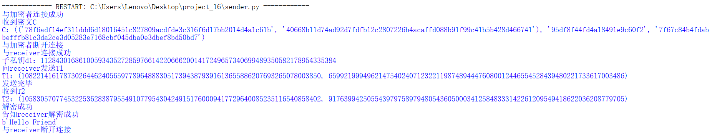
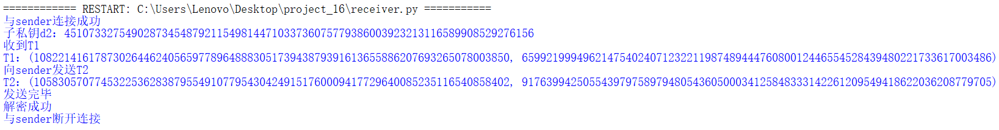

# implement sm2 2P decrypt with real network communication

|     代码名称      |        具体实现         |
| :---------------: | :---------------------: |
|     func9.py      |     共用的密码算法      |
| generate_d1_d2.py |   将私钥分为两个部分    |
|  sm2_enc_dec.py   | 自编写的sm2加密解密算法 |
|      test.py      |  未加入通讯的测试版本   |
|   generate_c.py   |         加密方          |
|     sender.py     |         发送方          |
|    receiver.py    |         接收方          |

> 注：通讯部分由generate_c.py、sender.py和receiver.py组成，运行时先运行generate_c.py再运行sender.py，完成第一阶段的通讯后，运行receiver.py完成第二阶段的通讯。

## 1. 实现原理


## 2. 实现过程

- 首先完成自编写sm2的加密解密算法，以便于后续实现网络通信。

- 选用推荐曲线参数以及博客中给出的对应的公私钥：
```python
n=0xFFFFFFFEFFFFFFFFFFFFFFFFFFFFFFFF7203DF6B21C6052B53BBF40939D54123
p=0xFFFFFFFEFFFFFFFFFFFFFFFFFFFFFFFFFFFFFFFF00000000FFFFFFFFFFFFFFFF
G=(0x32c4ae2c1f1981195f9904466a39c9948fe30bbff2660be1715a4589334c74c7,0xbc3736a2f4f6779c59bdcee36b692153d0a9877cc62a474002df32e52139f0a0)
a=0xFFFFFFFEFFFFFFFFFFFFFFFFFFFFFFFFFFFFFFFF00000000FFFFFFFFFFFFFFFC
b=0x28E9FA9E9D9F5E344D5A9E4BCF6509A7F39789F515AB8F92DDBCBD414D940E93
d=0x00B9AB0B828FF68872F21A837FC303668428DEA11DCD1B24429D0C99E24EED83D5
P=(0xB9C9A6E04E9C91F7BA880429273747D7EF5DDEB0BB2FF6317EB00BEF331A8308,0x1A6994B8993F3F5D6EADDDB81872266C87C018FB4162F5AF347B483E24620207)
```


- 由于必须双方共同才能完成解密，因此将私钥分为两个部分存储即可，应由一个可信方掌握私钥并将其拆分并分别告知双方。
```python
def generate_d1_d2(d,n):
    d1=random.randint(1, n-1)
    d1d2=inverse_mod(d+1,n) # d=(d1*d2)的-1次方-1
    d2=(d1d2*inverse_mod(d1,n))%n
    if (d-inverse_mod(d1*d2,n)+1)%n==0:
        return d1,d2
    else:
        return
```


- 然后需要有人发送加密后的消息让双方解密，由于步骤与双方签名相比，更为繁琐，因此先写一个不需要通讯的版本（test.py）进行测试，模拟全部流程。
> 注：后续将sm2加密解密相关函数放入func9.py。
```python
def sm2_dec(C,d1,d2):
    C1,C2,C3=C
    C1=(int(C1[0],16),int(C1[1],16))
    if C1[0]==0 and C1[0]==0:
        print("出错")
        return
    T1=mul(inverse_mod(d1, n),C1)
    _C1=(C1[0],p-C1[1]) #-C1
    T2=mul(inverse_mod(d2, n),T1)
    (x2,y2)=add(T2,_C1)
    klen=len(C2)*4
    t=KDF(hex(x2)[2:].zfill(64)+hex(y2)[2:].zfill(64),klen)
    M__=int(C2,16)^int(t,16)
    u=H(hex(x2)[2:].zfill(64)+hex(M__)[2:].zfill(klen//4)+hex(y2)[2:].zfill(64))
    if u==C3:
        return bytes.fromhex(hex(M__)[2:].zfill(klen//4))
```


最终实现成功。

- 接下来，进行通讯版本的实现，实现分为三方：加密方和两个解密方（发送方和接收方），首先是加密方与发送方通讯，将密文信息告知发送方，此时加密方作为服务端，发送方作为客户端，然后发送方在得知密文后，与接收方进行通讯，完成共同解密，此部分参照实现原理中的流程即可，此时发送方作为服务端，接收方作为客户端。

> 注：加密方首先确定为服务端，因为其需要向解密方提供密文，认为发送方和接收方均为个人，并且为双方协作且为双向通讯，因此实际上并不需要明显区分服务端和客户端，在此认为发送方需要主动发起解密（并不是向真正的服务端那样一直开启），并等待接收方加入协作过程，故将发送方作为服务端，接收方作为客户端，但反之也是合理的，其目的主要为通讯，因此不必纠结于服务端和客户端的身份。

- 加密方与发送方的通讯部分：加密方完成对明文的加密，并将密文发送给发送方，发送方完成接收密文。

加密方：
```python
print("与sender连接成功")
M=b"Hello Friend"
C=sm2_enc(M.hex(), P)
print("向sender发送密文")
print("C：{}".format(C))
self.request.send(str(C).encode('utf-8'))
print("发送完毕")
```
发送方：
```python
print("与加密者连接成功")
C = s.recv(1024).decode('utf-8')
print("收到密文C")
print("C：{}".format(C))
```

- 发送方与接收方通讯部分：参照实现原理中的流程。

发送方：
```python
print("与receiver连接成功")
d1=11284301686100593435272859766142206662001417249657340699489350582178954335384
print("子私钥d1：{}".format(d1))
C1,C2,C3=eval(C)
C1=(int(C1[0],16),int(C1[1],16))
if C1[0]==0 and C1[0]==0:
    print("出错")
    sys.exit() # 退出程序
T1=mul(inverse_mod(d1, n),C1)
print("向receiver发送T1")
print("T1：{}".format(T1))
self.request.send(str(T1).encode('utf-8'))
print("发送完毕")
T2=self.request.recv(1024).decode('utf-8')
print("收到T2")
print("T2：{}".format(T2))
_C1=(C1[0],p-C1[1]) #-C1
(x2,y2)=add(eval(T2),_C1)
klen=len(C2)*4
t=KDF(hex(x2)[2:].zfill(64)+hex(y2)[2:].zfill(64),klen)
M__=int(C2,16)^int(t,16)
u=H(hex(x2)[2:].zfill(64)+hex(M__)[2:].zfill(klen//4)+hex(y2)[2:].zfill(64))
if u==C3:
    print("解密成功")
    print("告知receiver解密成功")
    self.request.send("解密成功".encode('utf-8'))
    print(bytes.fromhex(hex(M__)[2:].zfill(klen//4)))
```

接收方：
```python
print("与sender连接成功")
d2=45107332754902873454879211549814471033736075779386003923213116589908529276156
print("子私钥d2：{}".format(d2))
T1=s.recv(1024).decode('utf-8')
print("收到T1")
print("T1：{}".format(T1))
T2=mul(inverse_mod(d2,n),eval(T1))
print("向sender发送T2")
print("T2：{}".format(T2))
s.send(str(T2).encode('utf-8'))
print("发送完毕")
result=s.recv(1024).decode('utf-8')
print(result)
```

## 3. 实现结果
加密方：



发送方：



接收方：


