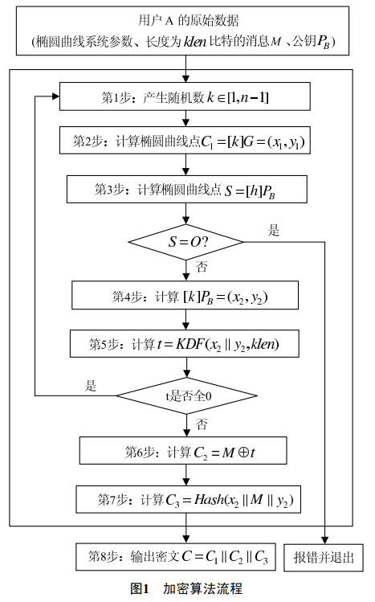
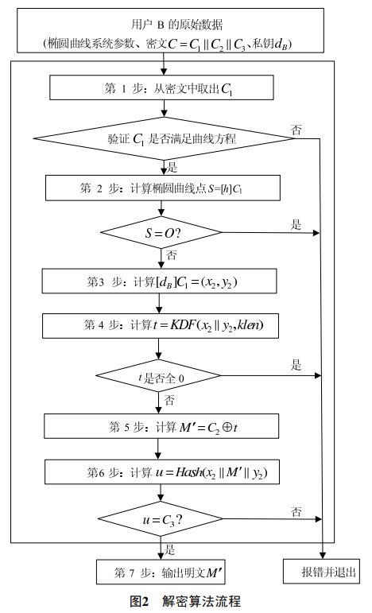
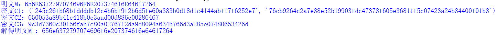

# 实现sm2算法的加密解密
## 1. 实现过程
参照官方文档完成实现 https://sca.gov.cn/sca/xwdt/2010-12/17/content_1002386.shtml

> 



## 2. 实现验证
使用附录中示例1的消息、椭圆曲线、公私钥以及随机数k作为验证。
```python
p=0x8542D69E4C044F18E8B92435BF6FF7DE457283915C45517D722EDB8B08F1DFC3
a=0x787968B4FA32C3FD2417842E73BBFEFF2F3C848B6831D7E0EC65228B3937E498
b=0x63E4C6D3B23B0C849CF84241484BFE48F61D59A5B16BA06E6E12D1DA27C5249A
G=(0x421DEBD61B62EAB6746434EBC3CC315E32220B3BADD50BDC4C4E6C147FEDD43D,0x0680512BCBB42C07D47349D2153B70C4E5D7FDFCBFA36EA1A85841B9E46E09A2)
n=0x8542D69E4C044F18E8B92435BF6FF7DD297720630485628D5AE74EE7C32E79B7
M="656E6372797074696F6E207374616E64617264"
P=(0x435B39CCA8F3B508C1488AFC67BE491A0F7BA07E581A0E4849A5CF70628A7E0A,0x75DDBA78F15FEECB4C7895E2C1CDF5FE01DEBB2CDBADF45399CCF77BBA076A42)
d=0x1649AB77A00637BD5E2EFE283FBF353534AA7F7CB89463F208DDBC2920BB0DA0
k=0x4C62EEFD6ECFC2B95B92FD6C3D9575148AFA17425546D49018E5388D49DD7B4F # 用于验证
```
加密结果和解密结果：


经验证，与官方文档结果一致。

> 注：后续在使用该加密解密时，使用推荐曲线参数。
