# 比较Firefox和谷歌的记住密码插件的实现区别
# PoC impl of the scheme, or do implement analysis by Google
首先对Google Password Checkup进行了实现，然后比较了Firefox和谷歌的记住密码插件的实现区别，并使用找到的开源代码对Firefox和谷歌的密码进行解密。

- Google Password Checkup

|     代码名称     |    具体实现    |
| :--------------: | :------------: |
|     func3.py     | 共用的密码算法 |
| Google_server.py |   谷歌服务器   |
|    client.py     |      用户      |

> 注：运行时需要先运行Google_server.py再运行client.py。

- 解密

|        代码名称         |              具体实现              |
| :---------------------: | :--------------------------------: |
| Firefox_password_dec.py | 开源代码中对火狐存在本地的密码解密 |
|  Google_password_dec.py  | 开源代码中对谷歌存在本地的密码解密 |

## Google Password Checkup
### 1. 实现原理

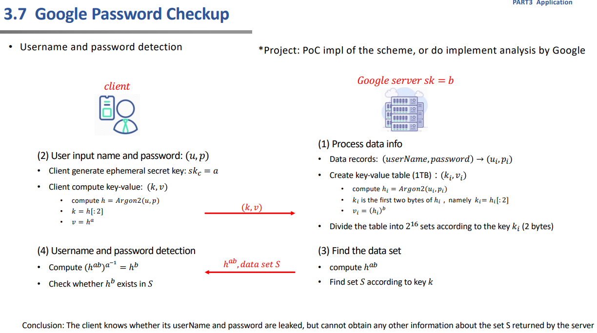

> 注：此处有些不理解服务器那端直接存储密码明文，感觉这样会带来安全问题，导致进一步泄露，经查询资料实际上应该是谷歌会使用一个复杂的过程来创建“散列和加密”的密码副本，然后将其存储在服务器中。

### 2. 实现过程
- 使用sage随机生成一个较大的素数p，用于后续实现。
- 由于不了解Argon2，因此用sm3代替Argon2。
- 参照实验原理确定服务端Google和客户端client。
- 使用socketserver模块-基于tcp协议通信。
- 具体过程均参照实验原理完成实现。

Google：谷歌服务器拥有泄露的用户名密码名单。
```python
print("与client连接成功")
data_records={"abc":"123","hhhhtttgxy":"52831a0D","abcdefg_":"0123456","user777":"89890146a","yyyyytsey":"17yh00_3","331305yo8b":"88887777"}
p=3587784517 # 素数
b=random.randint(1, p-1)
sk=b
key_value_table={}

for i in range(65536): # 初始化
    key_value_table[hex(i)[2:].zfill(4)]=set()
    
for item in data_records.items():
    hi=H(item[0]+item[1]) # 用sm3代替Argon2
    ki=hi[:4] # 2bytes对应4个16进制数
    vi=pow(int(hi,16),b,p)
    key_value_table[ki].add(vi)

k_v=self.request.recv(1024).decode('utf-8')
print("收到(k,v)")
print("(k,v)：{}".format(k_v))
k,v=eval(k_v)
hab=pow(v,b,p)
S=key_value_table[k]

print("向client发送hab和S")
print("hab：{}".format(hab))
print("S：{}".format(S))
self.request.send(str(hab).encode('utf-8'))
time.sleep(1)
self.request.send(str(S).encode('utf-8'))
print("发送完毕")
```

client：首先需要手动输入用户名和密码，实现中应注意由于后续需要求a在模p-1下的逆，因此在生成a时应注意a需要与p-1互素，最终会反馈是否泄露。
```python
print("与server连接成功")
p=3587784517 #素数
while True:
    a=random.randint(1, p-1)
    if gcd(a,p-1)==1:
        break
skc=a
h=H(username+password) # 用sm3代替Argon2
k=h[:4] # 2bytes对应4个16进制数
v=pow(int(h,16),a,p)
print("向server发送(k,v)")
print("(k,v)：{}".format((k,v)))
s.send(str((k,v)).encode('utf-8'))
print("发送完毕")
hab=s.recv(1024).decode('utf-8')
S=s.recv(1024).decode('utf-8')
print("收到hab和S")
print("hab：{}".format(hab))
print("S：{}".format(S))
inverse_a=inverse_mod(a,p-1)
hb=pow(int(hab),inverse_a,p)
if hb in eval(S):
    print("已泄露")
else:
    print("未泄露")
```

### 3. 实现结果
Google：

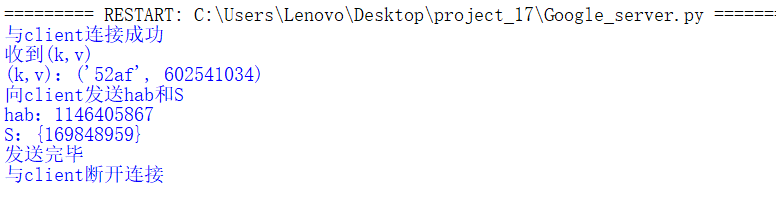


client：

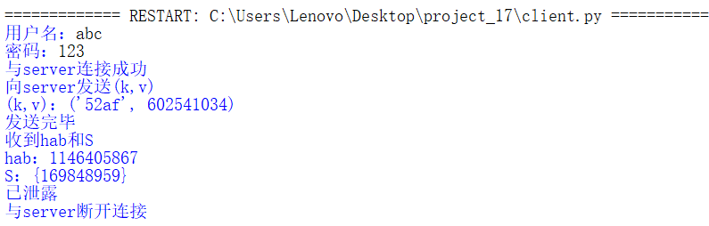


## 比较Firefox和谷歌的记住密码插件的实现区别
### Firefox
- 版本信息

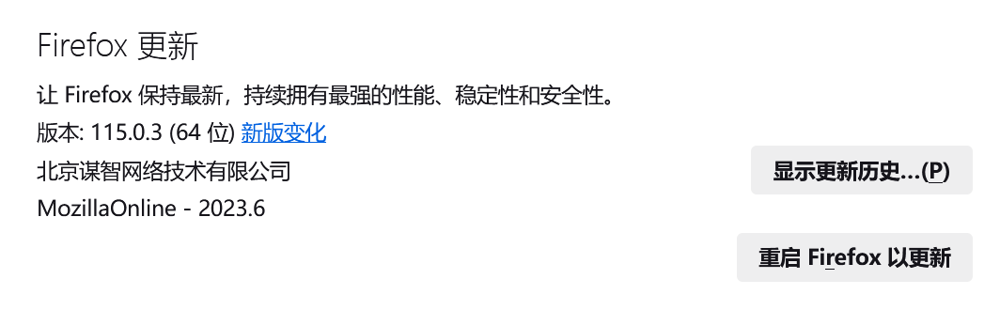


- 密码管理器

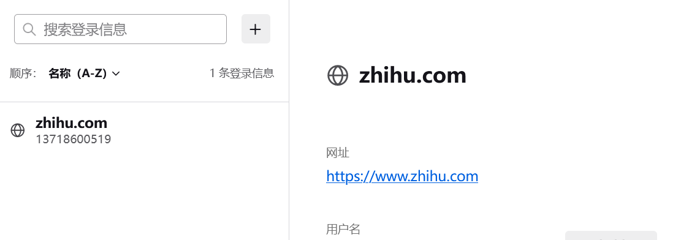

- 本地

保存在用户配置文档中。


> 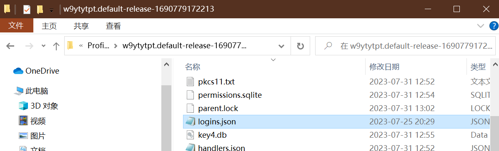
>
> 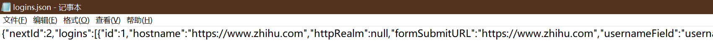

打开后可以看到以下信息。
```
{"id":1,"hostname":"https://www.zhihu.com","encryptedUsername":"MDoEEPgAAAAAAAAAAAAAAAAAAAEwFAYIKoZIhvcNAwcECKqJXDFw4vEvBBD4GN03Ek0TYJXpPAv+KL52","encryptedPassword":"MDoEEPgAAAAAAAAAAAAAAAAAAAEwFAYIKoZIhvcNAwcECAJYu1kOwMaABBD/StdsC7UJFT13J8odg6LK","guid":"{0bd550d4-b907-4022-9237-0afa26d55ce3}"
```

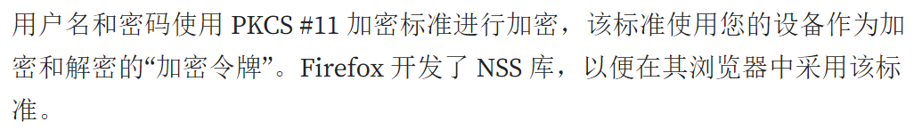


Firefox 可以通过使用主密码加密来保护敏感信息，例如保存的密码和证书。如果您创建了主密码，则每次启动 Firefox 时，它都会在第一次需要访问证书或存储的密码时要求您输入密码。您可以通过选中或取消选中此选项来设置、更改或删除主密码或通过单击更改主密码按钮。如果已设置主密码，则需要输入该密码才能更改或删除主密码。

使用参考文献[6]中的代码完成解密密码（结果如下）。

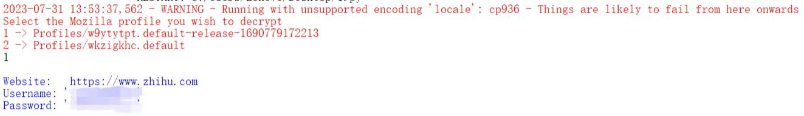


### 谷歌
- 版本信息

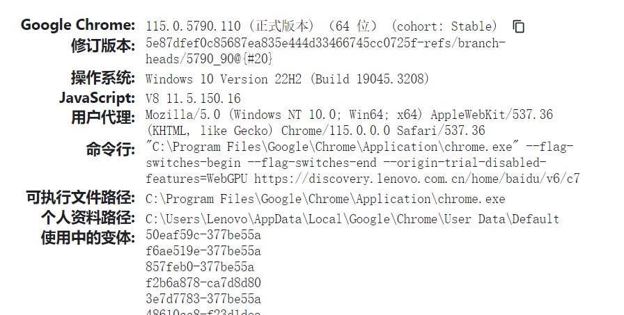

- 密码管理工具
  
不仅能够存储密码，还可以检查密码是否泄露、是否重复使用密码以及是否有安全系数低的密码。

> 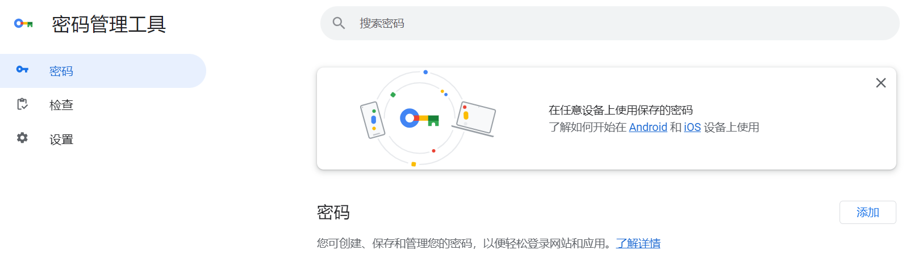
>
> 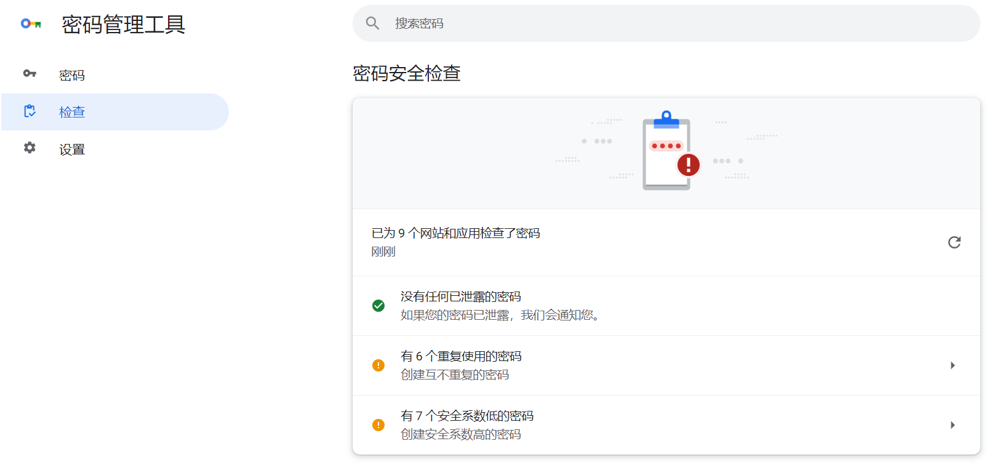

- 本地

谷歌会将密码存储在C:\Users\Lenovo\AppData\Local\Google\Chrome\User Data\Default的Login Data中，该数据库文件的类型是 SQLite，Login Data文件是加密的，加密方式是 AES-256 in GCM mode，用以确保用户登录凭据的安全性，但是密钥也存储在本地，对安全性有所降低，密钥存储在C:\Users\Lenovo\AppData\Local\Google\Chrome\User Data的Local State中，其内容的 encrypted_key 就是密钥。

> 密码：
> 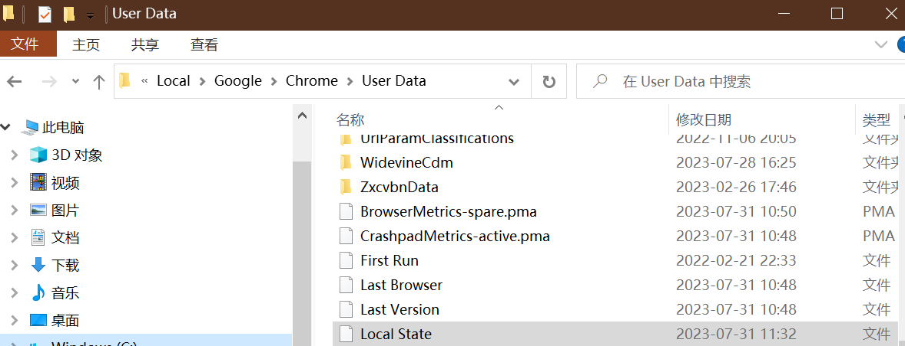
>
> 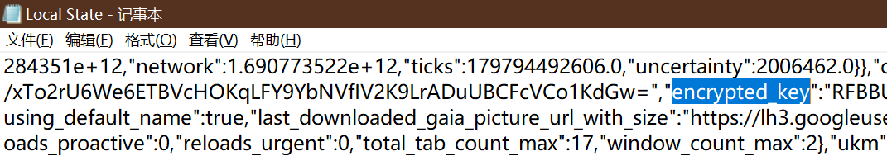

> 密钥：
> 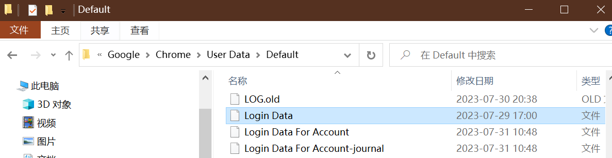
>
> 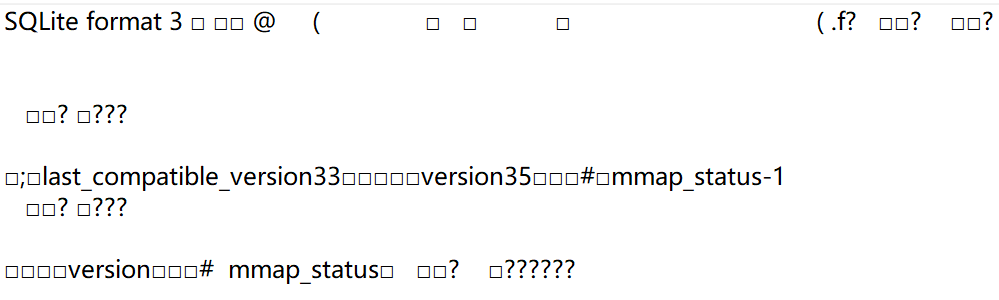

解密需要用到 win32 提供的 API CryptUnprotectData 函数，这个函数保证解密是和加密在同一台电脑（用户）进行的，所以如果直接复制硬盘的浏览器数据到其他电脑上是解密不了的，但是只要你的 Windows 登录了，任何程序只要想都可以解密 chrome 的密码然后上传。

使用参考文献[7]中的代码完成解密密码（结果如下）。

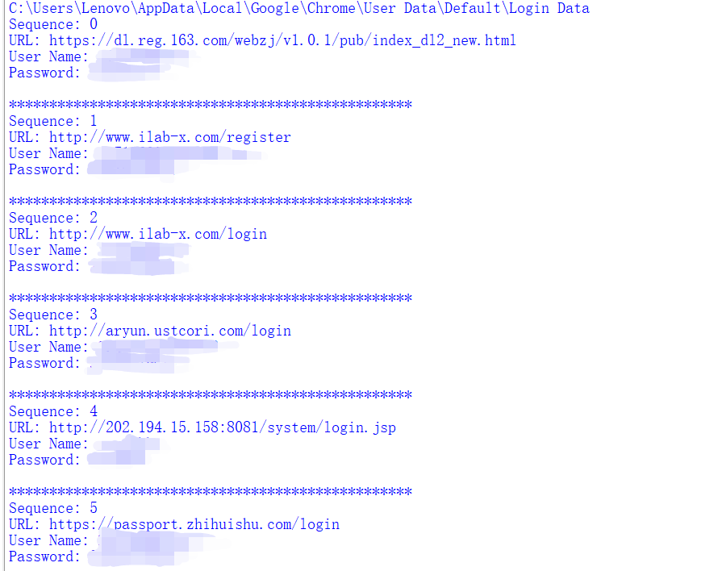

- Google密码管理工具的功能：

> 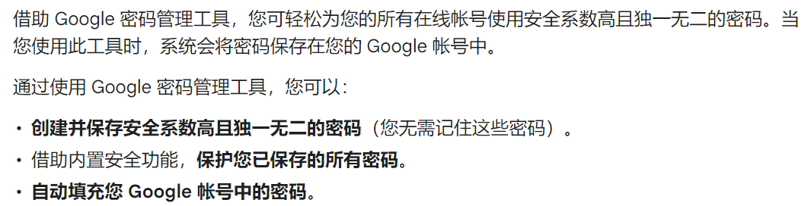
>
> 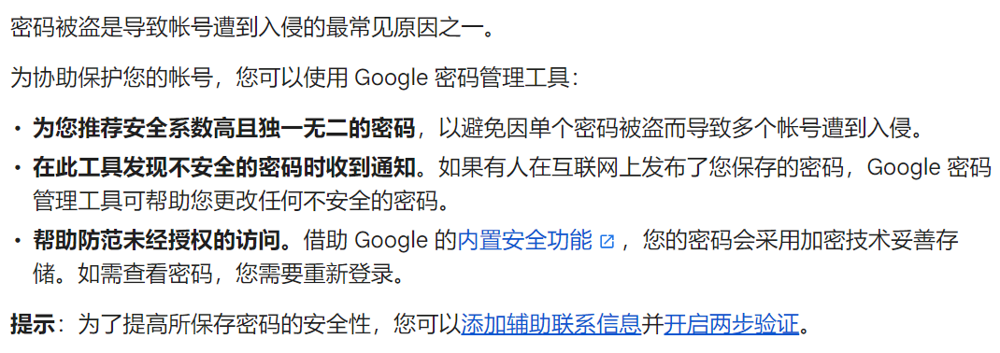

### Keeper 密码管理程序
偶然查询到了一款适用于 Chrome 的安全密码管理程序。

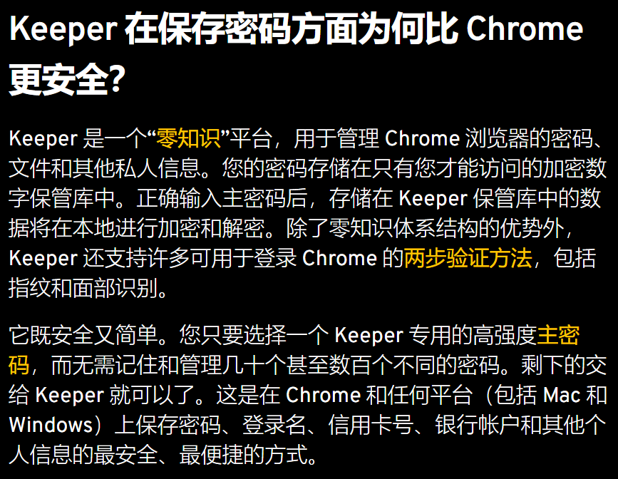

这是一个安全密码管理程序Keeper对“在Chrome中存储密码安全吗”这一问题给出的解答，前面进行的解密也印证了这一说法：

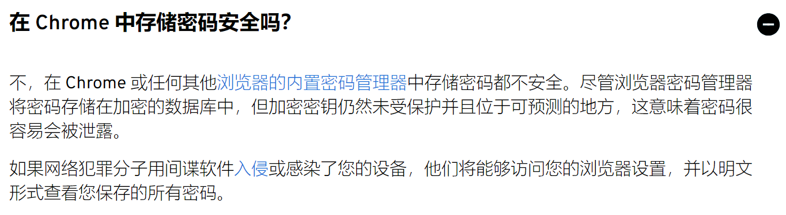


### 参考文献
[1] https://support.mozilla.org/en-US/kb/security-and-passwords-settings

[2] https://cloud.google.com/docs/security/encryption/default-encryption?hl=zh-cn

[3] https://support.google.com/accounts/answer/6208650?hl=zh-Hans&co=GENIE.Platform%3DAndroid

[4] https://www.keepersecurity.com/zh_CN/chrome-password-manager.html

[5] https://www.cnblogs.com/CourserLi/p/16941184.html

[6] https://medium.com/geekculture/how-to-hack-firefox-passwords-with-python-a394abf18016

[7] https://ohyicong.medium.com/how-to-hack-chrome-password-with-python-1bedc167be3d

[8] https://www.woshipm.com/pmd/35985.html

> 注：参考文献[8]中的内容更为详细，但过于久远（10年前），因此只附上链接。
