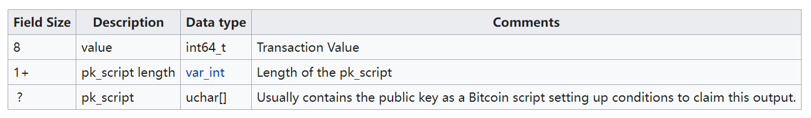

# send a tx on Bitcoin testnet, and parse the tx data down to every bit, better write script yourself
## 1. 实现原理
Bitcoin测试网（Bitcoin Testnet）是比特币的一个测试网络，旨在供开发人员和用户测试新的比特币应用程序或交易，而不必使用真正的比特币和区块链。与比特币主网相比，比特币测试网的区块链大小要小得多。目前，比特币测试网的区块链大小约为6 GB左右。由于测试网的使用相对较少，因此其区块链增长速度较慢。

> 
>
> 
>
> 
>
> 

## 2. 实现过程

- 使用bitcoin core的测试版（参考文献[2]），下载完成后还需要先同步数据。

- 首先需要建一个收款地址，也就是说别人可以通过这个地址向我提供比特币。

地址：tb1q6hcld6z7zcjpekxg2h56xs9kj80vuy3xu8rg7u

- 当然实际上是使用Testnet（参考文献[3]）向自己发送比特币，最终发送成功，我也成功收到。

- 对交易数据进行解析，并获取交易的hex（参考文献[4]）。

- 最终将测试币返还。

## 参考文献

[1] https://en.bitcoin.it/wiki/Testnet

[2] https://bitcoin.org/zh_CN/download

[3] http://bitcoinfaucet.uo1.net/send.php

[4] https://mempool.space/testnet/docs/api/rest#get-transaction

[5] https://aandds.com/blog/bitcoin-tx.html

[6] https://en.bitcoin.it/wiki/Protocol_documentation#tx
