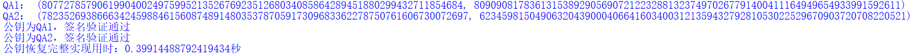

# forge a signature to pretend that you are Satoshi
# 伪造中本聪签名

|     代码名称     |       具体实现        |
| :--------------: | :-------------------: |
|  ECDSA_forge.py  |  ECDSA的伪造签名实现  |
| Schnorr_forge.py | Schnorr的伪造签名实现 |
|   sm2_forge.py   |   sm2的伪造签名实现   |

## 1. 实现原理（以ECDSA为例）
验证签名时一定要提供消息 m 本身, 而不能仅提供消息 m 的哈希值. 假设 sign = (r, s) 是使用私钥 d 对消息 m 计算的签名值, 如果验签时不要求提供消息 m 本身 (仅提供消息的哈希值 e), 则任何人都可以伪造关于私钥 d 的签名值.


Craig Wright (澳本聪) 曾经通过伪造 Satoshi Nakamoto 的签名值, 进而宣称自己为中本聪. 其实任何人都可以做类似的宣称, 甚至有网站提供了自动化的工具来伪造中本聪的签名来帮助你宣称自己是中本聪.

## 2. 实现过程

### ECDSA


```python
def ECDSA_forge_sign(QA):
    u=random.randint(1,n-1)
    v=random.randint(1,n-1)
    R_=add(mul(u,G),mul(v,QA))
    (x_,y_)=R_
    r_=x_%n
    e_=(r_*u*inverse_mod(v,n))%n
    s_=(r_*inverse_mod(v,n))%n
    return e_,(r_,s_)
```


在不提供消息的情况下，只提供哈希值，在只拥有公钥的前提下，是可以完成对ECDSA签名的伪造的，同时也说明验证时必须要使用消息而不是消息的哈希值。

经查询并未找到中本聪的公钥，因此打算先通过他人伪造的签名值（下图），恢复出公钥，进而完成对中本聪签名的伪造。


通过公钥恢复的方法，恢复出了两个可能的公钥，并进行核验。

```python
e_=0xd0f756e2d96f49b32579bd9365fde07674629dcab236fd9af8c01085a0cf9201
r_=0x99cc0d1f4ed3f1e6d18c130df22fece489b4ab016c33ed53db1ce45880bf4e99
s_=0x6633f2e0b12c0e192e73ecf20dd0131a30fa31e54314b2e7e4b57a344f76f2a8

start_time1 = time.time()
QA1,QA2=ECDSA_recover(e_,r_,s_)

print("QA1：",QA1) # 恢复中本聪公钥
print("QA2：",QA2)

if ECDSA_verify(e_,r_,s_,QA1):
    print("公钥为QA1，签名验证通过")
else:
    print("公钥为QA1，签名验证失败")

if ECDSA_verify(e_,r_,s_,QA2):
    print("公钥为QA2，签名验证通过")
else:
    print("公钥为QA2，签名验证失败")
```



最终分别用两个可能的公钥伪造中本聪签名。


整体代码实现结果如下：


参考文献[3]中给出了sage实现，放到附录部分。


### Schnorr
验证等式 $sG=R+eP$ ，等价于 $R=sG–eP$ 。可以随机构造一个 $e$ 和 $s$ 再求解 $R$ 就能成功地只使用公钥构建签名。同时也说明了级联R的必要性，倘若哈希时只对消息进行哈希，那么也可以构造消息然后求得 $e$ 进而随机构造 $s$ 再求解 $R$ ，完成伪造，因此说明了级联 $R$ 的必要性，倘若不规范使用就能轻松伪造签名。

> 注：这里不再是消息的哈希值，而是R级联消息m的哈希值。

```python
def Schnorr_forge_sign(P):
    e=random.randint(1,n-1)
    s=random.randint(1,n-1)
    sG=mul(s,G)
    eP=mul(e,P)
    _eP=(eP[0],p-eP[1]) # -eP
    R=add(sG,_eP)
    return e,(R,s)
```


### SM2

验证等式 $(x_1,y_1)=sG+tP$ ，其中 $t=(r+s)\ mod\ n$ 最终比对 $R=(e+x_1)\ mod\ n==r$ 因此先随机构造 $u$ 和 $v$ 属于 $[1,n-1]$ 计算出 $(x_1,y_1)=uG+vP$ ，最终 

$s=u$          
$r=(v-s)\ mod\ n$        
$e=(r-x_1)\ mod\ n$

```python
def sm2_sign(P):
    u=random.randint(1,n-1)
    v=random.randint(1,n-1)
    (x1,y1)=add(mul(u,G),mul(v,P))
    s=u
    r=(v-s)%n
    e=(r-x1)%n
    return e,(r,s)
```


通过对sm2签名的伪造，发现其伪造思路和ECDSA签名的伪造思路很像，同时又像Schnorr签名一样级联了其它内容一起哈希，进而提高了sm2签名算法的安全性。

## 参考文献
[1] https://crypto-in-action.github.io/ecdsa-blockchain-dangers/190816-secp256k1-ecdsa-dangers.pdf

[2] https://www.btcstudy.org/2021/11/20/introduction-to-schnorr-signatures-by-suredbits/

[3] https://bitcoin.stackexchange.com/questions/81115/if-someone-wanted-to-pretend-to-be-satoshi-by-posting-a-fake-signature-to-defrau


## 附录

```sage
F = FiniteField (0xFFFFFFFFFFFFFFFFFFFFFFFFFFFFFFFFFFFFFFFFFFFFFFFFFFFFFFFEFFFFFC2F)
C = EllipticCurve ([F (0), F (7)])
G = C.lift_x(0x79BE667EF9DCBBAC55A06295CE870B07029BFCDB2DCE28D959F2815B16F81798)
N = FiniteField (C.order())
P = P=-C.lift_x(0x11db93e1dcdb8a016b49840f8c53bc1eb68a382e97b1482ecad7b148a6909a5c) # block 9 coinbase payout key.
def forge(c, a=-1):  # Create a forged 'ECDSA'  (hashless) signature
  # set a to something other than -1 to be less obvious
  a = N(a)
  R = c*G + int(a)*P
  s = N(int(R.xy()[0]))/a
  m = N(c)*N(int(R.xy()[0]))/a
  print('hash1 = %d'%m)
  print('r1 = %d'%(int(R.xy()[0])))
  print('s1 = %d'%s)
for c in range(1,10):
  forge(c)
```


