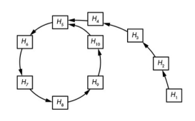
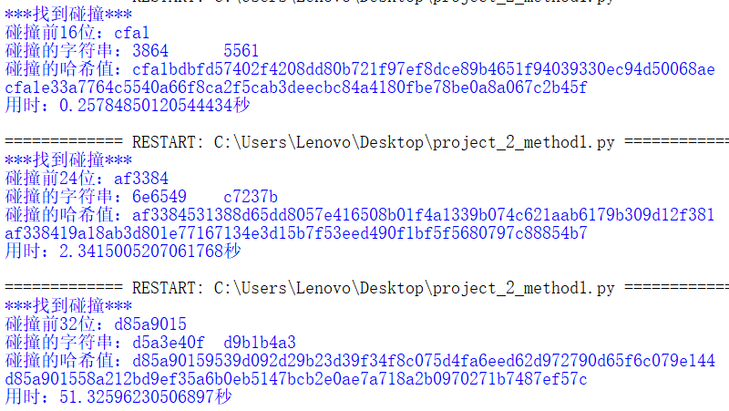
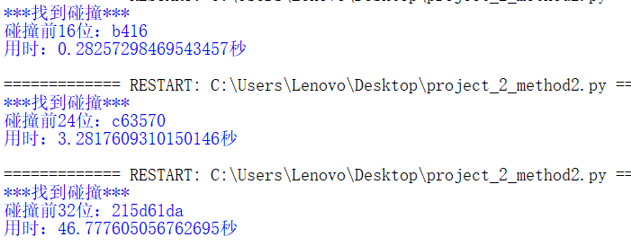
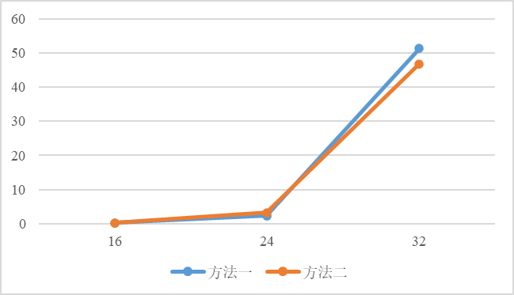
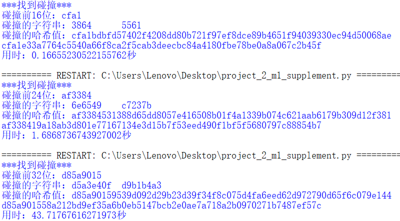
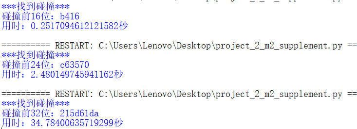
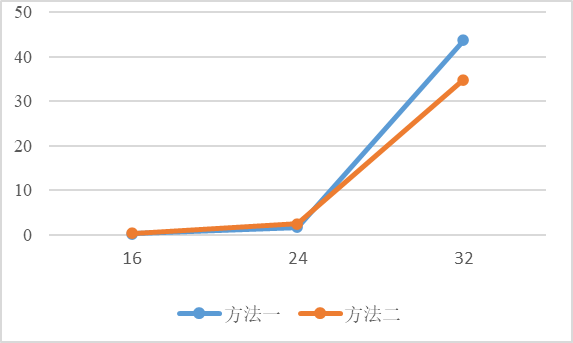

# implement the Rho method of reduced SM3
# 实现简化的SM3的Rho攻击方法

|          代码名称          |                具体实现                |
| :------------------------: | :------------------------------------: |
|    project_2_method1.py    | 调用gmssl库的sm3算法完成Rho攻击（法1） |
|    project_2_method2.py    | 调用gmssl库的sm3算法完成Rho攻击（法2） |
| project_2_m1_supplement.py | 使用自编写的sm3算法完成Rho攻击（法1）  |
| project_2_m2_supplement.py | 使用自编写的sm3算法完成Rho攻击（法2）  |

## 1. 实现原理
这种方法减少了存储，其主要原理是每次都对最后一个值进行哈希，一直重复操作，最终会进入哈希值的循环（这也是该方法的好处），则找到碰撞。



该图中 $H_4$ 和 $H_{10}$ 的哈希值均为 $H_5$ ，因此 $H_4$ 和 $H_{10}$ 是一个碰撞。

## 2. 实现过程
此处的碰撞是以16进制字符串作为碰撞的。

其中对sm3算法的使用改为：
```python
def h(str_): #sm3
    data=bytes.fromhex(str_)
    hash_=sm3.sm3_hash(func.bytes_to_list(data))
    return hash_
```
### 2.1 方法一
- 实现

每次都对最后一个值进行哈希，并寻找列表中有无相同的哈希值，若有则找到碰撞，若没有则继续哈希列表中最后一个值，直到找到碰撞为止，此方法需要将每次哈希的结果存储起来。
```python
def rho_attack(initial_str,collision_length):
    attack_list=[]
    collision_bit_length=collision_length*4
    initial_hash=h(initial_str)
    initial_hash_f=initial_hash[:collision_length]
    attack_list.append(initial_hash_f)
    while True:
        initial_hash_s1=initial_hash_f
        initial_hash_s2=h(initial_hash_f)
        initial_hash_f=h(initial_hash_f)
        initial_hash_f=initial_hash_f[:collision_length]
        if initial_hash_f in attack_list:
            print("***找到碰撞***")
            print("碰撞前{}位：{}".format(collision_bit_length,initial_hash_f))
            print("碰撞的字符串：{}\t{}".format(attack_list[attack_list.index(initial_hash_f)-1],initial_hash_s1))
            print("碰撞的哈希值：{}\t{}".format(h(attack_list[attack_list.index(initial_hash_f)-1]),initial_hash_s2))
            break
        else:
            attack_list.append(initial_hash_f)
```
- 结果
  



### 2.2 方法二
- 实现

设置两个变量，一个变量一次只哈希一次，另一个变量一次哈希两次，最终会在哈希值的循环中产生碰撞，此方法不需要存储哈希结果，因此更加节省存储空间，但也正是因为没有存储，从而无法输出产生碰撞的两个值，只能输出碰撞结果。
```python
def rho_attack(initial_str,collision_length):
    collision_bit_length=collision_length*4
    initial1=initial_str
    initial2=initial_str
    while True:
        initial1=h(initial1)[:collision_length]
        initial2=h(h(initial2)[:collision_length])[:collision_length]
        if initial1==initial2:
            print("***找到碰撞***")
            print("碰撞前{}位：{}".format(collision_bit_length,initial1))
            break
```
- 结果
  



## 3. 结果分析（单位：秒）

| 比特位数 | 16     | 24     | 32      |
| -------- | ------ | ------ | ------- |
| 方法一   | 0.2578 | 2.3415 | 51.3260 |
| 方法二   | 0.2826 | 3.2818 | 46.7776 |




Rho攻击方法普遍比生日攻击所用时间长，该方法的法一与法二速度相近。
## 4. 补充

由于后续实现了自己编写的sm3算法的python版本，因此补充调用自己实现的sm3算法进行攻击（只需改为调用自编写的sm3算法即可，其它攻击部分无需改动）。

- 结果
> 方法一
> 
> 
>
> 方法二
>
> 

- 结果整合（单位：秒）

| 比特位数 | 16     | 24     | 32      |
| -------- | ------ | ------ | ------- |
| 方法一   | 0.1666 | 1.6869 | 43.7177 |
| 方法二   | 0.2517 | 2.4801 | 34.7840 |



Rho攻击方法普遍比生日攻击所用时间长，该方法的法一与法二速度相近，但该实现效率比调用gmssl库更高，本质上是因为自编写的sm3算法效率更高。
