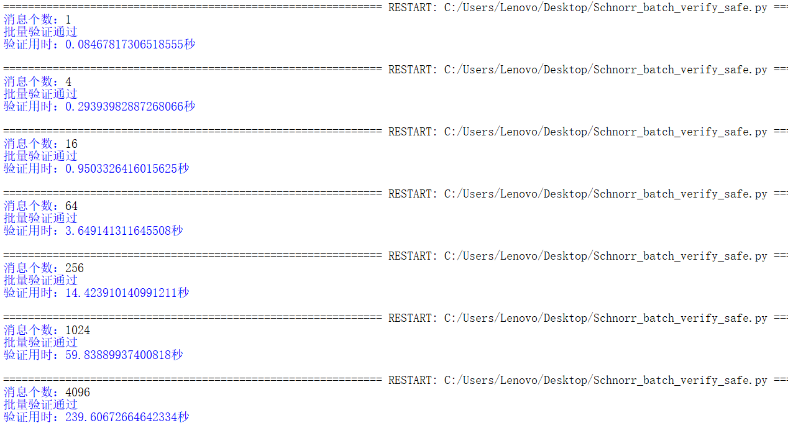

# Schnorr Batch

|           代码名称           |                         具体实现                          |
| :--------------------------: | :-------------------------------------------------------: |
|   Schnorr_batch_verify.py    |                 Schnorr签名的批量验证实现                 |
|          attack.py           |            Schnorr签名的批量验证的签名伪造实现            |
| Schnorr_batch_verify_safe.py | Schnorr签名的更安全批量验证实现以及使用Bos-Coster算法加速 |

## 1. 实现原理

如 BIP 340 所言，“已被标准化的 ECDSA 签名的具体形式，在批量验证时并不比单独验证更有效率，除非增加额外的见证数据。改变签名方案提供了一个解决这个问题的机会。” 换句话说，在 ECDSA 当前的形式下，批量验证大量的 ECDSA 签名，没有办法比单个单个地验证更快。引入一种新的签名标准（Schnorr 签名），让我们可以启用可称为 “批量验证” 的功能，也即是可以一次性验证许多签名，并且比一个一个验证它们还要更快。


## 2. 实现过程

首先需要实现Schnorr签名算法，其实之前已经实现过了，但未给出代码说明，在此给出。
  
- 公私钥生成：
```python
def Schnorr_keygenerate():
    d=random.randint(1,n-1)
    P=mul(d,G)
    return d,P
```
- 签名：
```python
def Schnorr_sign(M,P,d):
    k=random.randint(1,n-1)
    R=mul(k,G)
    e=H(hex(P[0])[2:].zfill(64)+hex(P[1])[2:].zfill(64)+hex(R[0])[2:].zfill(64)+hex(R[1])[2:].zfill(64)+M)
    s=(k+int(e,16)*d)%n
    return R,s
```

> 注：在算法说明中哈希并未级联公钥，但在这里的式子中加了，故添加，之前实现的未添加。

- 验签：

```python
def Schnorr_verify(M,R,s,P):
    e=H(hex(P[0])[2:].zfill(64)+hex(P[1])[2:].zfill(64)+hex(R[0])[2:].zfill(64)+hex(R[1])[2:].zfill(64)+M)
    return mul(s,G)==add(R,mul(int(e,16),P))
```

然后实现批量验证部分。

- 多次签名函数Schnorr_sign_：首先，生成num个消息（随机生成多个消息的函数不再介绍，在project5中使用过该方法），然后生成公私钥并对消息进行签名（该步骤进行num次），相当于一个签名模拟器，最终消息、公钥和签名会用于批量验证，这里要注意一定不可以用哈希值来批量验证，在project19中已经给出了相关伪造。

```python
def Schnorr_sign_(num): # 多次签名
    lst_M=generate_random_message(num)
    lst_P=[];lst_R=[];lst_s=[]
    for i in range(num):
        di,Pi=Schnorr_keygenerate()
        lst_P.append(Pi)
        Ri,si=Schnorr_sign(lst_M[i],Pi,di)
        lst_R.append(Ri)
        lst_s.append(si)
    return lst_M,lst_P,lst_R,lst_s
```

- 批量证明函数Schnorr_batch_verify：实验原理中已涉及。
  


```python
def Schnorr_batch_verify(lst_M,lst_R,lst_s,lst_P,num):
    lst_e=[]
    for i in range(num): # 计算哈希值
        ei=H(hex(lst_P[i][0])[2:].zfill(64)+hex(lst_P[i][1])[2:].zfill(64)+hex(lst_R[i][0])[2:].zfill(64)+hex(lst_R[i][1])[2:].zfill(64)+lst_M[i])
        lst_e.append(int(ei,16))
        
    s_all=(sum(lst_s))%n
    R_all=(0,0)
    eP_all=(0,0)
    for i in range(num):
        R_all=add(R_all,lst_R[i])
        eiPi=mul(lst_e[i],lst_P[i])
        eP_all=add(eP_all,eiPi)
        
    return mul(s_all,G)==add(R_all,eP_all)
```
实现结果：


参照实验原理部分做了一个整合，发现单个验证的用时确实有所下降，验证效率为原来的2倍多，但不像实验原理的结果那样持续下降，且验证效率明显提升。

| 消息个数 | 验证总用时 | 单个验证用时 | 每秒验证个数 |
| -------- | ---------- | ------------ | ------------ |
| 1        | 0.06138    | 0.06138      | 16           |
| 4        | 0.15934    | 0.03984      | 25           |
| 16       | 0.47789    | 0.02987      | 33           |
| 64       | 1.84461    | 0.02882      | 35           |
| 256      | 8.23528    | 0.03217      | 31           |
| 1024     | 29.93588   | 0.02923      | 34           |
| 4096     | 120.89915  | 0.02952      | 34           |

> 注：后续时间单位均为秒。

- 其实直接这样验证会存在伪造攻击。

可以构造出一对签名进行伪造。


```python
def attack(M1,M2,d1,P1,P2):
    r2=random.randint(1,n-1)
    s2=random.randint(1,n-1)
    R2=mul(r2,G)
    e2=H(hex(P2[0])[2:].zfill(64)+hex(P2[1])[2:].zfill(64)+hex(R2[0])[2:].zfill(64)+hex(R2[1])[2:].zfill(64)+M2.hex())
    _R1=mul(int(e2,16),P2)
    R1=(_R1[0],p-_R1[1])
    e1=H(hex(P1[0])[2:].zfill(64)+hex(P1[1])[2:].zfill(64)+hex(R1[0])[2:].zfill(64)+hex(R1[1])[2:].zfill(64)+M1.hex())
    s1=(r2+int(e1,16)*d1-s2)%n
    return (R1,s1),(R2,s2)
```


实现结果：


- 因此还需要更加安全的方法以避免上述攻击，

此部分PPT和参考文献中略有不同，但本质上是一样的，使用参考文献中的步骤以解决上述伪造攻击。


```python
def Schnorr_batch_verify_safe(lst_M,lst_R,lst_s,lst_P,num):
    lst_a=[random.randint(1,n-1) for _ in range(num)]
    lst_ae=[]
    lst_as=[]
    for i in range(num):
        ei=H(hex(lst_P[i][0])[2:].zfill(64)+hex(lst_P[i][1])[2:].zfill(64)+hex(lst_R[i][0])[2:].zfill(64)+hex(lst_R[i][1])[2:].zfill(64)+lst_M[i])
        lst_ae.append((lst_a[i]*int(ei,16))%n)
        lst_as.append((lst_a[i]*lst_s[i])%n)
    
    as_all=(sum(lst_as))%n
    aR_all=(0,0)
    aeP_all=(0,0)
    for i in range(num):
        aiRi=mul(lst_a[i],lst_R[i])
        aR_all=add(aR_all,aiRi)
        aieiPi=mul(lst_ae[i],lst_P[i])
        aeP_all=add(aeP_all,aieiPi)
        
    return mul(as_all,G)==add(aR_all,aeP_all)
```

实现结果：




可以看到，验证效率提升非常不明显，最快时效率仅为原来的1.5倍。

| 消息个数 | 验证总用时 | 单个验证用时 | 每秒验证个数 |
| -------- | ---------- | ------------ | ------------ |
| 1        | 0.08468    | 0.08468      | 12           |
| 4        | 0.29394    | 0.07349      | 14           |
| 16       | 0.95033    | 0.05940      | 17           |
| 64       | 3.64914    | 0.05702      | 18           |
| 256      | 14.42391   | 0.05634      | 18           |
| 1024     | 59.83890   | 0.05844      | 17           |
| 4096     | 239.60673  | 0.05850      | 17           |


- 使用Bos-Coster算法，尝试进一步加速。


```python
def Schnorr_batch_verify_safe_fast(lst_M,lst_R,lst_s,lst_P,num):
    lst_a=[random.randint(1,n-1) for _ in range(num)]
    lst_ae=[]
    lst_as=[]
    for i in range(num):
        ei=H(hex(lst_P[i][0])[2:].zfill(64)+hex(lst_P[i][1])[2:].zfill(64)+hex(lst_R[i][0])[2:].zfill(64)+hex(lst_R[i][1])[2:].zfill(64)+lst_M[i])
        lst_ae.append((lst_a[i]*int(ei,16))%n)
        lst_as.append((lst_a[i]*lst_s[i])%n)
    
    as_all=(sum(lst_as))%n
    _as_all=(-as_all)%n
    lst_c_p = [list(pair) for pair in zip(lst_a, lst_R)]
    lst_c_p.extend([list(pair) for pair in zip(lst_ae, lst_P)])
    lst_c_p.append([_as_all,G])
    
    while True:
        if len(lst_c_p)==0:
            return True
        if len(lst_c_p)==1:
            if mul(lst_c_p[0][0],lst_c_p[0][1])==(0,0):
                return True
            return False
        lst_c_p=sorted(lst_c_p, key=lambda x: x[0]) #已排序
        temp_=lst_c_p[-1][0]-lst_c_p[-2][0]
        temp_p=add(lst_c_p[-1][1],lst_c_p[-2][1])
        lst_c_p[-2][1]=temp_p
        if temp_==0:
            lst_c_p.pop()
        else:
            lst_c_p[-1][0]=temp_
```

实现结果：


可以看到前期提升很快，最高时能达到原来效率的10倍，后期效率相对下降（推测可能是因为随机生成的a增多造成），但与不使用Bos-Coster算法相比，效率依旧很高。

| 消息个数 | 验证总用时 | 单个验证用时 | 每秒验证个数 |
| -------- | ---------- | ------------ | ------------ |
| 1        | 0.06555    | 0.06555      | 15           |
| 4        | 0.05800    | 0.01450      | 69           |
| 16       | 0.15194    | 0.00950      | 105          |
| 64       | 0.45205    | 0.00706      | 142          |
| 256      | 1.69889    | 0.00664      | 151          |
| 1024     | 9.21118    | 0.00900      | 111          |
| 4096     | 84.99749   | 0.02075      | 48           |


- 未优化和优化后的每秒验证个数的对比图：


## 参考文献

[1] https://www.btcstudy.org/2021/12/06/schnorr-applications-batch-verification/

[2] https://eprint.iacr.org/2012/549.pdf
