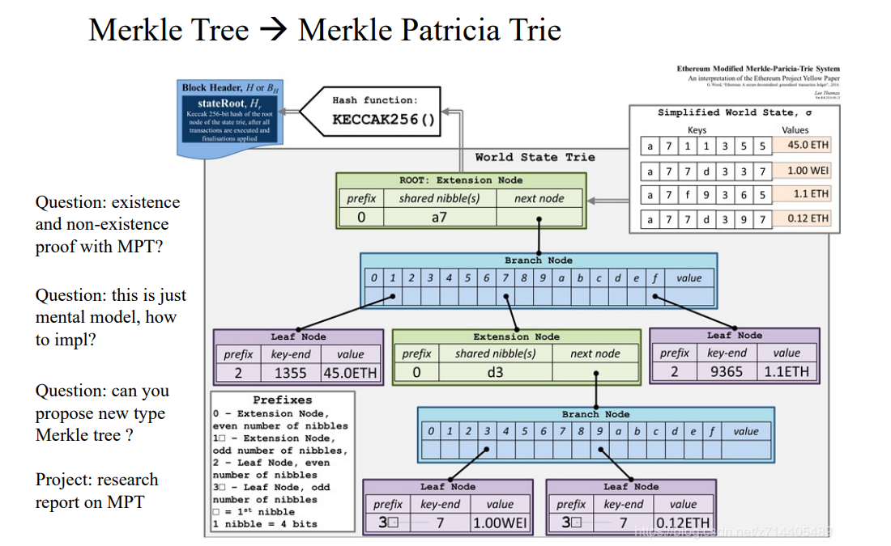
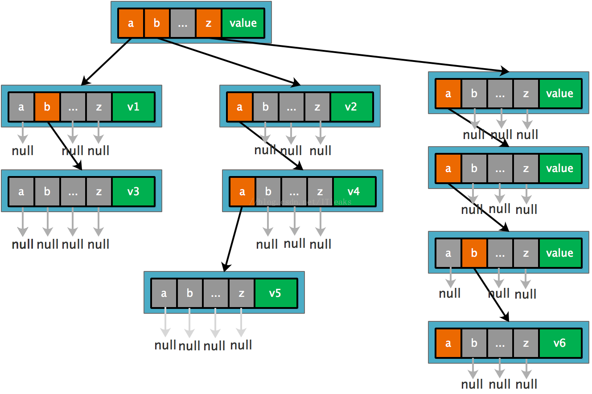
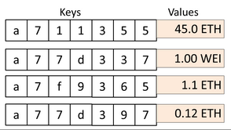
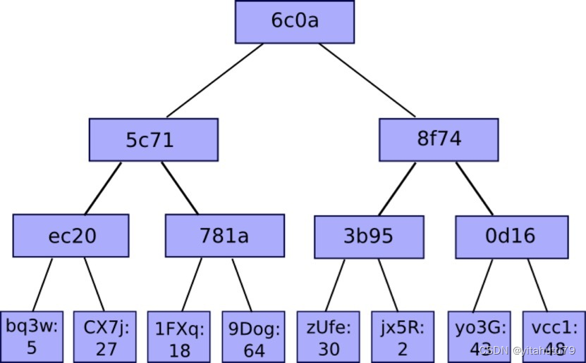
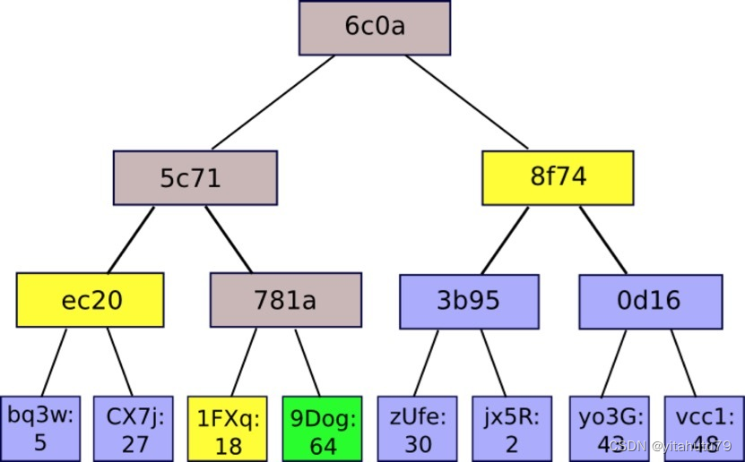

# research report on MPT
# Merkle Patricia Tree

MPT的全称是Merkle Patricia Tree,也就是Merkle Tree + Patricia Tree。

## 1. 实现原理

### 概述

MPT树的特点如下:

- 叶子节点和分支节点可以保存value, 扩展节点保存key
- 没有公共的key就成为2个叶子节点；key1=[1,2,3] key2=[2,2,3]
- 有公共的key需要提取为一个扩展节点；key1=[1,2,3] key2=[1,3,3] => ex-node=[1],下一级分支node的key
- 如果公共的key也是一个完整的key，数据保存到下一级的分支节点中；key1=[1,2] key2=[1,2,3] =>ex-node=[1,2],下一级分支node的key; 下一级分支=[3],上一级key对应的value



Merkle Patricia Tree（又称为Merkle Patricia Trie）是一种经过改良的、融合了Merkle tree和前缀树两种树结构优点的数据结构，是以太坊中用来组织管理账户数据、生成交易集合哈希的重要数据结构。

MPT树有以下几个作用：

- 存储任意长度的key-value键值对数据，符合以太坊的state模型
- 提供了一种快速计算所维护数据集哈希标识的机制
- 提供了快速状态回滚的机制
- 提供了一种称为默克尔证明的证明方法，进行轻节点的扩展，实现简单支付验证

### Patricia Tree

patricia tree 前缀树，是一种编码方式，它是传统trie的改进，是一种更节省空间的Trie。对于基数树的每个节点，如果该节点是唯一的儿子的话，就和父节点合并。

**Trie**，又称前缀树或字典树，是一种有序树状的数据结构，其中的键通常是字符串，常用语存储Key-value数据结构。

Trie与二叉查找树不同，键不是直接保存在节点中，而是由节点在树中的位置决定。一个节点的所有子孙都有相同的前缀，节点对应的key是根节点到该节点路径上的所有节点key值前后拼接而成，节点的value值就是该key对应的值。根节点对应空字符串key。

如果key是英文单词，trie的每个节点就是一个长度为27的指针数组，index0-25代表a-z字符，26为标志域。



**Merkle Patricia Tree对trie的改进**

上面tries出现的问题的根本原因是每个前置节点只能表示一个字母，key有多长，树的深度就会多长，不管这个key有没有和其他key共享部分key。因而允许一个节点表示变长的key就可以解决这个深度。



Merkle Patricia Tree有4种类型的节点：

- 叶子节点（leaf），表示为[key,value]的一个键值对。和前面的英文字母key不一样，这里的key都是16编码出来的字符串，每个字符只有0-f 16种，value是RLP编码的数据
- 扩展节点（extension），也是[key，value]的一个键值对，但是这里的value是其他节点的hash值，通过hash链接到其他节点
- 分支节点（branch），因为MPT树中的key被编码成一种特殊的16进制的表示，再加上最后的value，所以分支节点是一个长度为17的list，前16个元素对应着key中的16个可能的十六进制字符，如果有一个[key,value]对在这个分支节点终止，最后一个元素代表一个值，即分支节点既可以搜索路径的终止也可以是路径的中间节点。分支节点的父亲必然是extension node
- 空节点，代码中用null表示


### 以太坊中对Key的编码

在以太坊中，MPT树的key值共有三种不同的编码方式，以满足不同场景的不同需求。

三种编码方式分别为：

- Raw编码（原生的字符）

Raw编码就是原生的key值，不做任何改变。这种编码方式的key，是MPT对外提供接口的默认编码方式。

例如一条key为“cat”，value为“dog”的数据项，其key的Raw编码就是[‘c’, ‘a’, ‘t’]，换成ASCII表示方式就是[63, 61, 74]（Hex）

- Hex编码（扩展的16进制编码）

Hex编码就是把一个8位的字节数据用两个十六进制数展示出来，编码时，将8位二进制码重新分组成两个4位的字节，其中一个字节的低4位是原字节的高四位，另一个字节的低4位是原数据的低4位，高4位都补0，然后输出这两个字节对应十六进制数字作为编码。Hex编码后的长度是源数据的2倍。

ASCII码：A (65) 二进制码：0100_0001 重新分组：0000_0100 0000_0001 十六进制： 4 1 Hex编码：41

若该Key对应的节点存储的是真实的数据项内容（即该节点是叶子节点），则在末位添加一个ASCII值为16的字符作为terminator；

若该key对应的节点存储的是另外一个节点的哈希索引（即该节点是扩展节点），则不加任何字符；

[‘c’,’a’,’t’] -> [6,3,6,1,7,4,16]

- Hex-Prefix编码（16进制前缀编码）

目的：区分leaf和extension，把奇数路径变成偶数路径

步骤：如果有terminator（16）那么就去掉terminator，根据表格给key加上prefix

```
node type    path length    |    prefix    hexchar
--------------------------------------------------
extension    even           |    0000      0x0
extension    odd            |    0001      0x1
leaf         even           |    0010      0x2
leaf         odd            |    0011      0x3
```

如果prefix是0x0或者0x2，加一个padding nibble 0 在prefix后面，所以最终应该是 0x00 和 0x20。原因是为了保证key（path）的长度为偶数。

例如末尾的字符“16”说明该节点为叶子结点，并且加上了0x20

[ 0, f, 1, c, b, 8, 16] -> '20 0f 1c b8'

### 编码转换关系

- Raw编码：原生的key编码，是MPT对外提供接口中使用的编码方式，当数据项被插入到树中时，Raw编码被转换成Hex编码
- Hex编码：16进制扩展编码，用于对内存中树节点key进行编码，当树节点被持久化到数据库时，Hex编码被转换成HP编码
- HP编码：16进制前缀编码，用于对数据库中树节点key进行编码，当树节点被加载到内存时，HP编码被转换成Hex编码


每一个以太坊的区块头包含3颗 MPT 树，分别是：

- 交易树 txTrie

用来存储交易数据。路径是 rlp(transactionIndex)，其中 transactionIndex 是挖矿结束后得到的交易索引，在交易执行完后才生成，在挖矿结束后不会再更新。

- 状态树 stateTrie

世界状态存储的地方，存储了所有账户的信息，包括余额，交易次数，EVM 指令（合约数据）等等，每次交易执行，stateTrie 都会变化，这部分内容我们将在 go-ethereum 源码笔记（core 模块-状态管理） 这一篇进行探讨。路径是 sha3(ethereumAddress)，值是 rlp(ethereumAccount)，其中 ethereumAccount 是一个列表 [nonce,balance,storageRoot,codeHash]，而 storageRoot 是另一个独立的帕特里树，每个账户都有一个独立的帕特里夏树，它用来存储所有的合约数据。参考 Wiki Patricia Tree。

- 收据树 receiptTrie

路径是 rlp(transactionIndex)，其中 transactionIndex 是挖矿结束后得到的交易索引，在交易执行完后生成，在挖矿结束后不会再更新。

### 默克尔证明

默克尔证明指一个轻节点向一个全节点发起一次证明请求，询问全节点完整的默克尔树中，是否存在一个指定的节点；全节点向轻节点返回一个默克尔证明路径，由轻节点进行计算，验证存在性。

- 默克尔证明过程

如有棵如下图所示的merkle树，如果某个轻节点想要验证9Dog:64这个树节点是否存在与默克尔树中，只需要向全节点发送该请求，全节点会返回一个1FXq:18, ec20, 8f74的一个路径（默克尔路径，如图2黄色框所表示的）。得到路径之后，轻节点利用9Dog:64与1FXq:18求哈希，在与ec20求哈希，最后与8f74求哈希，得到的结果与本地维护的根哈希相比，是否相等。

> 
>
> 

- 默克尔证明安全性

1. 由于哈希的计算具有不可预测性，使得一个恶意的“全”节点想要为一条不存在的节点伪造一条“伪路径”使得最终计算的根哈希与轻节点所维护的根哈希相同是不可能的。
2. 由于在公链的环境中，无法判断请求的全节点是否为恶意节点，因此直接向某一个或者多个全节点请求得到的结果是无法得到保证的。但是轻节点本地维护的区块头信息，是经过工作量证明验证的，也就是经过共识一定正确的，若利用全节点提供的默克尔路径，与代验证的节点进行哈希计算，若最终结果与本地维护的区块头中根哈希一致，则能够证明该节点一定存在于默克尔树中。

## 2. 源码解读

### 编码转换

Compact就是上面说的HEX-Prefix，keybytes为按完整字节（8bit）存储的正常信息，hex为按照半字节nibble（4bit）储存信息的格式，为了便于作黄皮书中Modified Merkle Patricia Tree的节点的key，编码为偶数字节长度的hex格式。其第一个半字节nibble会在低的2个bit位中，由高到低分别存放t标志与奇数标志。经compact编码的keybytes，在增加了hex的t标志与半字节nibble为偶数个（即完整的字节）的情况下，便于存储。

代码主要实现了这三种编码的相互转换，以及一个求取公共前缀的方法。

```go
func hexToCompact(hex []byte) []byte {
	terminator := byte(0)
	if hasTerm(hex) {
		terminator = 1
		hex = hex[:len(hex)-1]
	}
	buf := make([]byte, len(hex)/2+1)
	buf[0] = terminator << 5 // the flag byte
	if len(hex)&1 == 1 {
		buf[0] |= 1 << 4 // odd flag
		buf[0] |= hex[0] // first nibble is contained in the first byte
		hex = hex[1:]
	}
	decodeNibbles(hex, buf[1:])
	return buf
}

func compactToHex(compact []byte) []byte {
	base := keybytesToHex(compact)
	base = base[:len(base)-1]
	// apply terminator flag
	if base[0] >= 2 { // TODO 先将keybytesToHex输出的末尾结束标志删除后，再通过判断头半个字节的标志位t加回去。操作冗余
		base = append(base, 16)
	}
	// apply odd flag
	chop := 2 - base[0]&1
	return base[chop:]
}

func keybytesToHex(str []byte) []byte {
	l := len(str)*2 + 1
	var nibbles = make([]byte, l)
	for i, b := range str {
		nibbles[i*2] = b / 16
		nibbles[i*2+1] = b % 16
	}
	nibbles[l-1] = 16
	return nibbles
}

// hexToKeybytes turns hex nibbles into key bytes.
// This can only be used for keys of even length.
func hexToKeybytes(hex []byte) []byte {
	if hasTerm(hex) {
		hex = hex[:len(hex)-1]
	}
	if len(hex)&1 != 0 {
		panic("can't convert hex key of odd length")
	}
	key := make([]byte, (len(hex)+1)/2) // TODO 对于一个已经判断为偶数的len(hex)在整除2的同时加1，为无效的+1逻辑
	decodeNibbles(hex, key)
	return key
}

func decodeNibbles(nibbles []byte, bytes []byte) {
	for bi, ni := 0, 0; ni < len(nibbles); bi, ni = bi+1, ni+2 {
		bytes[bi] = nibbles[ni]<<4 | nibbles[ni+1]
	}
}

// prefixLen returns the length of the common prefix of a and b.
func prefixLen(a, b []byte) int {
	var i, length = 0, len(a)
	if len(b) < length {
		length = len(b)
	}
	for ; i < length; i++ {
		if a[i] != b[i] {
			break
		}
	}
	return i
}

// hasTerm returns whether a hex key has the terminator flag.
func hasTerm(s []byte) bool {
	return len(s) > 0 && s[len(s)-1] == 16
}
```

### 数据结构

node的结构分为4种类型:

- fullNode

fullNode 是一个可以携带多个子节点的节点。它有一个 node 数组类型的成员变量 Children，数组的前16个空位分别对应十六进制的0-9a-f，对于每个子节点，根据其 key 值的十六进制表示一一对应，Children 数组的第17位，fullNode 用来存储数据。对应黄皮书中的分支节点。

- shortNode

shortNode 是一个仅有一个子节点的节点。成员变量 Val 指向一个子节点，成员变量 Key 是一个由任意长度的字符串，这体现了压缩前缀树的特点，通过合并只有一个子节点的父节点和其子节点来缩短 Trie 的深度。对应黄皮书里的扩展节点和叶子节点，通过 shortNode.Val 的类型来对应。


- valueNode

valueNode 在 MPT 结构中存储真正的数据。充当 MPT 的叶子节点，不带子节点。valueNode 是一个字节数组，但是它实现了 fstring(string) string, cache() (hashNode, bool), canUnload(cachegen, cachelimit uint16) bool 这三个接口（实际上 fullNode，shortNode，hashNode 也实现了这三个接口），因此可以作为 fullNode，shortNode 中的 node 使用。valueNode 可以承接数据，携带的的是数据的 RLP 哈希值，长度为 32 byte，RLP 编码的值存在 LevelDB 里。

- hashNode
  
hashNode 是 fullNode 或 shortNode 对象的 RLP 编码的32 byte 的哈希值，表明该节点还没有载入内存。遍历 MPT 时有时会遇到一个 hashNode，表明原来的 node 需要动态加载，hashNode 以 nodeFlag 结构体的成员 hash 的形式存在，如果 fullNode 或 shortNode 的成员变量发生变化，那么就需要更新它的 hashNode，在增删改的过程结束了都会调用 trie.Hash()，整个 MPT 自底向上变量，对所有清空的 hashNode 重新赋值，最终得到根节点的 hashNode，也就是整个 MPT 结构的哈希值。


trie的结构， root包含了当前的root节点， db是后端的KV存储，trie的结构最终都是需要通过KV的形式存储到数据库里面去，然后启动的时候是需要从数据库里面加载的。 originalRoot 启动加载的时候的hash值，通过这个hash值可以在数据库里面恢复出整颗的trie树。cachegen字段指示了当前Trie树的cache时代，每次调用Commit操作的时候，会增加Trie树的cache时代。 cache时代会被附加在node节点上面，如果当前的cache时代 - cachelimit参数 大于node的cache时代，那么node会从cache里面卸载，以便节约内存。 其实这就是缓存更新的LRU算法， 如果一个缓存在多久没有被使用，那么就从缓存里面移除，以节约内存空间。

```go
// Trie is a Merkle Patricia Trie.
// The zero value is an empty trie with no database.
// Use New to create a trie that sits on top of a database.
//
// Trie is not safe for concurrent use.
type Trie struct {
	root         node
	db           Database
	originalRoot common.Hash

	// Cache generation values.
	// cachegen increases by one with each commit operation.
	// new nodes are tagged with the current generation and unloaded
	// when their generation is older than than cachegen-cachelimit.
	cachegen, cachelimit uint16
}
```

可以看到 fullNode 体现了 Trie 的特点，shortNode 实现了 PatriciaTrie 的特性（当然也实现了 Trie 的特性），hashNode 既实现了 MPT 节点的动态加载，也实现了默克尔树的功能。

### Trie树的序列化和反序列化
序列化主要是指把内存表示的数据存放到数据库里面，反序列化是指把数据库里面的Trie数据加载成内存表示的数据。序列化的目的主要是方便存储，减少存储大小等。反序列化的目的是把存储的数据加载到内存，方便Trie树的插入，查询，修改等需求。

首先创建一个空的Trie树，然后插入一些数据，最后调用trie.Commit()方法进行序列化并得到一个hash值(root), 也就是上图中的KEC(c(J,0))或者是TRIE(J)。

```go
func TestInsert(t *testing.T) {
	trie := newEmpty()
	updateString(trie, "doe", "reindeer")
	updateString(trie, "dog", "puppy")
	updateString(trie, "do", "cat")
	root, err := trie.Commit()
}
```

Commit()的主要流程：经过一系列的调用，最终调用了hasher.go的hash方法。hash方法主要做了两个操作，一个是保留原有的树形结构，并用cache变量中， 另一个是计算原有树形结构的hash并把hash值存放到cache变量中保存下来。

```go
func (t *Trie) Commit() (root common.Hash, err error) {
	if t.db == nil {
		panic("Commit called on trie with nil database")
	}
	return t.CommitTo(t.db)
}
// CommitTo writes all nodes to the given database.
// Nodes are stored with their sha3 hash as the key.
//
// Committing flushes nodes from memory. Subsequent Get calls will
// load nodes from the trie's database. Calling code must ensure that
// the changes made to db are written back to the trie's attached
// database before using the trie.
func (t *Trie) CommitTo(db DatabaseWriter) (root common.Hash, err error) {
	hash, cached, err := t.hashRoot(db)
	if err != nil {
		return (common.Hash{}), err
	}
	t.root = cached
	t.cachegen++
	return common.BytesToHash(hash.(hashNode)), nil
}

func (t *Trie) hashRoot(db DatabaseWriter) (node, node, error) {
	if t.root == nil {
		return hashNode(emptyRoot.Bytes()), nil, nil
	}
	h := newHasher(t.cachegen, t.cachelimit)
	defer returnHasherToPool(h)
	return h.hash(t.root, db, true)
}
```

Trie的反序列化过程。如果参数root的hash值不为空，那么就会调用rootnode, err := trie.resolveHash(root[:], nil) 方法来得到rootnode节点。首先从数据库里面通过hash值获取节点的RLP编码后的内容，然后调用decodeNode来解析内容。

```go
func (t *Trie) resolveHash(n hashNode, prefix []byte) (node, error) {
	cacheMissCounter.Inc(1)

	enc, err := t.db.Get(n)
	if err != nil || enc == nil {
		return nil, &MissingNodeError{NodeHash: common.BytesToHash(n), Path: prefix}
	}
	dec := mustDecodeNode(n, enc, t.cachegen)
	return dec, nil
}
func mustDecodeNode(hash, buf []byte, cachegen uint16) node {
	n, err := decodeNode(hash, buf, cachegen)
	if err != nil {
		panic(fmt.Sprintf("node %x: %v", hash, err))
	}
	return n
}
```

decodeNode方法。根据rlp的list的长度来判断这个编码到底属于什么节点，如果是2个字段那么就是shortNode节点，如果是17个字段，那么就是fullNode，然后分别调用各自的解析函数。

```go
// decodeNode parses the RLP encoding of a trie node.
func decodeNode(hash, buf []byte, cachegen uint16) (node, error) {
	if len(buf) == 0 {
		return nil, io.ErrUnexpectedEOF
	}
	elems, _, err := rlp.SplitList(buf)
	if err != nil {
		return nil, fmt.Errorf("decode error: %v", err)
	}
	switch c, _ := rlp.CountValues(elems); c {
	case 2:
		n, err := decodeShort(hash, buf, elems, cachegen)
		return n, wrapError(err, "short")
	case 17:
		n, err := decodeFull(hash, buf, elems, cachegen)
		return n, wrapError(err, "full")
	default:
		return nil, fmt.Errorf("invalid number of list elements: %v", c)
	}
}
```

decodeShort方法。通过key是否有终结符号来判断到底是叶子节点还是中间节点。如果有终结符那么就是叶子结点，通过SplitString方法解析出来val然后生成一个shortNode。 不过没有终结符，那么说明是扩展节点， 通过decodeRef来解析剩下的节点，然后生成一个shortNode。

```go
func decodeShort(hash, buf, elems []byte, cachegen uint16) (node, error) {
	kbuf, rest, err := rlp.SplitString(elems)
	if err != nil {
		return nil, err
	}
	flag := nodeFlag{hash: hash, gen: cachegen}
	key := compactToHex(kbuf)
	if hasTerm(key) {
		// value node
		val, _, err := rlp.SplitString(rest)
		if err != nil {
			return nil, fmt.Errorf("invalid value node: %v", err)
		}
		return &shortNode{key, append(valueNode{}, val...), flag}, nil
	}
	r, _, err := decodeRef(rest, cachegen)
	if err != nil {
		return nil, wrapError(err, "val")
	}
	return &shortNode{key, r, flag}, nil
}
```

decodeRef方法。根据数据类型进行解析，如果类型是list，那么有可能是内容<32的值，那么调用decodeNode进行解析。 如果是空节点，那么返回空，如果是hash值，那么构造一个hashNode进行返回，注意的是这里没有继续进行解析，如果需要继续解析这个hashNode，那么需要继续调用resolveHash方法。到这里decodeShort方法就调用完成了。

```go
func decodeRef(buf []byte, cachegen uint16) (node, []byte, error) {
	kind, val, rest, err := rlp.Split(buf)
	if err != nil {
		return nil, buf, err
	}
	switch {
	case kind == rlp.List:
		// 'embedded' node reference. The encoding must be smaller
		// than a hash in order to be valid.
		if size := len(buf) - len(rest); size > hashLen {
			err := fmt.Errorf("oversized embedded node (size is %d bytes, want size < %d)", size, hashLen)
			return nil, buf, err
		}
		n, err := decodeNode(nil, buf, cachegen)
		return n, rest, err
	case kind == rlp.String && len(val) == 0:
		// empty node
		return nil, rest, nil
	case kind == rlp.String && len(val) == 32:
		return append(hashNode{}, val...), rest, nil
	default:
		return nil, nil, fmt.Errorf("invalid RLP string size %d (want 0 or 32)", len(val))
	}
}
```

decodeFull方法。与decodeShort方法的流程差不多。

```go
func decodeFull(hash, buf, elems []byte, cachegen uint16) (*fullNode, error) {
	n := &fullNode{flags: nodeFlag{hash: hash, gen: cachegen}}
	for i := 0; i < 16; i++ {
		cld, rest, err := decodeRef(elems, cachegen)
		if err != nil {
			return n, wrapError(err, fmt.Sprintf("[%d]", i))
		}
		n.Children[i], elems = cld, rest
	}
	val, _, err := rlp.SplitString(elems)
	if err != nil {
		return n, err
	}
	if len(val) > 0 {
		n.Children[16] = append(valueNode{}, val...)
	}
	return n, nil
}
```

### Trie树的插入，查找和删除

Trie树的初始化调用New函数，函数接受一个hash值和一个Database参数，如果hash值不是空值的化，就说明是从数据库加载一个已经存在的Trie树， 就调用trei.resolveHash方法来加载整颗Trie树。如果root是空，那么就新建一颗Trie树返回。

```go
func New(root common.Hash, db Database) (*Trie, error) {
	trie := &Trie{db: db, originalRoot: root}
	if (root != common.Hash{}) && root != emptyRoot {
		if db == nil {
			panic("trie.New: cannot use existing root without a database")
		}
		rootnode, err := trie.resolveHash(root[:], nil)
		if err != nil {
			return nil, err
		}
		trie.root = rootnode
	}
	return trie, nil
}
```

Trie树的插入，这是一个递归调用的方法，从根节点开始，一直往下找，直到找到可以插入的点，进行插入操作。参数node是当前插入的节点， prefix是当前已经处理完的部分key， key是还没有处理玩的部分key,  完整的key = prefix + key。 value是需要插入的值。 返回值bool是操作是否改变了Trie树(dirty)，node是插入完成后的子树的根节点， error是错误信息。

- 如果节点类型是nil(一颗全新的Trie树的节点就是nil的),这个时候整颗树是空的，直接返回shortNode{key, value, t.newFlag()}， 这个时候整颗树的跟就含有了一个shortNode节点。
- 如果当前的根节点类型是shortNode(也就是叶子节点)，首先计算公共前缀，如果公共前缀就等于key，那么说明这两个key是一样的，如果value也一样的(dirty == false)，那么返回错误。 如果没有错误就更新shortNode的值然后返回。如果公共前缀不完全匹配，那么就需要把公共前缀提取出来形成一个独立的节点(扩展节点),扩展节点后面连接一个branch节点，branch节点后面看情况连接两个short节点。首先构建一个branch节点(branch := &fullNode{flags: t.newFlag()}),然后再branch节点的Children位置调用t.insert插入剩下的两个short节点。这里有个小细节，key的编码是HEX encoding,而且末尾带了一个终结符。考虑我们的根节点的key是abc0x16，我们插入的节点的key是ab0x16。下面的branch.Children[key[matchlen]]才可以正常运行，0x16刚好指向了branch节点的第17个孩子。如果匹配的长度是0，那么直接返回这个branch节点，否则返回shortNode节点作为前缀节点。
- 如果当前的节点是fullNode(也就是branch节点)，那么直接往对应的孩子节点调用insert方法,然后把对应的孩子节点只想新生成的节点。
- 如果当前节点是hashNode, hashNode的意思是当前节点还没有加载到内存里面来，还是存放在数据库里面，那么首先调用 t.resolveHash(n, prefix)来加载到内存，然后对加载出来的节点调用insert方法来进行插入。

参数 node 是当前插入的根节点，prefix 是当前已经处理的 key(即 Patricia 树中节点共有的前缀)，key 是待处理的部分，完整的 key 应该是 prefix + key，value 是需要插入的值。返回的名为 dirty 的布尔值在 commit 阶段指明该树是否需要重新进行哈希计算。

```go
func (t *Trie) insert(n node, prefix, key []byte, value node) (bool, node, error) {
	if len(key) == 0 {
		if v, ok := n.(valueNode); ok {
			return !bytes.Equal(v, value.(valueNode)), value, nil
		}
		return true, value, nil
	}
	switch n := n.(type) {
	case *shortNode:
		matchlen := prefixLen(key, n.Key)
		// If the whole key matches, keep this short node as is
		// and only update the value.
		if matchlen == len(n.Key) {
			dirty, nn, err := t.insert(n.Val, append(prefix, key[:matchlen]...), key[matchlen:], value)
			if !dirty || err != nil {
				return false, n, err
			}
			return true, &shortNode{n.Key, nn, t.newFlag()}, nil
		}
		// Otherwise branch out at the index where they differ.
		branch := &fullNode{flags: t.newFlag()}
		var err error
		_, branch.Children[n.Key[matchlen]], err = t.insert(nil, append(prefix, n.Key[:matchlen+1]...), n.Key[matchlen+1:], n.Val)
		if err != nil {
			return false, nil, err
		}
		_, branch.Children[key[matchlen]], err = t.insert(nil, append(prefix, key[:matchlen+1]...), key[matchlen+1:], value)
		if err != nil {
			return false, nil, err
		}
		// Replace this shortNode with the branch if it occurs at index 0.
		if matchlen == 0 {
			return true, branch, nil
		}
		// Otherwise, replace it with a short node leading up to the branch.
		return true, &shortNode{key[:matchlen], branch, t.newFlag()}, nil

	case *fullNode:
		dirty, nn, err := t.insert(n.Children[key[0]], append(prefix, key[0]), key[1:], value)
		if !dirty || err != nil {
			return false, n, err
		}
		n = n.copy()
		n.flags = t.newFlag()
		n.Children[key[0]] = nn
		return true, n, nil

	case nil:
		return true, &shortNode{key, value, t.newFlag()}, nil

	case hashNode:
		// We've hit a part of the trie that isn't loaded yet. Load
		// the node and insert into it. This leaves all child nodes on
		// the path to the value in the trie.
		rn, err := t.resolveHash(n, prefix)
		if err != nil {
			return false, nil, err
		}
		dirty, nn, err := t.insert(rn, prefix, key, value)
		if !dirty || err != nil {
			return false, rn, err
		}
		return true, nn, nil

	default:
		panic(fmt.Sprintf("%T: invalid node: %v", n, n))
	}
}
```

删除的真正逻辑在 delete(n node, prefix, key []byte) (bool, node, error) 这个方法里，其中参数 key 是通过 keybytesToHex 获得的 hex 编码。删除的过程也是递归调用，其中 node，prefix，key 参数意义与插入时的参数一致。

- 对于 shortNode 情况，首先进行 key 的匹配，如果匹配的长度小于根节点的 key 的长度，意味着要删除的节点不在这颗树上，返回 false 以及根节点，不做任何操作；如果匹配的长度正好等于 key 的长度，意味着完全匹配，返回 true 以及 nil(表明该节点已经被删除)。
- 如果匹配的长度等于根节点的 key 的长度，并且小于参数 key 的长度，那么意味着要删除的节点是该树的子节点，需要删除的是根树的一颗子树，那么继续递归调用。
- 对于删除 fullNode 的情况，如果 fullNode 删除后有两个及以上的子节点，删除后返回根节点即可，如果删除后只有一个子节点，那么需要将该根节点变成 shortNode 返回。
- 对于删除 hashNode 的情况，先加载节点到内存中再递归调用删除操作。

```go
func (t *Trie) Delete(key []byte) {
	if err := t.TryDelete(key); err != nil {
		log.Error(fmt.Sprintf("Unhandled trie error: %v", err))
	}
}
func (t *Trie) TryDelete(key []byte) error {
	k := keybytesToHex(key)
	_, n, err := t.delete(t.root, nil, k)
	if err != nil {
		return err
	}
	t.root = n
	return nil
}
func (t *Trie) delete(n node, prefix, key []byte) (bool, node, error) {
	switch n := n.(type) {
	case *shortNode:
		matchlen := prefixLen(key, n.Key)
		if matchlen < len(n.Key) {
			return false, n, nil
		}
		if matchlen == len(key) {
			return true, nil, nil
		}
		dirty, child, err := t.delete(n.Val, append(prefix, key[:len(n.Key)]...), key[len(n.Key):])
		if !dirty || err != nil {
			return false, n, err
		}
		switch child := child.(type) {
		case *shortNode:
			return true, &shortNode{concat(n.Key, child.Key...), child.Val, t.newFlag()}, nil
		default:
			return true, &shortNode{n.Key, child, t.newFlag()}, nil
		}
	case *fullNode:
		dirty, nn, err := t.delete(n.Children[key[0]], append(prefix, key[0]), key[1:])
		if !dirty || err != nil {
			return false, n, err
		}
		n = n.copy()
		n.flags = t.newFlag()
		n.Children[key[0]] = nn
		
		pos := -1
		for i, cld := range n.Children {
			if cld != nil {
				if pos == -1 {
					pos = i
				} else {
					pos = -2
					break
				}
			}
		}
		if pos >= 0 {
			if pos != 16 {
				cnode, err := t.resolve(n.Children[pos], prefix)
				if err != nil {
					return false, nil, err
				}
				if cnode, ok := cnode.(*shortNode); ok {
					k := append([]byte{byte(pos)}, cnode.Key...)
					return true, &shortNode{k, cnode.Val, t.newFlag()}, nil
				}
			}
			return true, &shortNode{[]byte{byte(pos)}, n.Children[pos], t.newFlag()}, nil
		}
		return true, n, nil
	case valueNode:
		return true, nil, nil
	case nil:
		return false, nil, nil
	case hashNode:
		rn, err := t.resolveHash(n, prefix)
		if err != nil {
			return false, nil, err
		}
		dirty, nn, err := t.delete(rn, prefix, key)
		if !dirty || err != nil {
			return false, rn, err
		}
		return true, nn, nil
	default:
		panic(fmt.Sprintf("%T: invalid node: %v (%v)", n, n, key))
	}
}
```

Trie树的Get方法，基本上就是很简单的遍历Trie树，来获取Key的信息。

tryGet(origNode node, key []byte, pos int)方法提供三个参数，起始的node，hash key，还有当前hash匹配的位置，didResolve用来判断trie树是否发生变化，根据hashNode去db中获取该node值，获取到后，需要更新现有的trie，didResolve就会发生变化。

```go
func (t *Trie) tryGet(origNode node, key []byte, pos int) (value []byte, newnode node, didResolve bool, err error) {
	switch n := (origNode).(type) {
	case nil:
		return nil, nil, false, nil
	case valueNode:
		return n, n, false, nil
	case *shortNode:
		if len(key)-pos < len(n.Key) || !bytes.Equal(n.Key, key[pos:pos+len(n.Key)]) {
			// key not found in trie
			return nil, n, false, nil
		}
		value, newnode, didResolve, err = t.tryGet(n.Val, key, pos+len(n.Key))
		if err == nil && didResolve {
			n = n.copy()
			n.Val = newnode
			n.flags.gen = t.cachegen
		}
		return value, n, didResolve, err
	case *fullNode:
		value, newnode, didResolve, err = t.tryGet(n.Children[key[pos]], key, pos+1)
		if err == nil && didResolve {
			n = n.copy()
			n.flags.gen = t.cachegen
			n.Children[key[pos]] = newnode
		}
		return value, n, didResolve, err
	case hashNode:
		child, err := t.resolveHash(n, key[:pos])
		if err != nil {
			return nil, n, true, err
		}
		value, newnode, _, err := t.tryGet(child, key, pos)
		return value, newnode, true, err
	default:
		panic(fmt.Sprintf("%T: invalid node: %v", origNode, origNode))
	}
}
```

### Trie树的cache管理

Trie树的cache管理。 还记得Trie树的结构里面有两个参数， 一个是cachegen,一个是cachelimit。这两个参数就是cache控制的参数。 Trie树每一次调用Commit方法，会导致当前的cachegen增加1。

```go
func (t *Trie) CommitTo(db DatabaseWriter) (root common.Hash, err error) {
	hash, cached, err := t.hashRoot(db)
	if err != nil {
		return (common.Hash{}), err
	}
	t.root = cached
	t.cachegen++
	return common.BytesToHash(hash.(hashNode)), nil
}
```

在Trie树插入的时候，会把当前的cachegen存放到节点中。

```go
func (t *Trie) insert(n node, prefix, key []byte, value node) (bool, node, error) {
			....
			return true, &shortNode{n.Key, nn, t.newFlag()}, nil
		}

// newFlag returns the cache flag value for a newly created node.
func (t *Trie) newFlag() nodeFlag {
	return nodeFlag{dirty: true, gen: t.cachegen}
}
```

如果 trie.cachegen - node.cachegen > cachelimit，就可以把节点从内存里面卸载掉。 也就是说节点经过几次Commit，都没有修改，那么就把节点从内存里面卸载，以便节约内存给其他节点使用。

卸载过程在我们的 hasher.hash方法中， 这个方法是在commit的时候调用。如果方法的canUnload方法调用返回真，那么就卸载节点，观察他的返回值，只返回了hash节点，而没有返回node节点，这样节点就没有引用，不久就会被gc清除掉。 节点被卸载掉之后，会用一个hashNode节点来表示这个节点以及其子节点。 如果后续需要使用，可以通过方法把这个节点加载到内存里面来。

```go
func (h *hasher) hash(n node, db DatabaseWriter, force bool) (node, node, error) {
	if hash, dirty := n.cache(); hash != nil {
		if db == nil {
			return hash, n, nil
		}
		if n.canUnload(h.cachegen, h.cachelimit) {
			// Unload the node from cache. All of its subnodes will have a lower or equal
			// cache generation number.
			cacheUnloadCounter.Inc(1)
			return hash, hash, nil
		}
		if !dirty {
			return hash, n, nil
		}
	}
```

canUnload方法是一个接口，不同的node调用不同的方法。

```go
// canUnload tells whether a node can be unloaded.
func (n *nodeFlag) canUnload(cachegen, cachelimit uint16) bool {
	return !n.dirty && cachegen-n.gen >= cachelimit
}

func (n *fullNode) canUnload(gen, limit uint16) bool  { return n.flags.canUnload(gen, limit) }
func (n *shortNode) canUnload(gen, limit uint16) bool { return n.flags.canUnload(gen, limit) }
func (n hashNode) canUnload(uint16, uint16) bool      { return false }
func (n valueNode) canUnload(uint16, uint16) bool     { return false }

func (n *fullNode) cache() (hashNode, bool)  { return n.flags.hash, n.flags.dirty }
func (n *shortNode) cache() (hashNode, bool) { return n.flags.hash, n.flags.dirty }
func (n hashNode) cache() (hashNode, bool)   { return nil, true }
func (n valueNode) cache() (hashNode, bool)  { return nil, true }
```

### Trie树的默克尔证明

主要提供两个方法，Prove方法获取指定Key的proof证明， proof证明是从根节点到叶子节点的所有节点的hash值列表。 VerifyProof方法，接受一个roothash值和proof证明和key来验证key是否存在。

Prove方法，从根节点开始。把经过的节点的hash值一个一个存入到list中。然后返回。

```go
// Prove constructs a merkle proof for key. The result contains all
// encoded nodes on the path to the value at key. The value itself is
// also included in the last node and can be retrieved by verifying
// the proof.
//
// If the trie does not contain a value for key, the returned proof
// contains all nodes of the longest existing prefix of the key
// (at least the root node), ending with the node that proves the
// absence of the key.
func (t *Trie) Prove(key []byte) []rlp.RawValue {
	// Collect all nodes on the path to key.
	key = keybytesToHex(key)
	nodes := []node{}
	tn := t.root
	for len(key) > 0 && tn != nil {
		switch n := tn.(type) {
		case *shortNode:
			if len(key) < len(n.Key) || !bytes.Equal(n.Key, key[:len(n.Key)]) {
				// The trie doesn't contain the key.
				tn = nil
			} else {
				tn = n.Val
				key = key[len(n.Key):]
			}
			nodes = append(nodes, n)
		case *fullNode:
			tn = n.Children[key[0]]
			key = key[1:]
			nodes = append(nodes, n)
		case hashNode:
			var err error
			tn, err = t.resolveHash(n, nil)
			if err != nil {
				log.Error(fmt.Sprintf("Unhandled trie error: %v", err))
				return nil
			}
		default:
			panic(fmt.Sprintf("%T: invalid node: %v", tn, tn))
		}
	}
	hasher := newHasher(0, 0)
	proof := make([]rlp.RawValue, 0, len(nodes))
	for i, n := range nodes {
		// Don't bother checking for errors here since hasher panics
		// if encoding doesn't work and we're not writing to any database.
		n, _, _ = hasher.hashChildren(n, nil)
		hn, _ := hasher.store(n, nil, false)
		if _, ok := hn.(hashNode); ok || i == 0 {
			// If the node's database encoding is a hash (or is the
			// root node), it becomes a proof element.
			enc, _ := rlp.EncodeToBytes(n)
			proof = append(proof, enc)
		}
	}
	return proof
}
```

VerifyProof方法，接收一个rootHash参数，key参数，和proof数组， 来一个一个验证是否能够和数据库里面的能够对应上。

```go
// VerifyProof checks merkle proofs. The given proof must contain the
// value for key in a trie with the given root hash. VerifyProof
// returns an error if the proof contains invalid trie nodes or the
// wrong value.
func VerifyProof(rootHash common.Hash, key []byte, proof []rlp.RawValue) (value []byte, err error) {
	key = keybytesToHex(key)
	sha := sha3.NewKeccak256()
	wantHash := rootHash.Bytes()
	for i, buf := range proof {
		sha.Reset()
		sha.Write(buf)
		if !bytes.Equal(sha.Sum(nil), wantHash) {
			return nil, fmt.Errorf("bad proof node %d: hash mismatch", i)
		}
		n, err := decodeNode(wantHash, buf, 0)
		if err != nil {
			return nil, fmt.Errorf("bad proof node %d: %v", i, err)
		}
		keyrest, cld := get(n, key)
		switch cld := cld.(type) {
		case nil:
			if i != len(proof)-1 {
				return nil, fmt.Errorf("key mismatch at proof node %d", i)
			} else {
				// The trie doesn't contain the key.
				return nil, nil
			}
		case hashNode:
			key = keyrest
			wantHash = cld
		case valueNode:
			if i != len(proof)-1 {
				return nil, errors.New("additional nodes at end of proof")
			}
			return cld, nil
		}
	}
	return nil, errors.New("unexpected end of proof")
}

func get(tn node, key []byte) ([]byte, node) {
	for {
		switch n := tn.(type) {
		case *shortNode:
			if len(key) < len(n.Key) || !bytes.Equal(n.Key, key[:len(n.Key)]) {
				return nil, nil
			}
			tn = n.Val
			key = key[len(n.Key):]
		case *fullNode:
			tn = n.Children[key[0]]
			key = key[1:]
		case hashNode:
			return key, n
		case nil:
			return key, nil
		case valueNode:
			return nil, n
		default:
			panic(fmt.Sprintf("%T: invalid node: %v", tn, tn))
		}
	}
}
```

### 补充
databases.go：trie数据结构和磁盘数据库之间的一个写入层，方便trie中节点的插入删除操作。

iterator.go：遍历Trie的键值迭代器。

security_trie.go：加密的Trie，为了避免刻意使用很长的key导致访问时间的增加， security_trie包装了一下trie树， 所有的key都转换成keccak256算法计算的hash值。同时在数据库里面存储hash值对应的原始的key。

## 3. 总结

相对于普通的前缀树，MPT树能有效减少Trie树的深度，增加Trie树的平衡性。而且通过节点的hash值进行树的节点的链接，有助于提高树的安全性和可验证性。所以说MPT树是Trie和Merkle树混合加上平衡操作后的产物。

## 参考文献

https://zhuanlan.zhihu.com/p/46702178

https://blog.csdn.net/ITleaks/article/details/79992072

https://gitcode.net/weixin_58032876/Ethereum-tutorial/-/blob/master/trie%E6%BA%90%E7%A0%81%E5%88%86%E6%9E%90.md

https://blog.csdn.net/qq_34310276/article/details/81869574

https://zhuanlan.zhihu.com/p/32924994

https://blog.csdn.net/qq_40713201/article/details/124486307
