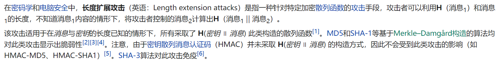
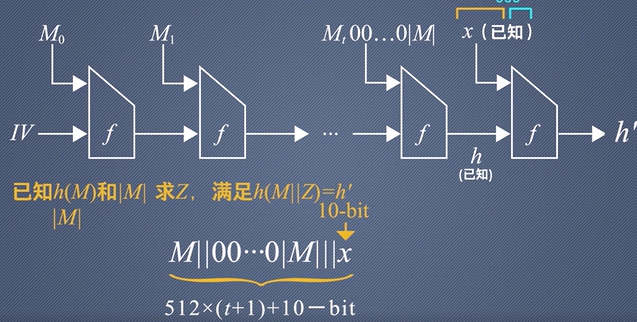
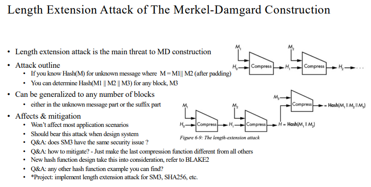
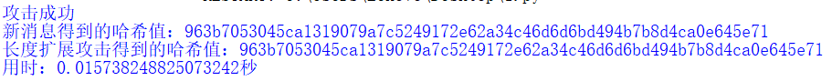
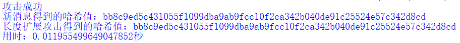

# implement length extension attack for SM3, SHA256, etc.
# 长度扩展攻击

|      代码名称       |           具体实现           |
| :-----------------: | :--------------------------: |
|       sm3.py        |       自编写的sm3算法        |
|      sha256.py      |      自编写的sha256算法      |
|  project_3_sm3.py   |  完成sm3算法的长度扩展攻击   |
| project_3_sha256.py | 完成sha256算法的长度扩展攻击 |

为了解sm3算法和sha256算法的细节并且实现长度扩展攻击，首先分别实现了python版本的[sm3算法](https://github.com/hhhhtttgxy/homework_group_49/edit/main/project_3/sm3.py)和[sha256算法](https://github.com/hhhhtttgxy/homework_group_49/edit/main/project_3/sha256.py)（分别见 [sm3.md](https://github.com/hhhhtttgxy/homework_group_49/edit/main/project_3/sm3.md) [sha256.md](https://github.com/hhhhtttgxy/homework_group_49/edit/main/project_3/sha256.md)）。

> 注：这里对SM3和SHA256进行了长度扩展攻击，其它MD结构的哈希算法类似。

MD结构首先对输入消息进行填充，让消息变成固定长度的整数倍（比如512或者1024）。这是因为压缩算法是不能对任意长度的消息进行处理的，所以在处理之前必须进行填充。消息被分成了很多个block，最开始的初始化向量和第一个block进行f操作，得到了的结果再和第二个block进行操作，如此循环进行，最终得到了最后的结果。

## 1. 实现原理
在已知H(M)和|M|的情况下，通过哈希函数内部的MD结构，进行攻击。








## 2. 实现过程
分别求出新消息的哈希值以及长度扩展攻击的哈希值，以下以sm3算法的长度扩展攻击为例，sha256类似。

- 求新消息的哈希值需要对原始消息M填充后，并级联附加消息（其实这里的下一步就可以直接对级联后的消息直接哈希，但为了更加完整的展示并没有这样做），然后对整体进行填充，再求解其哈希值。

```python
def h_sm3_new(message,x):
    len_bit = len(message) * 4
    message, bit_n = fill_message(message,len_bit)
    len_x = len(x) * 4
    len_new = len_x + bit_n
    message_new, bit_new = fill_message(hex(message)[2:]+x,len_new)
    n = bit_new // 512
    V = [0] * (n + 1)
    V[0] = IV
    return hex(iteration(message_new, n, V))[2:].zfill(64)
```
- 求解长度扩展攻击的哈希值需要对附加消息进行填充，并且最后64bit填充的长度应当是整体的长度即原始消息填充后的长度加附加消息的长度，然后将H(M)作为IV进一步求解其哈希值。
  
```python
def len_attack(h_m,len_m,x):
    k = (448 - 1 - len_m) % 512
    len_x = len(x) * 4
    len_new = k + 65 + len_m + len_x
    x_new, _ = fill_message(x,len_new)
    len_x_new = (448 - 1 - len_x) % 512 + 65 + len_x
    n = len_x_new // 512
    V_ = [0] * (n + 1)
    V_[0] = int(h_m,16)
    return hex(iteration(x_new, n, V_))[2:].zfill(64)
```

## 3. 实现结果
哈希值结果一致，攻击成功。

- sm3
  


- sha256


