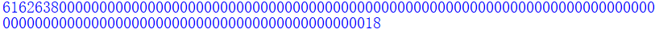
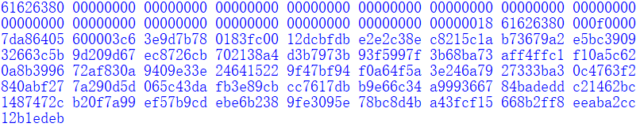
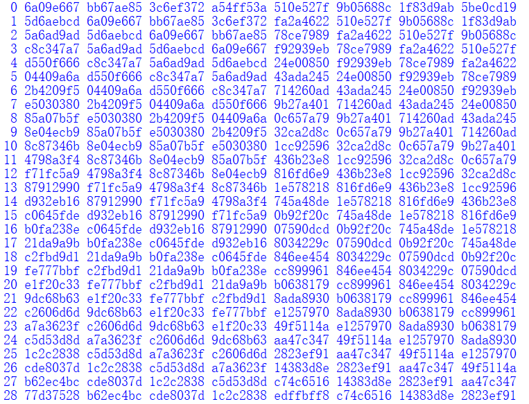
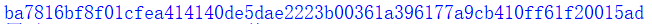
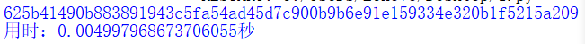
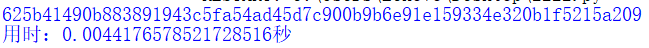

# 实现SHA256算法
## 1. 实现过程
参照博客中的流程完成实现
https://blog.csdn.net/u013073067/article/details/86600777
## 2. 实现验证
- 参考博客中的示例进行验证
> 填充后的消息：
>
> 
>
> 64个扩展字：
> 
> 
>
> 64轮迭代（部分）：
>
> 
>
> 最终压缩结果：
>
> 
>
> 经验证，中间过程与结果均与博客中给出的示例一致。

- 使用hashlib库进行验证
使用如下代码进行验证：
```python
import hashlib
import time

def sha_256(message):
    hash_message = hashlib.sha256(bytes.fromhex(message))
    return hash_message.hexdigest()

if __name__ == '__main__':
    m="61626364616263646162636461626364616263646162636461626364616263646162636461626364616263646162636461626364616263646162636461626364"
    start_time = time.time()
    print(sha_256(m))
    end_time = time.time()
    print("用时：{}秒".format(end_time - start_time))
```
> 自编写代码的结果：
>
> 
>
> hashlib库的结果：
>
> 
>
> 经验证，结果一致
