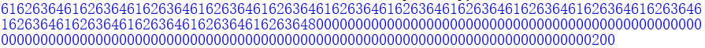
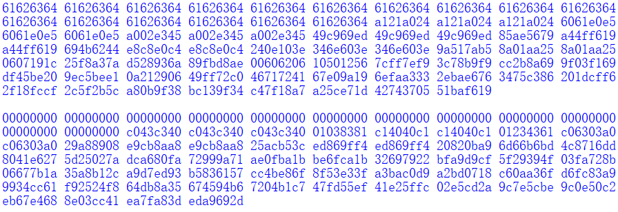
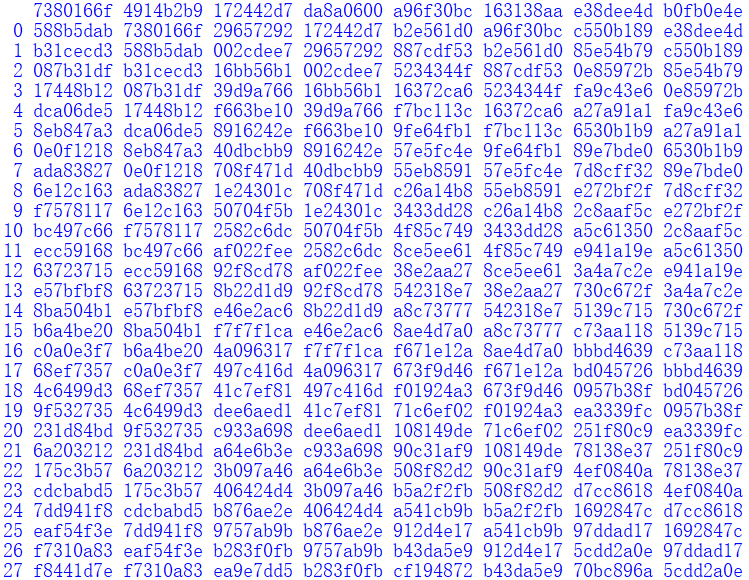
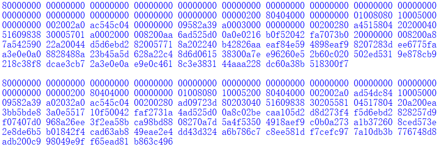
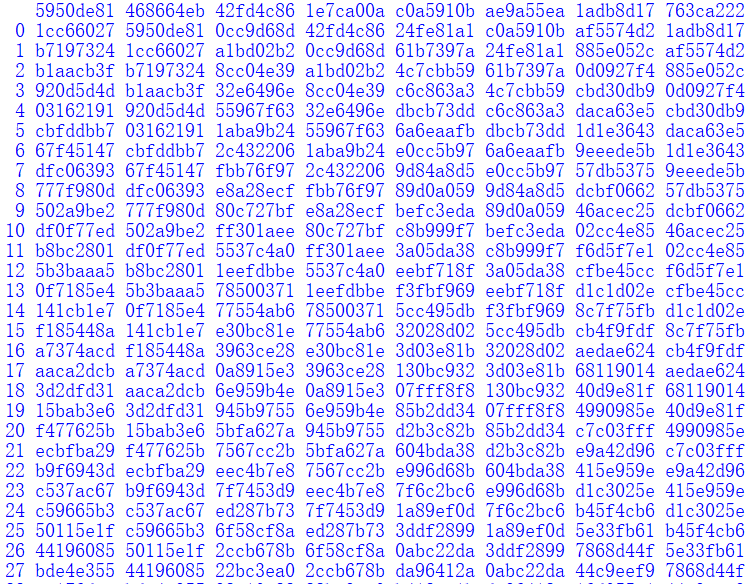
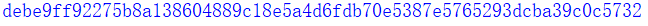
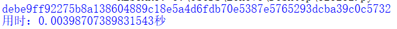

# 实现SM3算法
## 1. 实现过程
参照官方文档完成实现
http://www.sca.gov.cn/sca/xwdt/2010-12/17/1002389/files/302a3ada057c4a73830536d03e683110.pdf
## 2. 实现验证
- 填充后的消息：

- 第一个消息分组扩展后的消息：

- 第一个消息分组迭代压缩中间值（部分）：

- 第二个消息分组扩展后的消息：

- 第二个消息分组迭代压缩中间值（部分）：

- 最终压缩结果：

经验证，中间过程与结果均与官方文档一致。

## 3. 实现效率

