# do your best to optimize SM3 implementation (software)
# 在软件层面上尽力优化sm3算法

|     代码名称     |           具体实现           |
| :--------------: | :--------------------------: |
|   gmssl_sm3.py   |    调用gmssl库中的sm3算法    |
|      sm3.py      |       自编写的sm3算法        |
| sm3_original.cpp |   基础实现未优化的sm3算法    |
|   sm3_best.cpp   |       已优化的sm3算法        |
|  Linux_sm3.cpp   | 准备放入Linux下优化的sm3算法 |

## 1. 基础实现过程
先实现一个基础版本的sm3算法，在project_3中已经实现了sm3算法的python版本，因此只需要略作编程语言的调整更改，由于C++大数溢出以及字符串与整数的转化较为复杂等原因，因此在C++中将部分函数合并且不使用字符串，由于后续需要进行优化，因此在编写代码的过程中对于一些明显的、容易优化的且可读性与未调整差别不大的地方进行优化，例如，使用移位操作代替乘法除法。

## 2. 基础实现验证
- 第一个消息分组：

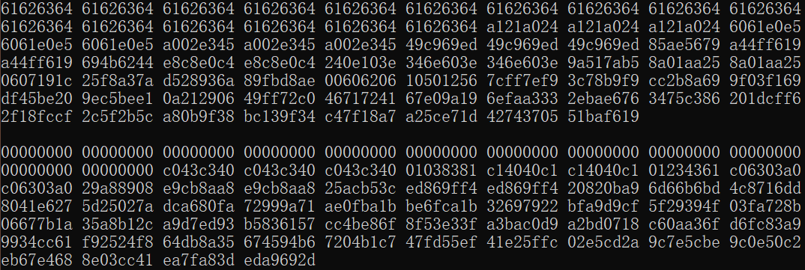

- 第一个消息分组迭代压缩中间值（部分）：

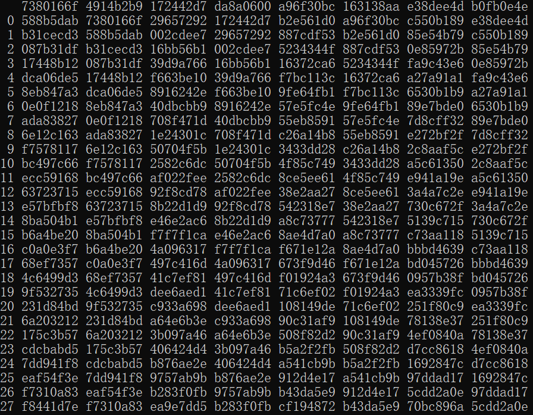

- 第二个消息分组：

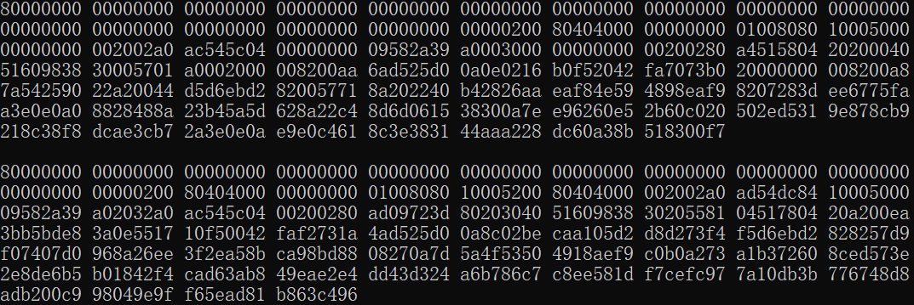

- 第二个消息分组迭代压缩中间值（部分）：

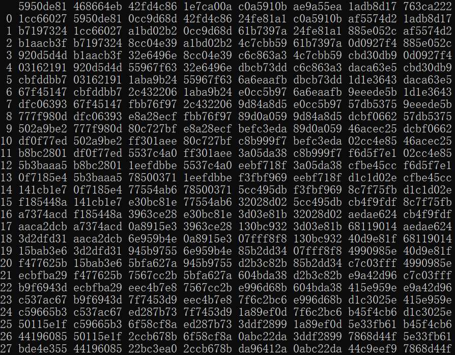

- 最终压缩结果：

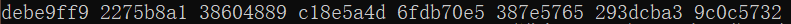

经验证，中间过程与结果均与官方文档一致。

## 3. 优化实现过程
主要采取三种优化方式：SIMD（一条指令处理多个数据）、UNROLL（循环展开）和INLINE（函数内联）。

### 3.1 SIMD
SIMD 的全称是 Single Instruction Multiple Data，即单指令多数据。顾名思义是一条指令处理多个数据。SIMD 本质上是采用一个控制器来控制多个处理器，同时对一组数据中的每一条分别执行相同的操作，从而实现空间上的并行性的技术，以下示例是SIMD与UNROLL的结合。

```C++
for (int j = 0; j < 64; j += 16) {
    __m256i Wj, Wj_4, Wj_, Wj_4_;
    Wj = _mm256_loadu_si256((__m256i*) & W[j]);
    Wj_4 = _mm256_loadu_si256((__m256i*) & W[j + 4]);
    Wj_ = _mm256_loadu_si256((__m256i*) & W[j + 8]);
    Wj_4_ = _mm256_loadu_si256((__m256i*) & W[j + 12]);
    _mm256_storeu_si256((__m256i*) & W_[j], _mm256_xor_si256(Wj, Wj_4));
    _mm256_storeu_si256((__m256i*) & W_[j + 8], _mm256_xor_si256(Wj_, Wj_4_));
}
```

### 3.2 UNROLL
unroll 是一种循环展开的优化技术，它可以提高代码的执行效率，循环展开有助于减少循环的迭代次数，从而减少循环的控制开销、跳转开销和循环内部的指令冲突等问题。同时，它可以增加指令级并行度，让循环体中的指令可以更好地重叠执行，从而提高程序的效率，注意在使用时，尽量保证在循环体内的运算没有关联性，以达到最大的并行性，以下给出一个示例。

```C++
for (int i = 0; i < len_fB_4; i += 4)
{
    B[i] = ((F[i * 4] << 24) | (F[i * 4 + 1] << 16) | (F[i * 4 + 2] << 8) | F[i * 4 + 3]) & 0xffffffff;
    B[i + 1] = ((F[(i + 1) * 4] << 24) | (F[(i + 1) * 4 + 1] << 16) | (F[(i + 1) * 4 + 2] << 8) | F[(i + 1) * 4 + 3]) & 0xffffffff;
    B[i + 2] = ((F[(i + 2) * 4] << 24) | (F[(i + 2) * 4 + 1] << 16) | (F[(i + 2) * 4 + 2] << 8) | F[(i + 2) * 4 + 3]) & 0xffffffff;
    B[i + 3] = ((F[(i + 3) * 4] << 24) | (F[(i + 3) * 4 + 1] << 16) | (F[(i + 3) * 4 + 2] << 8) | F[(i + 3) * 4 + 3]) & 0xffffffff;
}
```
### 3.3 INLINE
内联函数可以提高程序执行效率。如果函数是内联的，编译器在编译时，会把内联函数的实现替换到每个调用内联函数的地方。
```C++
inline unsigned int T(int j)
```

> 注：后补充在Linux下使用SIMD和O3完成优化（直接放入C++基础实现代码即可），编译指令如下，由于之前的测量时间方法只能在Windows下使用，故更改了测量时间的方法（如下）。

```
g++ -mavx -O3 -o sm3 sm3.cpp
```

```C++
auto start = chrono::high_resolution_clock::now();
int len_byte = sizeof(message) / sizeof(message[0]);
sm3(message, len_byte);
auto end = chrono::high_resolution_clock::now();
auto duration = chrono::duration_cast<chrono::microseconds>(end - start);
cout << "用时：" << duration.count() << " 微秒" << endl;
```

## 3. 实现效率对比
- 五个版本每个版本测量5次，取平均值，以下时间单位均为秒（s），Linux下的优化单位除外，为微秒。

> gmssl版本的运行效率：
> 
> 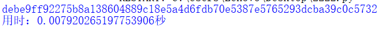
>
> 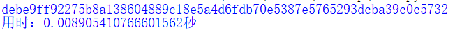
>
> 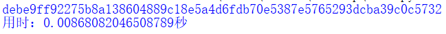
>
> 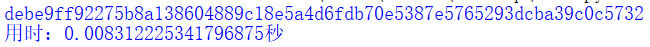
>
> 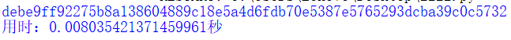


> python版本的运行效率：
>
> 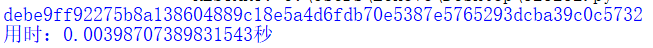
>
> 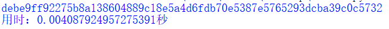
> 
> 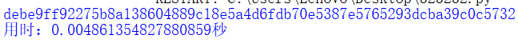
>
> 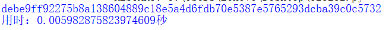
> 
> 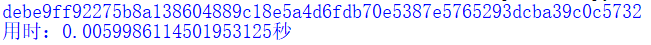


> C++初步实现未优化版本的运行效率：
>
> 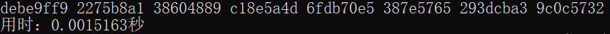
> 
> 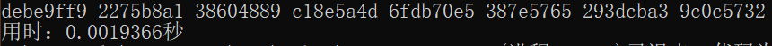
>
> 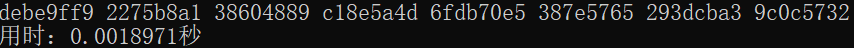
>
> 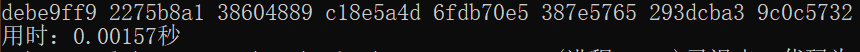
>
> 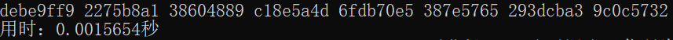


> C++优化版本的运行效率：
>
> 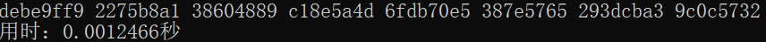
>
> 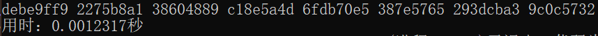
>
> 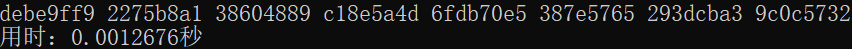
>
> 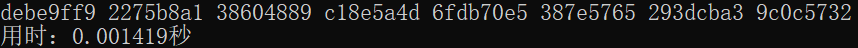
>
> 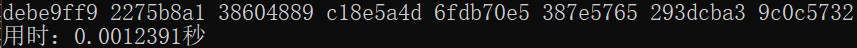

> linux下优化版本的运行效率：
>
> 

- 效率对比表：

|             | 1    | 2    | 3    | 4    | 5    | 平均时间 |
| ----------- | ---- | ---- | ---- | ---- | ---- | -------- |
| gmssl版本   | 0.007920 | 0.008905 | 0.008681 | 0.008312 | 0.008035 | 0.008371 |
| python版本  | 0.003987 | 0.004088 | 0.004861 | 0.005983 | 0.005999 | 0.004984 |
| C++基础版本 | 0.001516 | 0.001937 | 0.001897 | 0.001570 | 0.001565 | 0.001697 |
| C++优化版本 | 0.001247 | 0.001232 | 0.001268 | 0.001419 | 0.001239 | 0.001281 |
| Linux优化版本 | 16微秒 | 20微秒 | 19微秒 | 29微秒 | 27微秒 | 22.2微秒 |

- 效率对比图：将Linux优化版本的单位统一成秒。


gmssl版本到python版本以及python版本到C++版本效率提升较为明显，C++版本在进行优化后略有提升，最终优化了近7倍。再加上Linux下的优化（非常明显），最终优化了377倍:astonished:。
