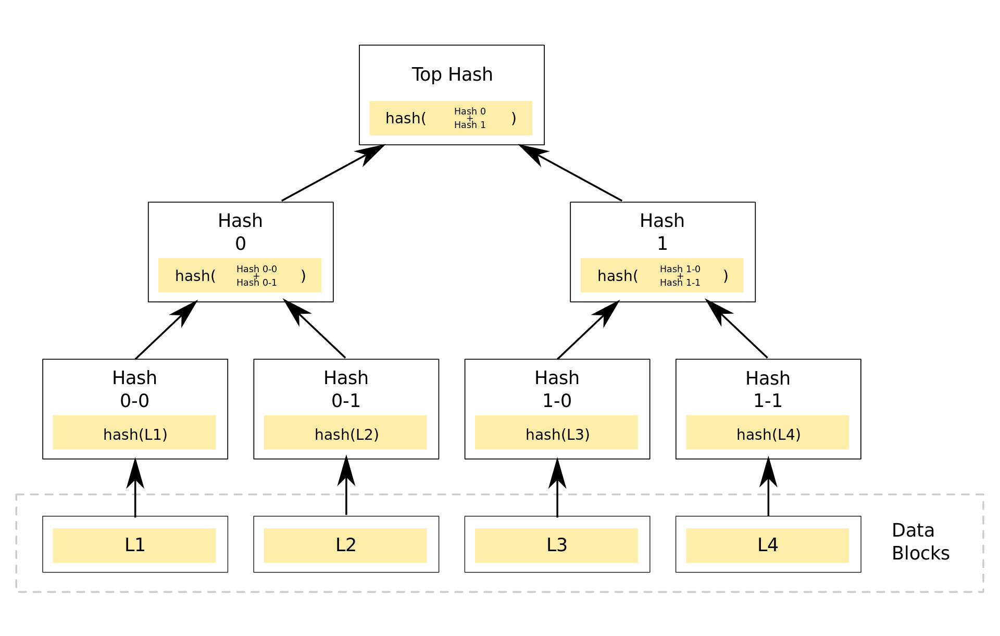
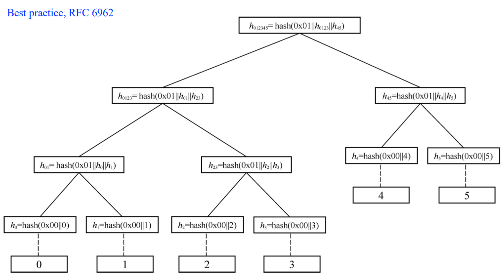
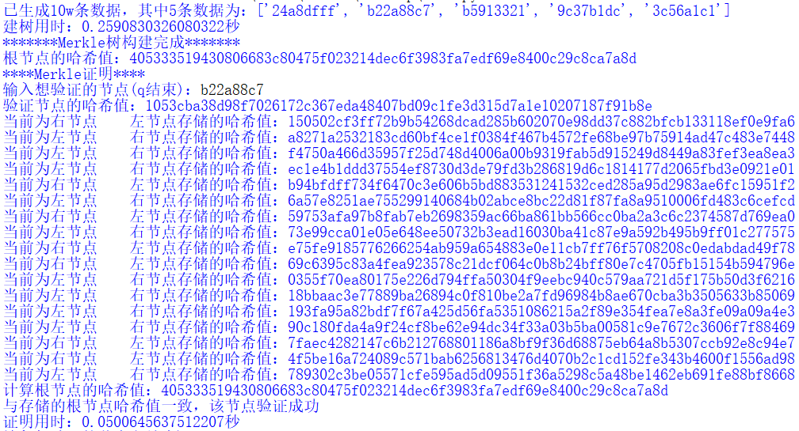
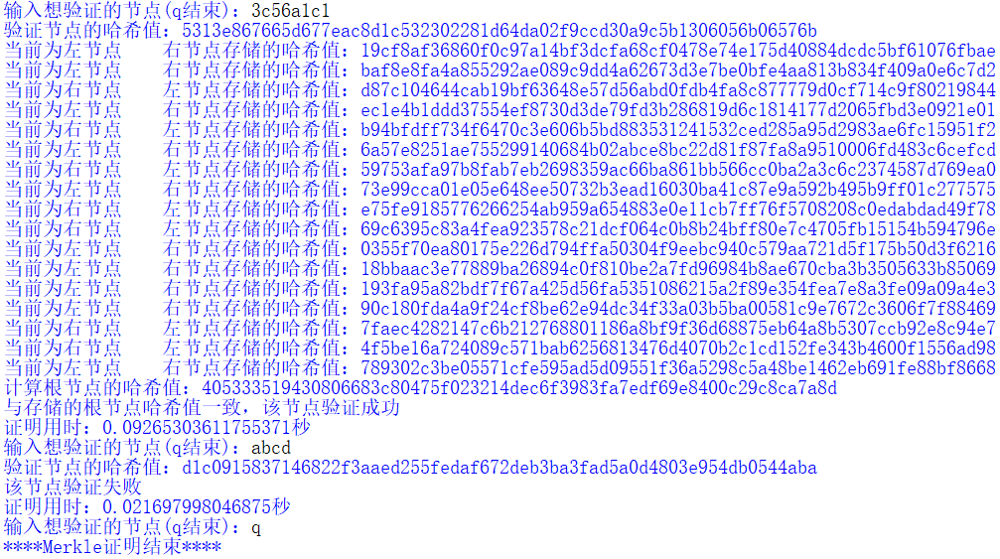

# Impl Merkle Tree following RFC6962

|   代码名称   |         具体实现         |
| :----------: | :----------------------: |
| project_5.py | Merkle Tree with RFC6962 |

## 1. 实现原理
Merkle 树是一种哈希树，其中每个叶子节点都标有数据块的加密哈希值，而每个非叶子节点都标有其子节点标签的加密哈希值。Merkle树的优势在于，对于大量数据，只需比较根节点的哈希值即可验证整个数据集的完整性，而不需要逐个比较每个数据块。这种结构还可以有效地检测到数据的任何变化，因为任意一个数据块的修改将导致从该数据块到根节点的哈希值链的变化。





- Merkle树构建过程，是从输入数据开始进行hash，hash的结果作为树的叶子节点，然后相邻两个节点值两两配对作为输入再hash散列得到上层节点，如此一直往上，如果某层的结点数为奇数时，则最后一个节点与自己配对进行散列
- 任何叶子节点数据变动都会逐层传递，导致根数据发生变化，根结果的比对可以作为构建树的数据的比对
- 反过来，根节点变化，可以根据逐层往下查找变动的节点，直到找到最终的叶子节点
- SHA-256散列函数算法总体比较简单高效，可以保证处理过程的高效性

## 2. 实现过程

具体实现时借鉴了C++的一些思路，后续的操作有些类似于C++的指针，然后又结合了python的一些优势，例如列表操作。

- Node类：用于在二叉树中创建节点对象。每个节点对象具有以下属性：hash是节点的哈希值，left指向左子节点，right指向右子节点，parent指向父节点。

```python
class Node:
    def __init__(self, hash_value, left=None, right=None, parent=None):
        self.hash = hash_value
        self.left = left
        self.right = right
        self.parent = parent
```

- sha_256函数: 使用SHA-256算法对输入的消息进行哈希计算。
```python
def sha_256(message):
    hash_message = hashlib.sha256(bytes.fromhex(message))
    return hash_message.hexdigest()
```

- create_tree函数: 用于创建Merkle树。首先，它对数据列表中的每个数据进行哈希计算，创建叶子节点，并将这些叶子节点存储在leaf_nodes列表中，然后，它通过循环构建树的每一层，直到只剩下一个根节点。在每一层中，如果节点数为奇数，则复制最后一个节点以保持偶数个节点，然后，对每两个相邻节点的哈希值级联后哈希，创建父节点，并将父节点存储在parent_nodes列表中，后将parent_nodes列表添加到nodes列表中，最终，返回根节点的哈希值和所有节点的列表。
> 注：对于叶子节点，在每次哈希时前面填充0x00，对于非叶子节点，在每次哈希时前面填充0x01。
```python
def create_tree(data_list):
    nodes = []

    leaf_nodes = []
    for data in data_list:
        hash_value = sha_256("00"+data)
        node = Node(hash_value)
        leaf_nodes.append(node)
    nodes.append(leaf_nodes)

    while len(nodes[-1]) != 1:
        parent_nodes = []
      
        length = len(nodes[-1])
        if length % 2:
            nodes[-1].append(nodes[-1][-1])
        
        for i in range(0, length, 2):
            parent_hash = sha_256("01"+nodes[-1][i].hash + nodes[-1][i + 1].hash)
            node = Node(parent_hash)
            node.left = nodes[-1][i]
            node.right = nodes[-1][i + 1]
            nodes[-1][i].parent = node
            nodes[-1][i + 1].parent = node
            parent_nodes.append(node)

        nodes.append(parent_nodes)

    root = nodes[-1][0].hash
    return root, nodes
```
- prove_node函数: 用于Merkle证明。首先，对输入数据进行哈希后，在叶子节点列表中查找与其匹配的节点，如果找到了节点，则通过向上迭代计算哈希值，直到达到根节点并得到计算出的根节点哈希值。最后，它将计算得到的根节点哈希值与存储的根节点哈希值进行比较，以完成节点的证明。
```python
def prove_node(v, root, nodes):
    hash_value = sha_256("00"+v)
    print("验证节点的哈希值：{}".format(hash_value))
    node = None

    for leaf_node in nodes[0]:
        if leaf_node.hash == hash_value:
            node = leaf_node
            break

    if node is None:
        print("该节点验证失败")
        return

    while node.parent is not None:
        if node.parent.left == node:
            print("当前为左节点\t右节点存储的哈希值：{}".format(node.parent.right.hash))
            hash_value = sha_256("01"+hash_value + node.parent.right.hash)
        else:
            print("当前为右节点\t左节点存储的哈希值：{}".format(node.parent.left.hash))
            hash_value = sha_256("01"+node.parent.left.hash + hash_value)
            
        node = node.parent

    print("计算根节点的哈希值：{}".format(hash_value))
    
    if hash_value == root:
        print("与存储的根节点哈希值一致，该节点验证成功")
    else:
        print("该节点验证失败")
```

> 注：在此将包含证明和排除证明合并。

- 主函数：首先创建一个包含 10w 条数据的列表 test_data，每条数据由 "0123456789abcdef" 中的随机 8 个字符组合而成。然后，调用create_tree函数构建Merkle树，并得到根节点的哈希值和所有节点的列表，而后输出用时和根节点的哈希值。最后进入一个循环，输入想要验证的节点，调用prove_node函数对该节点进行证明，并输出证明结果和用时，当输入"q"时，循环结束。

```python
if __name__ == "__main__":
    characters = "0123456789abcdef"
    test_data = [''.join(random.choices(characters, k=8)) for _ in range(100000)] # 生成10w条数据
    print("已生成10w条数据，其中5条数据为：{}".format(test_data[50000:50005]))
    start_time = time.time()
    root, nodes = create_tree(test_data)
    end_time = time.time()
    print("建树用时：{}秒".format(end_time - start_time))
    
    print("*******Merkle树构建完成*******")
    print("根节点的哈希值：{}".format(root))
    
    print("****Merkle证明****")
    while True:
        v=input("输入想验证的节点(q结束)：")
        if v=="q":
            break  
        start_time = time.time()
        prove_node(v, root, nodes)
        end_time = time.time()
        print("证明用时：{}秒".format(end_time - start_time))

    print("****Merkle证明结束****")
```

## 3. 实现结果
能够成功构建Merkle树以及完成Merkle证明。

> 
> 

## 4. 参考文献
https://docs.tongdelove.com/docs/0x08/se/domain/web3/4%E9%AB%98%E7%BA%A7/%E5%A6%82%E4%BD%95%E4%B8%BA%E5%A4%A7%E5%9E%8B%E7%A9%BA%E6%8A%95%E5%88%9B%E5%BB%BA%E9%BB%98%E5%85%8B%E5%B0%94%E6%A0%91/

https://ethbook.abyteahead.com/ch4/merkle.html

https://www.rfc-editor.org/rfc/rfc6962

https://www.cnblogs.com/LaoYuanPython/p/13643456.html
