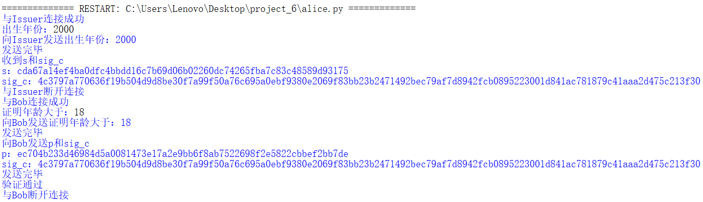

# impl this protocol with actual network communication
# Range Proof With Hash Function

|      代码名称      |    具体实现    |
| :----------------: | :------------: |
| project_6_basic.py | 协议的基础实现 |
|      func3.py      | 共用的密码算法 |
|     issuer.py      |    issuer方    |
|      alice.py      |    alice方     |
|       bob.py       |     bob方      |

> 注：通讯部分由issuer.py、alice.py和bob.py组成，先运行issuer.py再运行alice.py，完成第一阶段的通讯后，运行bob.py完成第二阶段的通讯，在需要输入时按照提示输入即可。

## 1. 实现原理

朴素的 PayWord 方法的工作原理如下：现在是 2021 年，Alice 想要向 Bob 证明她至少年满 21 岁，而无需出示身份证或驾驶执照。每个密码学家可能都知道，Alice 出生于 1978 年，当时 RSA 论文作者首次提到“对于我们的场景，我们假设 A 和 B（也称为 Alice 和 Bob）是公钥密码系统的两个用户”。但我们暂时假设 Bob 不是密码学家，并且确实需要 Alice 超过 21 岁的证明；他们也都信任政府颁发的证书。此外，假设我们想要使用这个证明系统直到 2100 年。

这一协议可以在不泄露出具体年龄的情况下，向对方提供年龄证明。


- Alice（出生于1978年）想向Bob证明她的年龄大于21岁。
- 依赖可信的发行方，证明系统需要在2100年之前可用。
- 假设今年是2021年。
- 可信的发行方
  - 选择一个128位的随机种子，计算种子的哈希值 $s$
  - $k = 2100 − 1978$ ， $c = {H_1}^k(s)$ ，对 $c$ 进行签名得到 $sig_c$
  - 给Alice $s$ 和 $sig_c$
- Alice向Bob证明她的年龄大于21岁
  - 例如，她出生在2000年之前
  - 计算 $d_0 = 2000-1978 = 22$ ，计算证明 $p = {H_1}^{d_0}(s)$
  - 给Bob $p$ 和 $sig_c$
- Bob验证Alice的证明
  - 计算 $d_1 = 2100-2000 = 100$
  - 计算 $c' = {H_1}^{d_1}(p)$ ，检查 $sig_c$ 是否为 $c'$ 的签名

## 2. 实现过程
### 2.1 基础版
依照实现原理中的各个步骤，先实现一个基础版的。签名算法使用sm2，哈希算法使用sm3，将可信的发行方、Alice和Bob主要分为三个函数实现，也为后续进阶版打下基础，代码和流程完全一致因此不再赘述。

### 2.2 进阶版
进阶版的目标是要实现三方通信，因此要将三方分为三个文件相当于是三个端，并且我们假设三方都是诚实的。
- 使用socketserver模块-基于tcp协议通信。
- 为了方便起见，将三方共用（例如，哈希算法、签名算法等）的部分放入一个文件，命名为func3.py，然后若有需要则可以直接将其作为模块导入。
- 首先Alice和可信的发行方进行通信，此时Alice作为客户端，可信的发行方作为服务端，Alice需要和可信的发行方通信告诉其自己的出生年份，然后可信的发行方会对此计算得到 $s$ 和 $sig_c$ 传递给Alice，两方的通信结束。
- 然后Alice和Bob进行通信，此时Bob作为客户端，Alice作为服务端，Alice需要和Bob通信告诉其自己想要证明年龄大于几，并且会把 $p$ 和 $sig_c$ 给Bob，最终Bob需要进行验证，并把验证结果告知Alice。

> 注：参考博客 https://www.cnblogs.com/rocedu/p/15518988.html 中对gmssl库中的对sm2签名算法的使用方法完成调用（后续到sm2部分会详细说明）。

```python
def Issuer(born):
    seed = secrets.randbits(128)
    s = SM3(hex(seed)[2:].zfill(32))
    c = s
    k = 2100 - born
    for i in range(k):
        c = SM3(c)
    sig_c = SM2_sign(bytes.fromhex(c),private_key)
    return s, sig_c
```

```python
def Alice(s, age_big):
    d0 = (2021 - age_big) - int(born)
    for i in range(d0):
        s = SM3(s)
    p = s
    return p
```

```python
def Bob(p, sig_c, age_big):
    d1 = 2100 - (2021 - age_big)
    for i in range(d1):
        p = SM3(p)
    c_ = p
    return SM2_verify(sig_c, bytes.fromhex(c_),public_key)
```
（这里只展示三方实际计算部分的代码，具体通讯过程见代码实现）

> 注：可信的发行方在此肯定作为服务端，Alice和Bob在此均认为是个人，Alice向Bob提供证明服务，因此在与Bob的通讯中作为服务端，但实际上，并不需要对其进行明显区分，只是为了满足通讯需要。

## 3. 实现结果
基础版：


进阶版：

在测试过程中发现由于有时需要连续传两个内容，在接受时可能并未成功将两个内容分开，因此在连续传两个内容的中间加入time.sleep(1)让程序停顿1秒即可顺利实现，后续有关network communication的均采用此种方法完成连续传多个内容。

> 测试1：
> 
>
> 
>
> 


> 测试2：
> 
>
> 
>
> 
