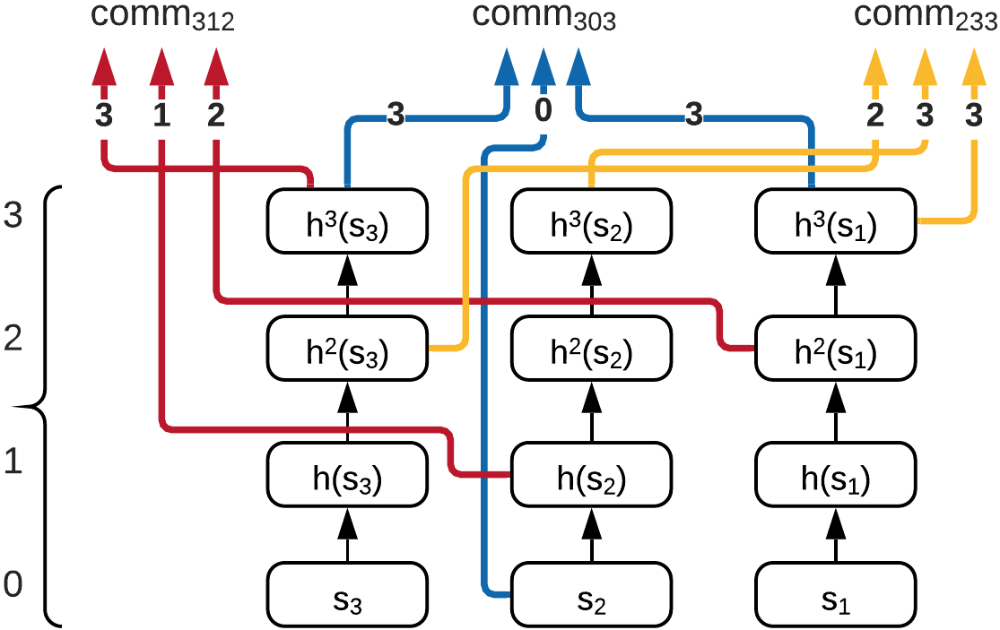

# Try to Implement this scheme
# HashWires

|   代码名称   |    具体实现     |
| :----------: | :-------------: |
| project_7.py | HashWires的实现 |

## 1. 实现原理


- 实现总流程：


- 总流程的核心部分：



- Padded sparse Merkle Tree部分：


HashWires 的应用包括 KYC 凭证的范围证明、位置（您可以轻松组合两个证明，每个坐标一个，以在 2D 或 3D 空间中创建一个范围）、时间戳范围（即，在数字证书中，我们只对 cert 感兴趣）验证，但不一定是在发行时），最后是小额支付、拍卖和逐渐可赎回的银行支票。

## 2. 实现过程
### 2.1 密码库算法使用示例
- 由于密钥派生中用的哈希算法是sha256，因此为了统一后续哈希算法均使用sha256，使用示例如下：
```python
from cryptography.hazmat.primitives import hashes
digest = hashes.Hash(hashes.SHA256())
digest.update(b"abc")
digest.update(b"123")
digest.finalize()
```

- 实现密钥派生KDF：选用HKDF算法作为密钥派生，使用示例如下：
```python
import os
from cryptography.hazmat.primitives import hashes
from cryptography.hazmat.primitives.kdf.hkdf import HKDF
salt = os.urandom(16)
info = b"hkdf-example"
hkdf = HKDF(
    algorithm=hashes.SHA256(),
    length=32,
    salt=salt,
    info=info,
)
key = hkdf.derive(b"input key")
hkdf = HKDF(
    algorithm=hashes.SHA256(),
    length=32,
    salt=salt,
    info=info,
)
hkdf.verify(b"input key", key)
```
### 2.2 具体实现
实现过程中选用的MDP列表为[312，303，233]，并且假设三方都是诚实的。

- 实现Merkle Tree：首先创建一个16个数据的列表，将传入的abcd随机放置，然后其余的12个位置放入随机数的哈希值即可。
```python
data_list=[0]*16
random_list=[]
while True: # 生成四个随机位置给a b c d
    if len(random_list)==4:
        break
    k=random.randint(0,15)
    if k not in random_list:
        random_list.append(k)
        
index0,index1,index2,index3=random_list
data_list[index0]=a;data_list[index1]=b;data_list[index2]=c;data_list[index3]=d
for i in range(16):
    if i not in random_list:
        data_list[i]=sha256(os.urandom(64).hex())
```

> 注：由于Padded sparse Merkle Tree部分只是对project_5中的实现进行改动，因此只说明改动部分，其中证明部分只是略作调整，故只介绍Merkle建树的改动部分。

- 实现sha256：主要参考密码库算法使用示例部分即可。
```python
def sha256(message):
    digest = hashes.Hash(hashes.SHA256())
    message = bytes.fromhex(message)
    digest.update(message)
    hash_value = digest.finalize()
    return hash_value.hex()
```
- 实现HKDF密钥派生：主要参考密码库算法使用示例部分即可。
```python
def hkdf(key):
    key = bytes.fromhex(key)
    hkdf_i = HKDF(
        algorithm=hashes.SHA256(),
        length=32,
        salt=os.urandom(32),
        info=b"hkdf",
    )
    subkey = hkdf_i.derive(key)
    return subkey.hex()
```
- 实现pl_accum函数：pl_accum是将输入的16进制字符串级联后再哈希。
```python
def pl_accum(a,b,c):
    return sha256(a+b+c)
```
> 注：实际的pl_accum函数可能要更复杂。
- 实现H函数：加盐哈希。
```python
def H(a,b):
    return sha256(a+b)
```
- 实现shuffle函数：使用种子初始化随机数生成器，最终将输入列表中的元素进行洗牌。
```python
def shuffle(arr, seed):
    seed = int(seed,16)
    rng = random.Random(seed)
    rng.shuffle(arr)
    return arr
```

- 实现checksum函数：检验和也就是最右边的单链，作用是可以防止被篡改。

```python
def checksum(seed_d):
    for i in range(9):
        seed_d=sha256(seed_d)
    comm_checksum=seed_d
    D=comm_checksum
    return D
```

- 可信的发行方：计算出最终的值，用作验证方进行Merkle证明，并且传递一些必要的信息给证明方和验证方，流程和实现原理部分中的总流程基本一致，故不再赘述。
```python
def issuer(num):
    x,y,z=str(num).zfill(3)
    x=int(x);y=int(y);z=int(z)
    
    if 0<=x<=2 and 0<=y<=3 and 0<=z<=3:
        chain=233
    elif 300<=num<=303:
        chain=303
    elif 310<=num<=312:
        chain=312
        
    random_bytes = os.urandom(32)
    seed_main = random_bytes.hex()
    
    s1=hkdf(seed_main);h1_1 = sha256(s1);h1_2 = sha256(h1_1);h1_3 = sha256(h1_2)
    s2=hkdf(seed_main);h2_1 = sha256(s2);h2_2 = sha256(h2_1);h2_3 = sha256(h2_2)
    s3=hkdf(seed_main);h3_1 = sha256(s3);h3_2 = sha256(h3_1);h3_3 = sha256(h3_2)

    comm_312=pl_accum(h3_3,h2_1,h1_2)
    comm_303=pl_accum(h3_3,s2,h1_3)
    comm_233=pl_accum(h3_2,h2_3,h1_3)
    
    salt_A=hkdf(seed_main)
    salt_B=hkdf(seed_main)
    salt_C=hkdf(seed_main)
    
    if chain==233:
        salt=salt_C
    elif chain==303:
        salt=salt_B
    elif chain==312:
        salt=salt_A
        
    A=H(salt_A,comm_312)
    B=H(salt_B,comm_303)
    C=H(salt_C,comm_233)
    shuffle_seed=hkdf(seed_main)
    A,B,C=shuffle([A,B,C],shuffle_seed)
    seed_d=hkdf(seed_main)
    D=checksum(seed_d)
    root, nodes=create_tree(A,B,C,D)
    
    return s1,s2,s3,chain,salt,root,nodes
```
- 证明方：收到证明需要使用的链后，从每个链的顶部节点开始计数，并根据她需要证明的数字，返回相应的节点（哈希值）给验证方。
```python
def prove(s1,s2,s3,num,chain):
    x,y,z=str(num).zfill(3)
    x=int(x);y=int(y);z=int(z)
    
    x_,y_,z_=str(chain).zfill(3)
    x_=int(x_);y_=int(y_);z_=int(z_)
    
    a=s3;b=s2;c=s1

    for i in range(x_-x):
        a=sha256(a)
    for i in range(y_-y):
        b=sha256(b)
    for i in range(z_-z):
        c=sha256(c)
        
    return a,b,c
```

- 验证方：在收到证明方提供的中间值后，验证方需要对中间值进行对应次数（按值的每一位对应的数字，例如123，那么对应的分别为1、2、3次）的哈希运算，而后进行pl_accum操作再加盐，最终进行验证。
```python
def verify(a,b,c,num,salt,root,nodes):
    x,y,z=str(num).zfill(3)
    x=int(x);y=int(y);z=int(z)
    
    for i in range(x):
        a=sha256(a)
    for i in range(y):
        b=sha256(b)
    for i in range(z):
        c=sha256(c)
    comm_=pl_accum(a,b,c)
    comm_salt=H(salt,comm_)
    return prove_node(comm_salt, root, nodes)
```
- 主函数：反馈验证成功or验证失败，并且测量实现所需时间。
```python
if __name__ == '__main__': # HashWires
    num=int(input("请输入："))
    start_time = time.time()
    s1,s2,s3,chain,salt,root,nodes=issuer(num)
    a,b,c=prove(s1,s2,s3,num,chain)
    if verify(a,b,c,num,salt,root,nodes):
        print("验证成功")
    else:
        print("验证失败")
    end_time = time.time()
    print("用时：{}秒".format(end_time - start_time))
```
## 3. 实现结果

> 
>
> 
>
> 

## 4. 参考文献
https://cryptography.io/en/37.0.1/

https://zkproof.org/2021/05/05/hashwires-range-proofs-from-hash-functions/

HashWires: Hyperefficient Credential-Based Range Proofs
