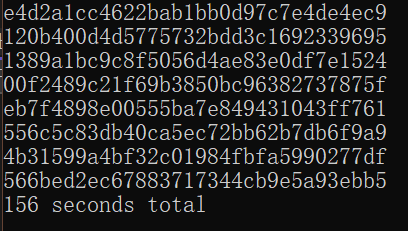
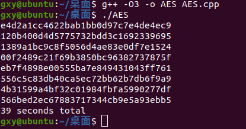

**以下是摘自对应仓库的介绍**

#

- aes_scalar.cpp

This is the scalar implementation, which can be compiled on any platform, not only ARM.

- aes_neon.cpp

This implementation uses the NEON SIMD instructions of ARMv8.

- aes_bitslice.cpp

This implementation uses the bitslicing algorithm, which allows a parallel processing of 8 encryptions/decryptions.
Only 128- and 256-bit keys are supported.

#

Compiled with **gcc 11.3.0** for Ubuntu using **-O3** optimization level.
Executed on **Raspberry Pi 4B**, 8GB RAM.
Each benchmark included 100,000,000 encryption rounds done on 8 data blocks.

- aes_scalar:   92 seconds
- aes_neon:     52 seconds
- aes_bitslice: 11 seconds

For comparison, the aes_scalar benchmark executed on an Intel Core i5 CPU took 24 seconds.

#
下面自己运行了一下aes_scalar.cpp。

- 在vs运行aes_scalar.cpp的结果：

- 在Linux下运行aes_scalar.cpp的结果：

