# AES / SM4 software implementation

| 代码名称 |     具体实现      |
| :------: | :---------------: |
| AES.cpp  | AES分组加密的实现 |
| SM4.cpp  | SM4分组加密的实现 |

# AES
## 1. 实现原理
高级加密标准(AES)，原名Rijndael，是美国国家标准与技术研究所(NIST)在2017年制定的电子数据加密规范。

AES是Rijndael分组密码的一个变体，由两位比利时密码学家Joan Daemen和Vincent Rijmen开发，他们在AES选择过程中向NIST提交了一份提案。Rijndael是一个具有不同密钥和块大小的密码家族。对于AES，NIST 选择了Rijndael系列的三个成员，每个成员的块大小均为128位，但具有三种不同的密钥长度：128、192和256位。

### 1.1 加密
  
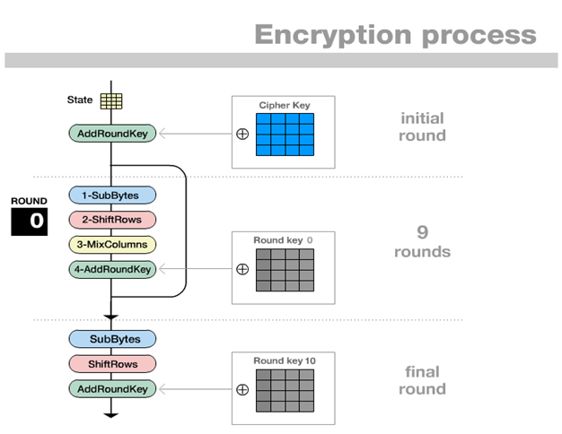

- 过S盒

输入的数据通过S盒完成一个字节到另一个字节的映射，是唯一的非线性部件。

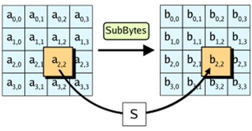

- 行移位

每一行按字节循环移位，第一行不变，第二行向左移动1个字节、第三行向左移动2个字节、第四行向左移动3个字节，将某一列的四个字节扩散到4列。

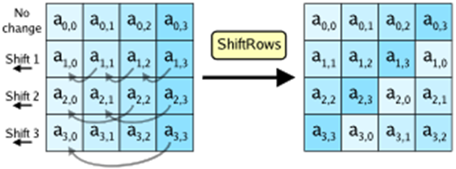

- 列混合
  
列混合变换是通过矩阵相乘来实现的，经行移位后的状态矩阵与固定的矩阵相乘，得到混淆后的状态矩阵（ $GF(2^8)$ 上的乘法）。以列为单位，使得输出的每一个字节和输入的四个字节有关。

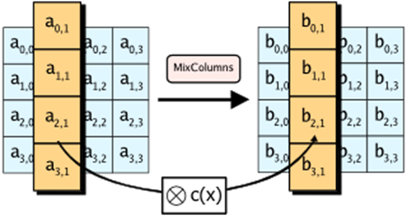

- 轮密钥加

每个字节与轮密钥的对应字节进行异或运算。

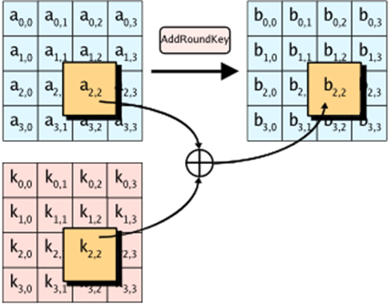

- 密钥扩展方案

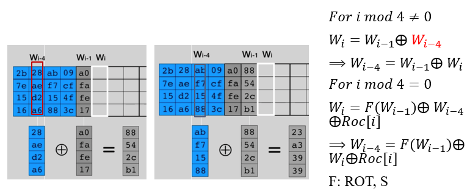

加密实现：

```C++
void Aes_Encrypt(unsigned int Plain[4][4], unsigned int Key[4][44])
{
    AddRoundKey(Plain, Key, 0);
    for (int i = 1; i < 10; i++)
    {
        S(Plain);
        ShiftRow(Plain);
        MixColumn(Plain);
        AddRoundKey(Plain, Key, i);
    }
    S(Plain);
    ShiftRow(Plain);
    AddRoundKey(Plain, Key, 10);
}
```

> 后续考虑使用查找表的方式提升效率

### 1.2 解密
  
解密过程的每一步分别对应加密过程的逆操作，其中轮密钥加即与密钥异或，逆向运算和不逆向运算是相同的。加解密所有操作的顺序是相反的，并且密钥使用的顺序也应当调整。

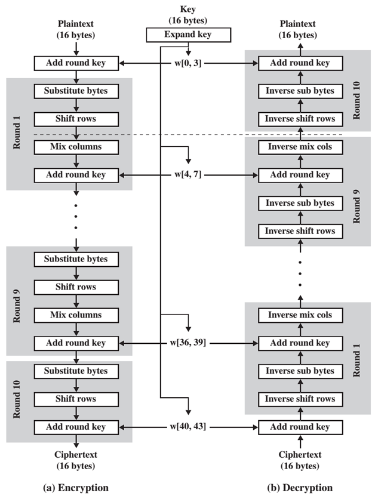

解密实现：

```C++
void Aes_Decrypt(unsigned int Cipher[4][4], unsigned int Key[4][44])
{
    AddRoundKey(Cipher, Key, 10);
    for (int i = 0; i < 9; i++)
    {
        Inverse_ShiftRow(Cipher);
        Inverse_S(Cipher);
        AddRoundKey(Cipher, Key, 9 - i);
        Inverse_MixColumn(Cipher);
    }
    Inverse_ShiftRow(Cipher);
    Inverse_S(Cipher);
    AddRoundKey(Cipher, Key, 0);
}
```

### 1.3 工作模式

NIST（SP800-38A）定义了5种工作模式
- ECB模式 （Electronic Codebook 电码本模式）
- CBC模式（Cipher Block Chaining 密码分组链接模式）
- CFB模式（Cipher Feedback 密码反馈模式）
- OFB模式（Output Feedback 输出反馈模式）
- CTR模式（Counter 计数器模式）

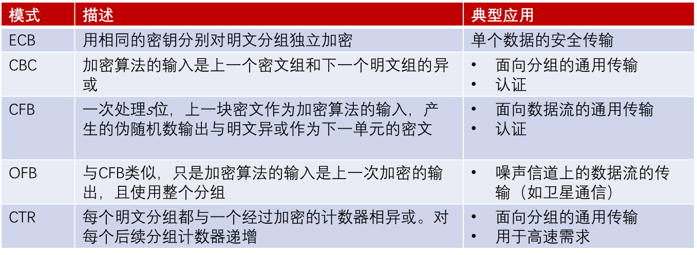

> 后续有时间考虑补充工作模式

## 2. 实现验证
参考博客中的示例进行验证 https://blog.csdn.net/u013073067/article/details/86529111

> 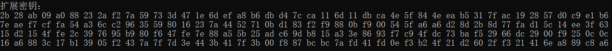
>
> 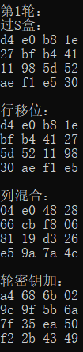
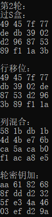
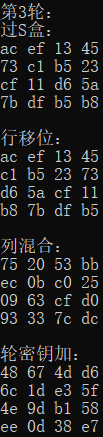
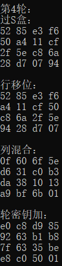
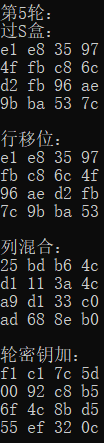
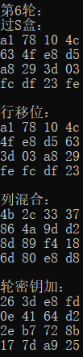
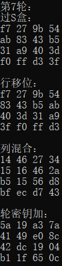
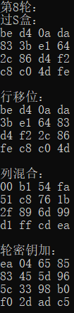
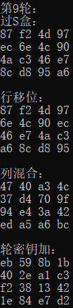
>
> 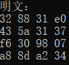
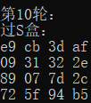
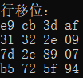
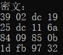
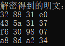
>
> 经验证，中间过程与结果均与博客中给出的示例一致。

## 3. 实现效率

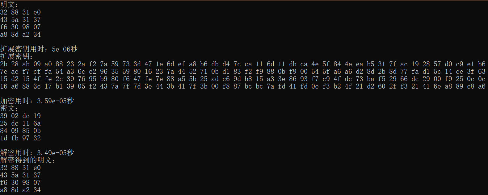

# SM4
## 1. 实现原理
本算法是一个分组算法。该算法的分组长度为 128 比特，密钥长度为 128 比特。加密算法与密钥扩展算法都采用 32 轮非线性迭代结构。解密算法与加密算法的结构相同，只是轮密钥的使用顺序相反，解密轮密钥是加密轮密钥的逆序。

参考官方文档 http://www.sca.gov.cn/sca/c100061/201611/1002423/files/330480f731f64e1ea75138211ea0dc27.pdf
实现了SM4算法的加密以及解密。

加密实现：

```C++
void SM4_Encrypt(unsigned int Plain[4], unsigned int Cipher[4], unsigned int rk[32])
{
    unsigned int X[36];
    for (int i = 0; i < 4; i++)
    {
        X[i] = Plain[i];
    }
    for (int i = 0; i < 32; i++)
    {
        X[i + 4] = X[i] ^ T(X[i + 1] ^ X[i + 2] ^ X[i + 3] ^ rk[i]); //F函数
    }
    for (int i = 0; i < 4; i++)
    {
        Cipher[i] = X[35 - i];
    }
}
```

解密实现：

```C++
void SM4_Decrypt(unsigned int Plain[4], unsigned int Cipher[4], unsigned int rk[32])
{
    unsigned int X[36];
    for (int i = 0; i < 4; i++)
    {
        X[i] = Cipher[i];
    }
    for (int i = 0; i < 32; i++)
    {
        X[i + 4] = X[i] ^ T(X[i + 1] ^ X[i + 2] ^ X[i + 3] ^ rk[31 - i]); //F函数
    }
    for (int i = 0; i < 4; i++)
    {
        Plain[i] = X[35 - i];
    }
}
```

## 2. 实现结果

测试明文{0x01234567,0x89abcdef,0xfedcba98,0x76543210}，密钥{0x01234567,0x89abcdef,0xfedcba98,0x76543210}，测试加密一次的轮密钥、中间结果以及密文，经对比与和官方结果一致，并且解密结果与明文一致。为了进一步验证，测试加密1000000次后的密文，同样与官方结果一致。

> 加密一次：
>
> 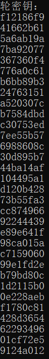
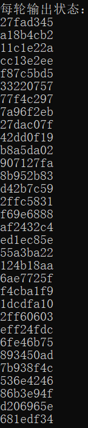
>
> 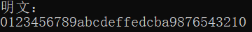
>
> 
>
> 加密1000000次：
> 
> 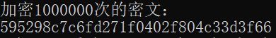

## 3. 实现效率
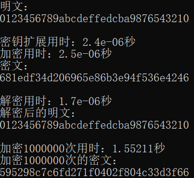
